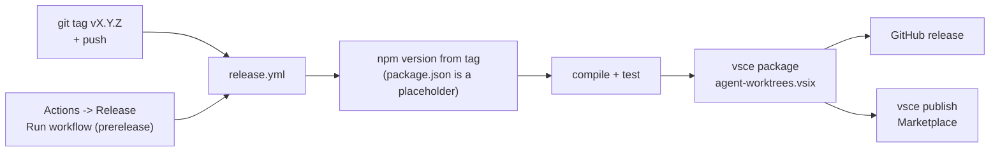

# Releasing Agent Worktrees

A release is cut by pushing a `vX.Y.Z` tag. That triggers
`.github/workflows/release.yml`, which sets the version from the tag, runs
`npm ci` + `npm run compile` + `npm test`, packages the `.vsix` (with
`MARKETPLACE.md` as the listing readme), creates a GitHub release with the
`agent-worktrees.vsix` asset, and publishes to the VS Code Marketplace when
`VSCE_PAT` is set.



## The version lives in the git tag, not package.json

The tag is the single source of truth; the workflow injects it into
`package.json` at build time. The committed `package.json` `version` is a stale
placeholder (it has sat at `0.0.1`). **Never** read the next version from
`package.json`, and never hand-edit it to "bump". The human-readable version
history is `CHANGELOG.md` (e.g. the latest section is the current released
version).

## Regular vs pre-release channel (chosen per run, no suffix)

Versions are **one continuous line that always increments** - no odd/even split
and **no `-suffix`**. Every build takes the next plain `vX.Y.Z` above the latest
tag; the channel is an independent choice at publish time:

- **Regular release** -> push a plain `vX.Y.Z` tag (the workflow's `push`
  trigger). Always the regular channel.
- **Pre-release** -> run the workflow manually (Actions tab -> **Release** ->
  **Run workflow**), enter the version and tick **prerelease**. That publishes
  `vsce publish --pre-release` and tags the commit for you. Publishing any
  pre-release is what makes the "Switch to Pre-Release Version" button show on
  the listing; users opt in per-install.

## Steps

1. **Find the latest version.** Check both the tags and the changelog; use the
   higher if they disagree.

   ```sh
   git fetch --tags
   git tag --sort=-v:refname | head -3        # newest tags
   gh release list -L 3                        # cross-check published latest
   head -8 CHANGELOG.md                        # latest documented version
   ```

2. **Compute the next version** from that latest version (plain numbers, no
   suffix):
   - patch: bump Z (`v2.1.0` -> `v2.1.1`) - bug fixes, packaging, docs, screenshots
   - minor: bump Y, reset Z (`v2.1.0` -> `v2.2.0`) - new features
   - major: bump X (`v2.1.0` -> `v3.0.0`) - breaking changes

   Confirm it does not already exist (`git tag | grep -x vX.Y.Z` returns
   nothing).

3. **Land the changes and a CHANGELOG entry on `main` first.** The workflow
   builds the commit at the tag, so everything must already be merged to
   `origin/main`. Add a `## X.Y.Z` section at the top of `CHANGELOG.md` (match
   the existing style: bold lead-in, `-` separators, no em dashes, no emojis)
   and keep `README.md` (mechanism) + `MARKETPLACE.md` (user-facing) in sync per
   the project CLAUDE.md. Regenerate screenshots if `panel.js`/`panel.css`
   changed. Verify locally:

   ```sh
   npm run compile && npm test
   ```

4. **Publish on the chosen channel** (only after the release commit is on
   `origin/main`).

   - **Regular release** - tag the merge commit and push:

     ```sh
     git checkout main && git pull
     git tag -a vX.Y.Z -m vX.Y.Z
     git push origin vX.Y.Z
     ```

   - **Pre-release** - trigger the workflow manually (it tags for you, so do NOT
     also push a tag):

     ```sh
     gh workflow run release.yml -f version=X.Y.Z -f prerelease=true
     ```

5. **Watch the workflow and confirm it published.**

   ```sh
   gh run watch "$(gh run list --workflow=release.yml -L1 --json databaseId -q '.[0].databaseId')" --exit-status
   gh release view vX.Y.Z --json tagName,isPrerelease,assets -q '{tag:.tagName, prerelease:.isPrerelease, assets:[.assets[].name]}'
   ```

   A healthy run shows the `Publish to VS Code Marketplace` step green and an
   `agent-worktrees.vsix` asset on the release. If `VSCE_PAT` is unset the
   Marketplace step is skipped but the GitHub release + `.vsix` are still
   produced.

## Notes

- `images/` and `screenshots/` are excluded from the packaged `.vsix`; the
  Marketplace listing loads PNGs from raw GitHub URLs, so the release does not
  bundle them.
- Tagging via the manual workflow uses `GITHUB_TOKEN`, which does not re-trigger
  the push-tag run - that is intentional, not a failure.
