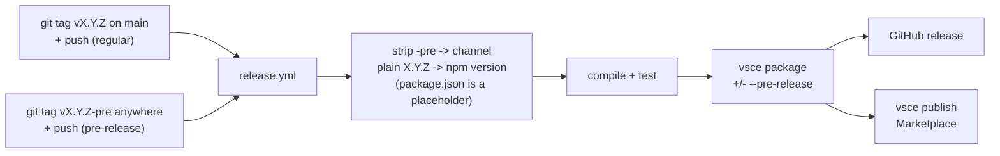

# Releasing Agent Worktrees

A release is cut by pushing a `vX.Y.Z` tag (or `vX.Y.Z-pre` for the pre-release
channel). That triggers
`.github/workflows/release.yml`, which sets the version from the tag, runs
`npm ci` + `npm run compile` + `npm test`, packages the `.vsix` (with
`MARKETPLACE.md` as the listing readme), creates a GitHub release with the
`agent-worktrees.vsix` asset, and publishes to the VS Code Marketplace when
`VSCE_PAT` is set.


```mermaid
flowchart LR
  A["git tag vX.Y.Z on main<br/>+ push (regular)"] --> B[release.yml]
  M["git tag vX.Y.Z-pre anywhere<br/>+ push (pre-release)"] --> B
  B --> C["strip -pre -> channel<br/>plain X.Y.Z -> npm version<br/>(package.json is a placeholder)"]
  C --> D[compile + test]
  D --> E["vsce package<br/>+/- --pre-release"]
  E --> F[GitHub release]
  E --> G["vsce publish<br/>Marketplace"]
```

## The version lives in the git tag, not package.json

The tag is the single source of truth; the workflow injects it into
`package.json` at build time. The committed `package.json` `version` is a stale
placeholder (it has sat at `0.0.1`). **Never** read the next version from
`package.json`, and never hand-edit it to "bump". The human-readable version
history is `CHANGELOG.md` (e.g. the latest section is the current released
version).

## Regular vs pre-release channel (the tag's suffix)

The channel is the tag's suffix. The version itself is plain `X.Y.Z` either way
and says nothing about the channel:

- **Regular release** -> tag the merge commit **on `main`** with `vX.Y.Z` and
  push it.
- **Pre-release** -> tag the commit to preview - a PR branch head is fine, that
  is what the channel is for - with `vX.Y.Z-pre` and push it. It publishes
  version `X.Y.Z` to the pre-release channel; the suffix names the tag, not the
  build, and never reaches the manifest. Publishing any pre-release is what
  makes the "Switch to Pre-Release Version" button show on the listing; users
  opt in per-install.

`-pre` is the only suffix a tag may carry. The Marketplace rejects semver
prerelease versions outright (`4.5.0-rc.1` cannot be published), which is why
the suffix is stripped before the version is set rather than passed through.

Both tag pushes run the same workflow. The manual run (Actions -> **Release** ->
**Run workflow**) takes the channel as a dropdown input instead, and tags the
chosen ref for you.

### One number line, so a version is spent once

This replaced a scheme where the minor's **parity** picked the channel (odd =
pre-release, even = regular). That is what the VS Code docs recommend, but
nothing enforces it - `vsce` validates only that the version is valid semver
with no prerelease suffix - and it cost every stable minor a skipped number to
reserve a line that mostly went unused.

What the parity bought was that the channels shared no version numbers. They
share one now, and **a version can only be published once, in either channel**:

> Preview `4.5.0` as `v4.5.0-pre`, and the stable release of that work is
> `4.5.1`, not `4.5.0`.

The workflow checks for the other tag form before it publishes anything and
fails with that explanation, so the mistake costs a red run rather than a
half-finished release.

## Steps

1. **Find the latest version.** Check both the tags and the changelog; use the
   higher if they disagree.

   ```sh
   git fetch --tags
   git tag --sort=-v:refname | head -3        # newest tags
   gh release list -L 3                        # cross-check published latest
   head -8 CHANGELOG.md                        # latest documented version
   ```

2. **Compute the next version** from that latest version. Plain `X.Y.Z`, higher
   than the last release, and nothing else is reserved:
   - patch: bump Z (`v4.4.31` -> `v4.4.32`) - bug fixes, packaging, docs, screenshots
   - minor: bump Y, reset Z (`v4.4.32` -> `v4.5.0`) - new features
   - major: bump X (`v4.5.0` -> `v5.0.0`) - breaking changes

   The same numbers serve both channels; the tag's `-pre` suffix is what picks
   one. Since a version is only publishable once, a preview spends it: after
   `v4.5.0-pre`, the stable release of that work is `v4.5.1`.

   **Z is a number, not a digit.** It keeps counting past 9 - `v4.4.9` ->
   `v4.4.10` -> `v4.4.31` -> `v4.4.1001` - and reaching two or four figures is
   never a reason to bump the minor. The minor means "new features"; a long run
   of bug fixes is still a run of bug fixes, and rolling it over would burn a
   feature version on nothing. `release.yml` takes any `X.Y.Z` of plain numbers,
   so nothing in the pipeline cares how long Z is.

   Sorting is the one thing that does. `git tag --sort=-v:refname` in step 1 is
   a *version* sort and puts `v4.4.10` above `v4.4.9`; a lexical one
   (`git tag | sort -r`, or eyeballing an alphabetical list) puts `v4.4.9` on
   top, which would have you compute the next version from an already-released
   tag and try to cut `v4.4.10` twice. Keep the `-v:refname`.

   Confirm neither tag form already exists, since either one spends the version
   (`git tag | grep -Ex 'vX\.Y\.Z(-pre)?'` returns nothing). The workflow checks
   this too and fails the run before publishing anything.

3. **Regular releases only: land the changes and a CHANGELOG entry on `main`
   first.** The workflow builds the commit at the tag, so everything must
   already be merged to `origin/main`. Add a `## X.Y.Z` section at the top of
   `CHANGELOG.md` (match the existing style: bold lead-in, `-` separators, no
   em dashes, no emojis) and keep `README.md` (mechanism) + `MARKETPLACE.md`
   (user-facing) in sync per the project CLAUDE.md. Regenerate screenshots if
   `panel.js`/`panel.css` changed. A pre-release skips this: it may be tagged
   on a PR branch head to preview unmerged work, and its changelog entry is
   the upcoming stable section on that branch. Verify locally either way:

   ```sh
   npm run compile && npm test
   ```

4. **Publish by pushing the tag.**

   - **Regular release** - tag the merge commit on main and push:

     ```sh
     git checkout main && git pull
     git tag -a vX.Y.Z -m vX.Y.Z
     git push origin vX.Y.Z
     ```

   - **Pre-release** - tag the commit to preview (a PR branch head is fine) with
     the `-pre` suffix and push. It publishes version `X.Y.Z`:

     ```sh
     git tag -a vX.Y.Z-pre -m vX.Y.Z-pre <commit>
     git push origin vX.Y.Z-pre
     ```

5. **Watch the workflow and confirm it published.**

   ```sh
   gh run watch "$(gh run list --workflow=release.yml -L1 --json databaseId -q '.[0].databaseId')" --exit-status
   gh release view vX.Y.Z --json tagName,isPrerelease,assets -q '{tag:.tagName, prerelease:.isPrerelease, assets:[.assets[].name]}'
   ```

   (`vX.Y.Z-pre` for a pre-release; `isPrerelease` should be `true` for it and
   `false` for a regular release.)

   A healthy run shows the `Publish to VS Code Marketplace` step green and an
   `agent-worktrees.vsix` asset on the release. If `VSCE_PAT` is unset the
   Marketplace step is skipped but the GitHub release + `.vsix` are still
   produced.

## Notes

- `images/` and `screenshots/` are excluded from the packaged `.vsix`; the
  Marketplace listing loads PNGs from raw GitHub URLs, so the release does not
  bundle them. Those URLs point at `main` in the repo, and the workflow rewrites
  them to the release's tag in the working tree just before `vsce package` (never
  committing that), so a published listing keeps the screenshots of the build it
  is selling rather than tracking main. The step **fails the release** if it finds
  no `/agent-worktrees/main/images/` URLs to rewrite - if you reshape those URLs
  in `MARKETPLACE.md`, update the step with them.
- Tagging via the manual workflow uses `GITHUB_TOKEN`, which does not re-trigger
  the push-tag run - that is intentional, not a failure.
