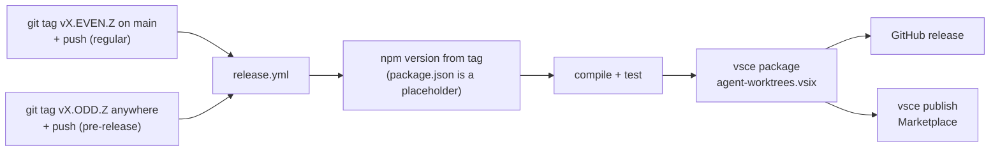

# Releasing Agent Worktrees

A release is cut by pushing a `vX.Y.Z` tag. That triggers
`.github/workflows/release.yml`, which sets the version from the tag, runs
`npm ci` + `npm run compile` + `npm test`, packages the `.vsix` (with
`MARKETPLACE.md` as the listing readme), creates a GitHub release with the
`agent-worktrees.vsix` asset, and publishes to the VS Code Marketplace when
`VSCE_PAT` is set.


```mermaid
flowchart LR
  A["git tag vX.EVEN.Z on main<br/>+ push (regular)"] --> B[release.yml]
  M["git tag vX.ODD.Z anywhere<br/>+ push (pre-release)"] --> B
  B --> C["npm version from tag<br/>(package.json is a placeholder)"]
  C --> D[compile + test]
  D --> E["vsce package<br/>agent-worktrees.vsix"]
  E --> F[GitHub release]
  E --> G["vsce publish<br/>Marketplace"]
```

## The version lives in the git tag, not package.json

The tag is the single source of truth; the workflow injects it into
`package.json` at build time. The committed `package.json` `version` is a stale
placeholder (it has sat at `0.0.1`). **Never** read the next version from
`package.json`, and never hand-edit it to "bump". The human-readable version
history is `CHANGELOG.md` (e.g. the latest section is the current released
version).

## Regular vs pre-release channel (the minor's parity)

The channel is encoded in the version number, the convention the VS Code
publishing docs recommend: an **odd minor** is a pre-release (`3.9.x`), an
**even minor** is a regular release (`3.8.x`, `4.0.0`). The Marketplace rejects
semver suffixes (`-pre.1`, `-rc.2`, dates), so the parity is the only standard
way to keep the two channels' version lines apart - the workflow refuses a
suffixed tag with that explanation. Versions still only ever increment; the
convention starts at 3.9/4.0 (older tags predate it).

- **Regular release** -> tag the merge commit **on `main`** with the next even
  minor `vX.Y.Z` and push the tag.
- **Pre-release** -> tag the commit to preview - a PR branch head is fine, that
  is what the channel is for - with the next `vX.ODD.Z` *below* the upcoming
  stable (previews of `4.0.0` are `3.9.0`, `3.9.1`, ...) and push the tag. Each
  build bumps the odd line's patch. Publishing any pre-release is what makes
  the "Switch to Pre-Release Version" button show on the listing; users opt in
  per-install.

Both tag pushes run the same workflow; it derives the channel from the minor.
The manual run (Actions -> **Release** -> **Run workflow**) publishes the same
way from a typed version, and tags the chosen ref for you.

## Steps

1. **Find the latest version.** Check both the tags and the changelog; use the
   higher if they disagree.

   ```sh
   git fetch --tags
   git tag --sort=-v:refname | head -3        # newest tags
   gh release list -L 3                        # cross-check published latest
   head -8 CHANGELOG.md                        # latest documented version
   ```

2. **Compute the next version** from that latest version (plain numbers, no
   suffix - the workflow rejects one):
   - **Regular release** (even minor):
     - patch: bump Z (`v2.2.0` -> `v2.2.1`) - bug fixes, packaging, docs, screenshots
     - minor: bump Y by TWO, reset Z (`v2.2.1` -> `v2.4.0`) - new features (the
       odd minor between them is the pre-release line)
     - major: bump X (`v2.2.0` -> `v3.0.0`) - breaking changes
   - **Pre-release** (odd minor): the odd line just below the upcoming stable,
     next free patch - previews of `4.0.0` are `v3.9.0`, `v3.9.1`, ...

   **Z is a number, not a digit.** It keeps counting past 9 - `v4.4.9` ->
   `v4.4.10` -> `v4.4.11` -> `v4.4.12` - and reaching two figures is never a
   reason to bump the minor. The minor means "new features" and moves by two to
   keep the channels apart; a long run of bug fixes is still a run of bug fixes,
   and rolling it over would burn a feature version on nothing and skip the
   pre-release line in between. Same on the odd line: `v3.9.9` is followed by
   `v3.9.10`. `release.yml` takes any `X.Y.Z` of plain numbers, so nothing in
   the pipeline cares how long Z is.

   Sorting is the one thing that does. `git tag --sort=-v:refname` in step 1 is
   a *version* sort and puts `v4.4.10` above `v4.4.9`; a lexical one
   (`git tag | sort -r`, or eyeballing an alphabetical list) puts `v4.4.9` on
   top, which would have you compute the next version from an already-released
   tag and try to cut `v4.4.10` twice. Keep the `-v:refname`.

   Confirm it does not already exist (`git tag | grep -x vX.Y.Z` returns
   nothing).

3. **Regular releases only: land the changes and a CHANGELOG entry on `main`
   first.** The workflow builds the commit at the tag, so everything must
   already be merged to `origin/main`. Add a `## X.Y.Z` section at the top of
   `CHANGELOG.md` (match the existing style: bold lead-in, `-` separators, no
   em dashes, no emojis) and keep `README.md` (mechanism) + `MARKETPLACE.md`
   (user-facing) in sync per the project CLAUDE.md. Regenerate screenshots if
   `panel.js`/`panel.css` changed. A pre-release skips this: it may be tagged
   on a PR branch head to preview unmerged work, and its changelog entry is
   the upcoming stable section on that branch. Verify locally either way:

   ```sh
   npm run compile && npm test
   ```

4. **Publish by pushing the tag.**

   - **Regular release** - tag the merge commit on main and push:

     ```sh
     git checkout main && git pull
     git tag -a vX.Y.Z -m vX.Y.Z
     git push origin vX.Y.Z
     ```

   - **Pre-release** - tag the commit to preview (a PR branch head is fine)
     with the odd-minor version and push:

     ```sh
     git tag -a vX.Y.Z -m vX.Y.Z <commit>
     git push origin vX.Y.Z
     ```

5. **Watch the workflow and confirm it published.**

   ```sh
   gh run watch "$(gh run list --workflow=release.yml -L1 --json databaseId -q '.[0].databaseId')" --exit-status
   gh release view vX.Y.Z --json tagName,isPrerelease,assets -q '{tag:.tagName, prerelease:.isPrerelease, assets:[.assets[].name]}'
   ```

   A healthy run shows the `Publish to VS Code Marketplace` step green and an
   `agent-worktrees.vsix` asset on the release. If `VSCE_PAT` is unset the
   Marketplace step is skipped but the GitHub release + `.vsix` are still
   produced.

## Notes

- `images/` and `screenshots/` are excluded from the packaged `.vsix`; the
  Marketplace listing loads PNGs from raw GitHub URLs, so the release does not
  bundle them. Those URLs point at `main` in the repo, and the workflow rewrites
  them to the release's tag in the working tree just before `vsce package` (never
  committing that), so a published listing keeps the screenshots of the build it
  is selling rather than tracking main. The step **fails the release** if it finds
  no `/agent-worktrees/main/images/` URLs to rewrite - if you reshape those URLs
  in `MARKETPLACE.md`, update the step with them.
- Tagging via the manual workflow uses `GITHUB_TOKEN`, which does not re-trigger
  the push-tag run - that is intentional, not a failure.
