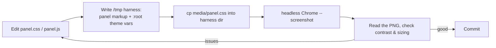

# Agent Worktrees - project notes

VS Code extension that shows git worktrees, their git/PR status, and the Claude
agents running in each. The panel UI is a webview:

- `media/panel.js` - renders all markup (no framework; string templates + an
  `icons` map of inline SVGs).
- `media/panel.css` - all styling. Colors come from `--vscode-*` theme tokens
  so the panel matches the user's editor theme.
- `src/` - the extension host (TypeScript): git, GitHub PR polling, the webview
  provider. `npm run compile` typechecks/builds.

## Documentation

There are two user-facing docs and a feature/UX change usually needs **both**
updated:

- `README.md` - development-focused. The repo landing page: architecture, how the
  hook/emitter pipeline works, how to build and contribute. Describe features in
  terms of how they work.
- `MARKETPLACE.md` - usage-focused. The VS Code Marketplace listing the user
  reads before installing. Describe features in terms of what the user gets,
  with no build/internals detail.

When a feature is added, removed, or changed, check both: README for the
mechanism, MARKETPLACE for the user-facing capability. Don't update one and
leave the other stale.

## Marketplace screenshots (Playwright)

`screenshots/` holds a Playwright suite that renders the **real** webview UI
(`media/panel.js` + `media/panel.css`) in a browser with fake data and writes
the listing images to `images/`, referenced from `MARKETPLACE.md`.

```
npm run screenshots      # regenerate images/*.png
```

Important: this does **not** launch the VS Code extension host. It stubs
`acquireVsCodeApi`, mounts `#root`, loads the actual panel JS/CSS, and drives it
through the same `postMessage` "update" path the extension uses (see
`screenshots/fixtures.js`). That keeps the images faithful to the current UI
while staying fast and host-free. Re-run after any `panel.js` / `panel.css`
change so the marketplace listing stays current. `images/` and `screenshots/`
are excluded from the packaged `.vsix`; the listing loads the PNGs from raw
GitHub URLs.

## Validating accessibility / contrast

The webview styling can't be eyeballed from the source alone, and we do **not**
spin up the real VS Code extension (no extension-host runs) just to check
visuals. Two host-free options, both rendering `panel.css` against VS Code theme
tokens: reuse the Playwright harness above, or a throwaway static HTML harness
screenshotted with headless Chrome.



### Recipe

1. Create a temp dir, e.g. `/tmp/awt-preview/`.
2. Write an `index.html` that:
   - `<link>`s `panel.css`,
   - defines a `:root` block setting the `--vscode-*` variables to a known
     theme (VS Code **Dark+** values - foreground `#cccccc`,
     descriptionForeground `#9d9d9d`, editor bg `#1e1e1e`, button bg `#0e639c`,
     charts green/yellow/red `#89d185` / `#cca700` / `#f14c4c`, etc.). Without
     these the panel falls back to the few hardcoded fallbacks and looks wrong.
   - reproduces the relevant markup (`.card`, `.gitline`, `.prline`,
     `.agent-row`, settings view, ...) matching what `panel.js` emits.
3. `cp media/panel.css <dir>/panel.css`.
4. Render and screenshot:
   ```
   "/Applications/Google Chrome.app/Contents/MacOS/Google Chrome" \
     --headless --disable-gpu --force-device-scale-factor=2 \
     --window-size=380,560 --screenshot=<dir>/shot.png <dir>/index.html
   ```
5. Read the PNG and judge contrast/legibility. Repeat against a **light** theme
   (foreground `#1f1f1f`, bg `#ffffff`) when a change could regress light mode.
6. Delete the temp dir when done.

This is for visual review only - it is not a committed test.

## Contrast / readability guidelines

- Prefer `--vscode-foreground` for primary text; reserve
  `--vscode-descriptionForeground` for genuinely secondary text. It is a low
  contrast gray - don't use it for small text that matters.
- Body/primary text >= 12px; the smallest secondary text (meta, badges) >= 11px.
  Avoid 10px.
- Badge fills that carry white text need a saturated/dark background. The
  `--vscode-charts-*` tokens are tuned light/pastel for chart lines and fail
  white-on-color contrast - use fixed dark fills for badges (see `.pr-state`,
  which uses GitHub's state colors).
- Chart-color tokens are fine for glyphs/dots/text on the dark code-block
  background (e.g. CI check counts), just not as a white-text badge fill.
- Keep icons monochrome via `currentColor` so they inherit and stay legible in
  both themes.

## Conventions

- Spaces, not tabs. No em dashes or emojis in UI copy.
- Don't commit unless asked.
