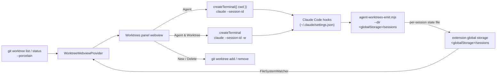
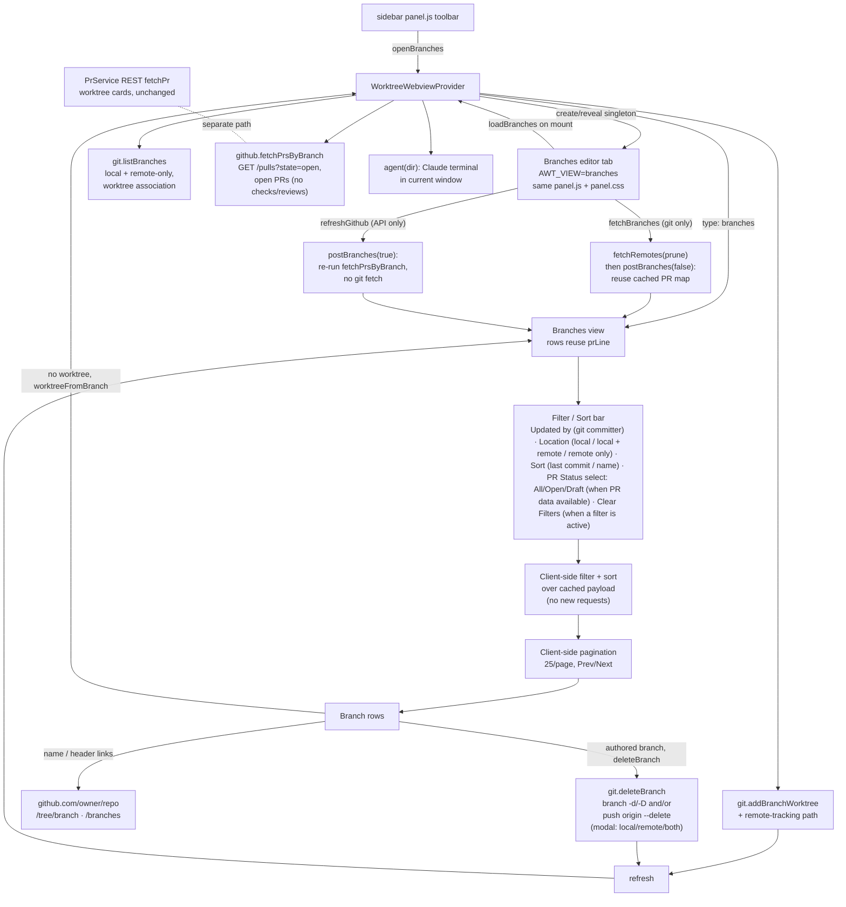

# Agent Worktrees

A VS Code side panel for running and monitoring multiple Claude Code agents
across the git worktrees of a repository. Spin up a Claude session in any
worktree, watch each one go **active**, **waiting**, or **idle** at a glance, and
manage the worktrees themselves without leaving the panel.

## Why

Worktrees are the natural unit for running several agents in parallel: each gets
an isolated checkout, so they never step on each other's files. But coordinating
them means juggling terminals and `git worktree` commands by hand, with no single
place to see which agent needs you. This panel puts every worktree, its git
state, and its running agents in one view.

## Screenshots

<sub>Click any thumbnail to view it full size.</sub>

| Worktrees, git status & agents | PR checks, review & comments | Settings & integrations | Skills used per agent |
| :---: | :---: | :---: | :---: |
| [](https://raw.githubusercontent.com/BradenTerry/agent-worktrees/main/images/overview.png) | [](https://raw.githubusercontent.com/BradenTerry/agent-worktrees/main/images/pr-status.png) | [](https://raw.githubusercontent.com/BradenTerry/agent-worktrees/main/images/settings.png) | [](https://raw.githubusercontent.com/BradenTerry/agent-worktrees/main/images/skills.png) |

## Features

- **Worktrees panel** (webview) listing every worktree (primary + linked), with
  branch name and badges for `Primary` / `detached` / `locked`.
- **Per-worktree git status** — a clean/changed count, `+`/`−` line totals, and
  the ahead/behind distance from the upstream branch, refreshed as files change.
  A per-card **refresh** button re-reads that one worktree's git status (and its
  PR/CI when the GitHub integration is on) on demand, without a `git fetch`.
- **GitHub PR status** — when a stored token resolves a PR for the branch, the
  card shows the PR title (wrapping when long), then its lifecycle state, CI
  check rollup, review decision and comment counts (polled from the REST API in
  `src/github.ts` / `src/prs.ts`). Two
  merge-readiness pills sit beside the state badge: `Out of date` when GitHub's
  `mergeable_state` is `behind` ("This branch is out-of-date with the base
  branch"), and `Auto-merge` when auto-merge is enabled on the PR.
- **Agent** — start one or more Claude CLI sessions in a worktree, each in its
  own terminal. Sessions can be revealed (focus) or stopped from the panel, and
  closing a terminal removes its row.
- **Agent & Worktree** — create a new worktree with Claude (`claude -w`) and
  start an agent in it in a single step.
- **Open in new window** — open any worktree in its own VS Code window from the
  card header. If a window for that worktree is already open, VS Code focuses it
  instead of duplicating (the focus behavior uses the `code` CLI when it is on
  `PATH`; otherwise a fresh window is always opened).
- **Change branch** — an edit button beside the branch name opens a quick pick of
  the branches that can be checked out in that worktree (every local/remote branch
  except the one already there and any held by another worktree, since git allows a
  branch in only one worktree at a time), plus a **Create new branch** entry that
  prompts for a name and branches off the worktree's current HEAD. The switch runs
  `git switch` in that worktree only (`git switch -c` when creating), so the other
  worktrees stay put; git's own error (a checkout conflict, say) is surfaced
  verbatim.
- **Delete Worktree** — `git worktree remove` behind a single confirmation. The
  modal gathers everything upfront — agents that will be stopped, uncommitted
  changes that will be discarded, the branch left behind and its unpushed commit
  count — and offers **Remove** or **Remove and Delete Branch** (never the
  default branch). Because the consequences were disclosed, no follow-up prompts:
  a dirty or locked worktree is force-removed (passing `--force` twice, as git
  requires for locked trees), and the branch delete forces past "not fully
  merged" when the unpushed commits were already shown. The only second prompt
  is the rare case where git refuses a delete the modal claimed was loss-free.
- **Stale lock cleanup** — `claude -w` locks the worktree it creates for the
  lifetime of the session ("claude session ... (pid ... start ...)"), and a
  crashed or killed session leaves that lock behind: a `locked` badge with no
  agents, and a worktree `git worktree remove` refuses to delete. On refresh
  (and before a delete) the panel unlocks any worktree whose lock reason names
  a claude pid that is no longer running. Locks with any other reason, or with
  a live pid, are never touched.
- **Skills used** — each agent row shows a chip with the count of Claude skills
  it has invoked; click it for the full list.
- **Subagents used** — a robot glyph with a count tracks how many subagents each
  agent has spawned (every `Task` tool call is one subagent). The Agents bar sums
  it across the worktree; each agent row shows its own.
- **Collapsible agent lists** with per-status counts, so a card reads at a glance
  and expands to the individual sessions on demand.
- **Branches view** — a toolbar button opens a dedicated editor tab listing every
  branch (local plus remote-only `origin/*`). Each row shows whether a worktree
  already exists, ahead/behind vs the branch's base, a
  **Delete Local** action (any local branch; it removes the local ref only and
  never touches the remote), and — for branches without a worktree — a **Create
  worktree & start
  agent** action that creates the worktree in the current window and launches a
  Claude agent. A header **Fetch** button with a **Prune** toggle pulls from the
  remote to refresh local branch state (git only), and a **Delete gone** button
  bulk-deletes every local branch whose upstream is gone (merged or deleted on
  the remote). The view is **git-first**: each row carries a "last updated" line
  (the tip commit's committer date as a relative time, and who made it), and the
  client-side controls are an **Updated by** user filter (the committers of the
  listed branches), a **Location** multi-select (local only / local + remote /
  remote only) and a **Sort** by most/least recently updated or name — all
  derived from git, so they work with or without a token. When a GitHub token is
  stored, PR/CI status is refreshed automatically when the tab opens (the
  **Fetch Open PRs** button spins until it lands) and can be re-polled on demand
  from that button, decoupled from the git fetch, which stays manual; a **PR
  Status** single-select then appears that narrows the list by PR state — **All**
  (no filter), **Open**, or **Draft** — alongside a **Reviewer** single-select
  that narrows to branches whose PR has a review requested from one or more
  person (**All** or **Review requested**). A **Clear Filters** button resets the
  author, Location, PR Status and Reviewer filters (enabled only while one is
  active). A branch's
  **open** (or draft) PR rollup is shown when one exists, as a hint on the branch
  row — a dedicated PR view may come later.

## Agent status from hooks

The panel cannot tell on its own whether a Claude session is working, waiting on
you, or idle. Claude Code's [hooks](https://docs.claude.com/en/docs/claude-code/hooks)
fire exactly on those transitions, so the extension installs one small emitter
script wired to a handful of events. The events map to a status shown in the
panel:

| Hook                                              | Status            |
| ------------------------------------------------- | ----------------- |
| `SessionStart`, `Stop`                            | idle              |
| `UserPromptSubmit`, `PreToolUse`, `PostToolUse`   | active            |
| `Notification` (permission / question)            | waiting           |
| `SessionEnd`                                       | removed from panel |

Installing the hooks edits your global `~/.claude/settings.json`, so it is always
gated behind **explicit consent** in the panel — nothing is written until you
accept. On accept, the bundled `hooks/agent-worktrees-emit.mjs` is copied into
the extension's global storage and wired into settings (the command passes the
state directory to the emitter via `--dir`, since that separate process can't
read the extension's context).

Each hook event runs the emitter, which derives the session's worktree from git
and writes one small state file per session into the extension's **global
storage** (atomically, via tmp + rename, so the watcher never reads a
half-written file). The worktree/branch resolution is cached in that state file
keyed by the session's `cwd`: `PreToolUse` fires on every tool call and Claude
Code blocks the tool until the hook exits, so follow-up events reuse the cached
value instead of spawning `git rev-parse` twice per event — on Windows, where
process spawns are expensive, that cache is the difference between hooks being
free and every tool call paying a visible startup tax. `SessionStart`
re-resolves from git. When the extension launched the agent it passes `claude
--session-id <uuid>` and stamps that same uuid into the terminal env as
`AGENT_WORKTREES_SID`; the emitter (a child of the Claude process) inherits it
and keys the state file by it rather than by Claude's live `session_id`. That id
is stable across `/resume` (Claude's own `session_id` changes, but the launch id
in the terminal env and the process argv does not), so the panel row, its
terminal handle, and `pkill -f <id>` stay linked after a resume instead of
orphaning the row. Sessions not launched by the extension fall back to the live
`session_id`. The files land in `<globalStorage>/sessions/` (e.g.
`~/Library/Application Support/Code/User/globalStorage/bradenterry.agent-worktrees/`
on macOS). The extension watches that directory and groups the sessions by
worktree. **Nothing is sent over the network** — status flows entirely through
local files, and nothing of the extension's lives in your `~/.claude` tree apart
from the hook entries in `settings.json`. Status reporting needs `node` on
`PATH`.

## Requirements

- The [Claude Code CLI](https://docs.claude.com/en/docs/claude-code) (`claude`)
  on your `PATH`.
- `git` and `node` on your `PATH`.
- A workspace whose first folder is inside a git repository.

## Develop

```bash
npm install
npm run compile     # or: npm run watch
```

Press `F5` (Run Extension) to launch an Extension Development Host. Open a folder
that is a git repository (with worktrees) to populate the panel.

### Tests

Two layers, both run on the `ubuntu`/`macos`/`windows` CI matrix
(`.github/workflows/ci.yml`):

```bash
npm test              # fast: node --test over test/**/*.test.js (pure git/util logic)
npm run test:integration   # real VS Code extension host (@vscode/test-electron)
```

`npm test` exercises the pure logic against the real `git` CLI and never needs
VS Code. `npm run test:integration` downloads a real VS Code, launches the
extension host, and runs `src/test/integration/**` (compiled to `out/test/`) with
the `vscode` API available — this is what gives **real Windows coverage** of the
parts the unit suite can't reach (activation, commands, the built-in Git
extension API), which is where the Windows-only panel failures lived. On a
headless Linux box it needs a display (`xvfb-run -a npm run test:integration`).

## Architecture



### Refresh coalescing

The panel refreshes on a few discrete signals: extension load, the manual Refresh
button, the session-state `FileSystemWatcher` (one event per Claude hook firing,
which also surfaces an agent creating a new worktree), window focus, and
source-control scope changes. Each refresh spawns `git status` for every worktree
(plus a `git diff --numstat HEAD` only for worktrees with tracked changes — a
clean worktree skips it, halving its per-worktree spawns), so reacting to every
raw event would peg the CPU - and noticeably worse on Windows, where every process
spawn is far more expensive than on macOS. The per-worktree statuses run at most
4 at a time (`mapLimit`) so a many-worktree repo never fires an unbounded spawn
burst, and a refresh only re-reads the Branches tab while that tab is actually
visible — hidden behind another editor it skips the (git-heavy) branch listing
and catches up when revealed.

Deliberately absent is a workspace-wide `**/*` file watcher. Refreshing on every
saved file is overkill, and because our own `git status` opportunistically
rewrites `.git/index`, watching the tree fed git's writes straight back into
another refresh — a perpetual loop that respawned git for every worktree several
times a second even while idle. The git line is recomputed on the discrete
signals above instead; read-only git also runs with `GIT_OPTIONAL_LOCKS=0` so it
never churns the user's index.

These signals funnel through a `Coalescer` (`src/scheduler.ts`): a trailing
debounce (`REFRESH_DEBOUNCE_MS`, 500ms) that collapses a burst into one refresh,
with a `maxDelay` cap so a *continuous* stream (a build writing files, an agent
streaming tool events) still flushes at a bounded rate instead of starving, and
in-flight coalescing so an async refresh never overlaps itself - triggers that
arrive mid-refresh fold into a single follow-up. The session-state watcher pokes
a second `Coalescer` that nudges the (independently throttled) PR poller, so an
active agent's hook stream doesn't hit the GitHub API per event. The clock is
injectable, so the coalescing guarantees are unit-tested with virtual time in
`test/scheduler.test.js`.

### Branches view

The **Branches** toolbar button posts an `openBranches` message to the webview
provider, which opens (or reveals, if already open) a dedicated webview as an
editor tab in the active column, filling the editor area. It is a singleton: a
second click reveals the existing tab rather than duplicating it. The tab loads
the same `media/panel.js` + `media/panel.css` as the sidebar, switched into
branches mode by a `window.AWT_VIEW = "branches"` flag set in its HTML. On mount
the tab requests data with a `loadBranches` message.

On `loadBranches` the provider builds the branch data and posts it back to that
panel as a `{ type: "branches" }` payload:

- `git.listBranches` enumerates every local branch plus every remote-only
  `origin/*` branch (each shown once by short name) and annotates whether a
  worktree already holds it and whether a matching `origin/<name>` exists (so the
  row can tag itself "local only" / "local + remote" / "remote only"). It then
  enriches each branch with ahead/behind against its compare base — its upstream
  when configured, otherwise the repo's default branch (`origin/HEAD`).
  Ahead/behind comes from `%(upstream:track)` when there is an upstream and, for
  branches without one, from a single batched
  `git for-each-ref --format=%(ahead-behind:<default>)` call (git 2.41+) over all
  refs at once, falling back to a per-branch `git rev-list --left-right --count
  base...tip` only on older git or when a branch compares to its own
  `origin/<name>` (a per-branch base that cannot be expressed against a single
  committish). The branch rows deliberately do **not** show a +/- line diff: that
  needed one `git diff` process per branch (git has no batch form), which was the
  main cost on large repos, and the commit ahead/behind is the more useful
  signal. The per-branch ahead/behind calls run with bounded concurrency so a
  many-branch repo doesn't spawn a process per branch at once, and any per-branch
  failure leaves that branch's counts at zero. The same `for-each-ref` calls also
  read each branch's tip-commit `committerdate`, `committername` and
  `committeremail` (one extra field per record, no extra git process), which give
  the row its "last updated" time and the **Updated by** user filter — the
  git-native signal the view sorts and filters on. Every git call goes through
  `execFile` (argument arrays, no shell), so there is no per-call `cmd.exe`/`sh`
  wrapper — on Windows that roughly halves the process count for a branch listing
  and avoids shell-specific `--format` quoting. Each git call also has a timeout
  so a wedged invocation cannot hang the view, and git activity plus a per-load
  timing summary (branch count and ahead/behind call counts) is logged to the
  "Agent Worktrees" output channel — wired via `setGitLogger` so `git.ts` keeps
  no dependency on the vscode API. The for-each-ref parsing is split into pure
  `parseLocalBranchRefs` / `parseRemoteBranchRefs` helpers (unit-tested, CRLF-safe).
  If listing fails the error is surfaced in the view, not swallowed into an empty
  list.
- The optional `Agent Worktrees: Trace` setting turns on verbose tracing of every
  external call. It is surfaced in the panel under **Settings → Debug** (a
  toggle plus an **Open log** button), and is also flipped by the "Toggle Debug
  Tracing" command; both write the same `agentWorktrees.trace` config, which the
  host's `onDidChangeConfiguration` handler re-applies. `git.ts` and `github.ts`
  each take an injected tracer
  (`setGitTracer` / `setGithubTracer`) wired by the extension host to the
  diagnostics channel, so both modules stay free of a *runtime* vscode dependency
  (their `vscode` imports are type-only and elided, which is what lets the unit
  tests load them without a vscode stub). Each git invocation and each GitHub
  `fetch` is logged with its command/URL, duration, and result; request headers
  (which carry the token) are never logged. Off by default, zero overhead when
  off (the tracer is null, so no trace strings are built).
- The git-only branch list paints first, so the tab is responsive immediately,
  then PR data is fetched in the background: when the PR integration is enabled
  with a token connected, opening the tab kicks off a GitHub refresh on load (the
  **Fetch Open PRs** button spins until it lands) and that button re-polls on
  demand afterwards. The git fetch is **not** run on open — it stays the manual
  **Fetch** button. With no token the view stays git-only and never calls the API.
- When that fetch runs (on open or on demand) and the PR integration is enabled
  with a token connected, `github.fetchPrsByBranch` lists the repo's **open** PRs
  with a single REST `GET /repos/{owner}/{repo}/pulls?state=open` (paged from
  most-recently-updated, so one call for the common case, no per-PR follow-ups).
  Open-only on purpose: the view only renders open/draft PRs, and a repo carries
  far more closed/merged PRs than live branches, so `state=all` used to page
  through up to ~1000 historical PRs to surface a handful of open ones. It returns
  those PRs with the fields the list endpoint carries — state, author, assignees,
  requested reviewers and auto-merge. The list endpoint has **no** CI-check,
  review-decision or comment data, so those badges are left empty in the branches
  view; pulling them would require a per-PR follow-up the bulk path deliberately
  skips. The result is mapped to branches by head ref client-side, and the fetch
  time is surfaced as the header's **Last refreshed** label. A failure degrades
  the whole view to "no PR data"; rows still render, and the failure reason
  (`fetchPrsByBranch` returns an `error`) plus a "fetched N PRs, matched M
  branches" tally are logged to the "Agent Worktrees" output channel. Because the
  bulk list is a plain `GET /pulls`, a fine-grained PAT only needs
  **Pull requests: Read** — the previous GraphQL path failed with "Resource not
  accessible by personal access token" on tokens denied GraphQL, which this
  avoids.

The bulk-list path is used **only** by the branches view. The per-worktree PR
badges on the cards keep the existing per-branch REST `fetchPr` path (which does
fetch each PR's checks and reviews) unchanged, so the two are separate code
paths — and the cards still show CI checks and review status that the branches
view does not.

The view is git-first, so its **Updated by** and **Location** filters and
**Sort** are git-based and run entirely client-side over the cached payload —
changing any of them issues no network request, and all work with no token at
all. The **Updated by** filter is
a multi-select of the branches' tip-commit committers (`userOptions`, viewer
pinned first when a committer name matches the GitHub login); the **Location**
filter is a multi-select over where a branch lives — `Local only` /
`Local + remote` / `Remote only`, matching the tag each row displays
(`branchKind`), with an empty selection meaning no filter; the **Sort** is
single-select over `Recently updated` / `Least recently updated` (tip-commit
`committerdate`) and `Name (A–Z)`. Two **PR-aware** single-selects round out the
bar, each shown **only** when GitHub PR data is available (and ignored if their
persisted state is stale while the integration is off, so neither can blank the
list): **PR Status** narrows by PR state — `All` (no filter), `Open`, or `Draft`
(the fetch is open-only, so those are the only states it can match) — and
**Reviewer** narrows to branches whose PR has a review requested from the
signed-in user (`reviewRequestedFromViewer`), i.e. the PRs they still have to
review — `All` (no filter) or `Review requested`. A
**Clear Filters** button (right-aligned, `data-action="clearFilters"`) resets the
**Updated by**, **Location**, **PR Status** and **Reviewer** filters in one click
(Sort is an ordering, not a filter, so it is left alone); it is `disabled` unless
a filter is actually narrowing the list (`users.length > 0 ||
locations.length > 0 || (prStatus !== "all" && prAvailable) ||
(reviewer !== "all" && prAvailable)`), the same predicate
`visibleBranches` filters on. A
branch's open (or draft) PR rollup is rendered as a hint on its row when one
exists; the fetch is open-only, so merged/closed PRs are not loaded. Deleting a
squash-merged branch therefore falls back to git's "not fully merged" prompt
(one extra confirmation) rather than skipping it. The selected filters and sort
persist across reopens via the webview state.

A branch with no worktree shows a **Create worktree & start agent** action; one
that already has a worktree shows a **Worktree exists** marker plus a **Start
agent** action that posts an `agent` message to launch a Claude agent in that
existing worktree. Clicking create posts a `worktreeFromBranch` message; the
provider runs
`git.addBranchWorktree` (checking out an existing local branch, or creating a
local tracking branch for a remote-only branch), starts a Claude agent in it via
the existing `agent(dir)` flow in the current window, then refreshes the sidebar
and re-posts the branch data so the row flips to the marker.

Worktrees the extension creates (this action and the New Worktree command) are
placed inside the primary worktree at `.claude/worktrees/<branch>` — the same
location `claude -w` uses — rather than in the repo's parent directory
(`worktreeUtils.worktreeDirFor`). The extension never edits the repo's ignore
rules: exactly as with `claude -w`, the nested directory shows as an untracked
entry in `git status` unless the user excludes it themselves (one
`/.claude/worktrees/` line in `.git/info/exclude` or `.gitignore`).

**Deleting branches.** Delete is local-only: every branch with a local ref shows
a **Delete Local** action that removes the local branch and never touches the
remote. A remote-only branch has no local ref, so it shows no action. The repo's
default branch (origin/HEAD's short name, carried on each row as `isDefault`) is
never deletable: the row shows no Delete action and `deleteBranchAction` refuses
it server-side (via `defaultBranchName`) even if a crafted message asks. Clicking
it posts a `deleteBranch` message carrying the branch name and whether its PR is
`merged`.

Git refuses to delete a branch that is checked out in a worktree, so
`deleteBranchAction` inspects `listWorktrees` first. If the **primary** worktree
(this repo dir) is on the branch, the delete is blocked with a "switch away
first" message. If a **linked** worktree is on it, the delete is allowed but
guarded: a modal warns it will leave that worktree on a detached HEAD, and the
provider runs `detachWorktreeHead` (a `git checkout --detach` in that worktree)
to free the ref before deleting.

Before the delete it computes `unpushedCommitCount` — commits not on the branch's
upstream, or (with no upstream) not on the default branch — and, when non-zero
and the PR is not flagged merged, surfaces the count in a confirm (a second modal
in the linked-worktree path) and force-deletes on consent. When a branch still
carries a known-merged PR the row passes a `merged` flag to skip the "not fully
merged" prompt — but the branches view now fetches **open** PRs only, so a
squash-merged branch usually arrives without that flag and instead hits the
fallback below. `git.deleteBranch` runs `git branch -d`/`-D`; an unmerged refusal
falls back to an explicit force prompt (one extra confirmation for the
squash-merge case). Both views refresh afterward so the row drops.

**Bulk "Delete gone".** The header **Delete gone** button posts `deleteGoneBranches`.
`git.goneBranches` reads `git for-each-ref ... %(upstream:track,nobracket)` and
returns the local branches whose track is `gone` (the upstream was deleted, what
`git branch -vv` shows as `[gone]`), so it reflects the last fetch; pair it with
**Prune** to register a just-deleted remote. `deleteGoneBranchesAction` drops the
default branch, skips any branch checked out in a worktree (it never bulk-detaches,
and reports the skipped count), lists the rest in one confirm, then deletes with
`-d`. Branches that refuse as "not fully merged" (squash-merges) are collected and
force-deleted only after a second, explicit confirm naming them.

**No delete flicker.** A delete triggers a refresh, but a routine refresh already
in flight may have started its `gatherBranches()` before the delete and resolve
*after* it, re-posting the deleted branch, which the next refresh then removes
again (the "branch flickers back, then gone" report). `postBranches` guards against
this with a monotonic `branchPostSeq`: each call claims the latest token before
awaiting git/GitHub and only posts if it is still the latest when it resolves, so a
stale gather can't clobber a newer render.

**GitHub links.** When `origin` is a github.com remote the provider attaches
`repoUrl` (`https://github.com/<owner>/<repo>`) to the payload. Each row links its
name to the branch tree (`/tree/<branch>`, each path segment encoded so slashes
survive), and the header carries a **Branches on GitHub** link to `/branches`.
These are plain `<a target="_blank">` anchors that VS Code opens externally — no
round-trip.

**Refresh and fetch.** `fetchRemotes(cwd, { prune })` runs `git fetch --all`
(with `--prune` unless disabled), so stale `refs/remotes/origin/*` (branches
deleted on the remote) are dropped and no longer surface as phantom "remote only"
/ "local + remote" rows. Opening the tab (`loadBranches`) posts the local list
immediately and **without** awaiting the GitHub token probe (`connection()`, a
network round trip that used to gate the first paint): it synthesizes a
`hasToken` connection from the local `getToken()` so the Fetch Open PRs button
still shows (flagged `githubRefreshing` when a token is present, so it spins),
then does the rest in the background — the real `connection()` probe, then (when
a token is connected) `postBranches(true)` for PR/CI status, then a background
`refresh(false)` for the sidebar. The background posts are awaited in sequence so
the slow GitHub post isn't dropped by the `branchPostSeq` staleness guard. No git
fetch runs on open; that stays the manual
**Fetch** button, which posts `fetchBranches` with the
**Prune** checkbox state; the provider fetches with the chosen prune setting, then
re-reads both views (without a second fetch) and re-posts the branches reusing the
cached PR map (`postBranches(false)`) — so the git fetch never hits the GitHub
API. The Prune choice is persisted in the webview state.

**GitHub refresh (on open and on demand).** PR/CI status is fetched by
`postBranches(true)` — the only path that runs `fetchPrsByBranch` and stamps
`branchPrsAt` — shown next to a **Last refreshed** label (the fetch time, or
**Never** before the first refresh) when a token is stored (`github.hasToken`).
Two things call it: opening the tab (`loadBranches`, see above) and the **Refresh
GitHub** button (`refreshGithub`) on demand. Every other path (the git Fetch,
watcher-driven refreshes, worktree/branch mutations) calls `postBranches(false)`
and reuses the cached PR map, so they re-render rows without touching the GitHub
API. The GitHub refresh stays the API-only counterpart to the git-only Fetch;
the two are independent so refreshing PR state never triggers a git fetch and
vice versa.

**Performance.** The webview only rebuilds the DOM when the posted payload
actually changed (it compares a JSON signature, mirroring the settings view's
`ghSig` guard), so a routine poll no longer wipes the list or resets the user's
scroll position; renders that do happen restore the `.brows` scroll offset. The
filtered list is paginated client-side (25 per page) with a Prev/Next pager, and
the page resets to the first whenever a filter or sort changes.

**In-progress buttons.** Buttons that kick off real git/network/window work
(`agent`, `agentWorktree`, `openWindow`, `openBranches`, `worktreeFromBranch`,
`fetchBranches`, `refreshGithub` — see `BUSY_ACTIONS` in `panel.js`) swap their
icon for a spinning ring and disable themselves on click (`markBusy`). The state
is transient DOM: the next `update`/`branches` payload re-renders the view with
the real icon restored, so it clears automatically when the work lands. A no-op
fetch that returns an unchanged payload re-renders only when a spinner is pending
(so background polls still skip the rebuild), and a 15s safety timeout restores
any button that never sees a re-render.



## Caveats

- The repository is located from the first workspace folder.
- Agent terminals are tracked in memory; after an extension-host reload the panel
  can still show and stop agents (by session id / working directory) but loses
  the terminal handle used to reveal them.
- The session list lives in global storage shared by every VS Code window, but
  terminal handles are per-window. So a window can show (and stop) an agent that
  another window launched, yet clicking it cannot reveal a terminal it does not
  own; the panel says so instead of silently doing nothing.
- A terminal closed without `/exit` never fires `SessionEnd`; its state file is
  pruned automatically once it is older than 24 hours.
</content>
