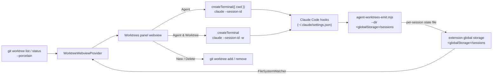
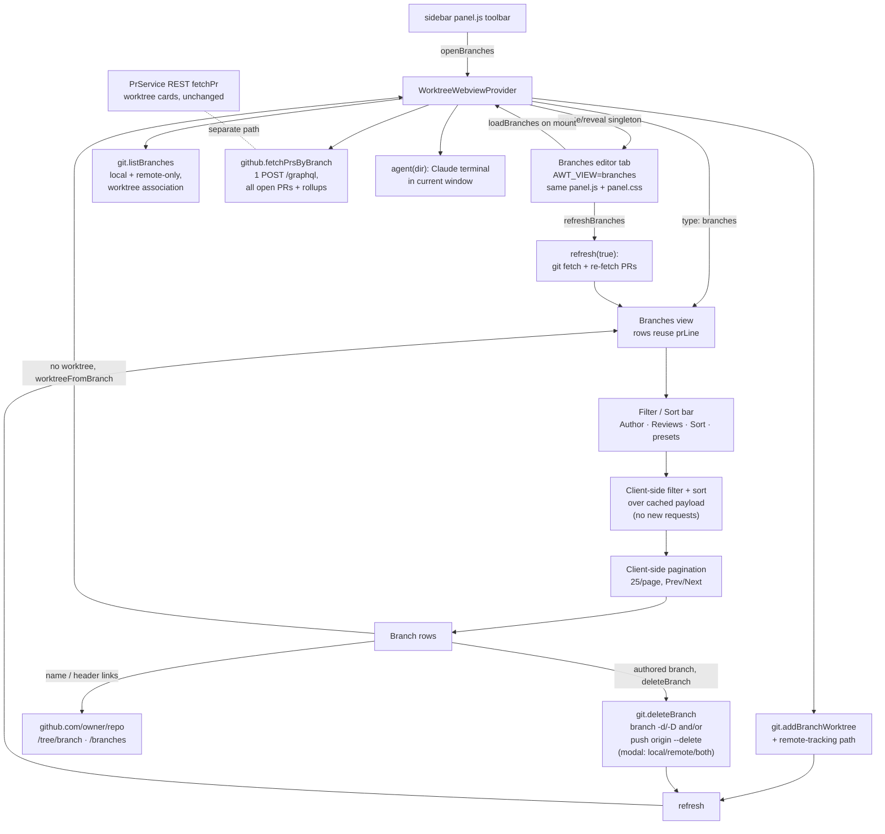

# Agent Worktrees

A VS Code side panel for running and monitoring multiple Claude Code agents
across the git worktrees of a repository. Spin up a Claude session in any
worktree, watch each one go **active**, **waiting**, or **idle** at a glance, and
manage the worktrees themselves without leaving the panel.

## Why

Worktrees are the natural unit for running several agents in parallel: each gets
an isolated checkout, so they never step on each other's files. But coordinating
them means juggling terminals and `git worktree` commands by hand, with no single
place to see which agent needs you. This panel puts every worktree, its git
state, and its running agents in one view.

## Screenshots

<sub>Click any thumbnail to view it full size.</sub>

| Worktrees, git status & agents | PR checks, review & comments | Settings & integrations | Skills used per agent |
| :---: | :---: | :---: | :---: |
| [](https://raw.githubusercontent.com/BradenTerry/agent-worktrees/main/images/overview.png) | [](https://raw.githubusercontent.com/BradenTerry/agent-worktrees/main/images/pr-status.png) | [](https://raw.githubusercontent.com/BradenTerry/agent-worktrees/main/images/settings.png) | [](https://raw.githubusercontent.com/BradenTerry/agent-worktrees/main/images/skills.png) |

## Features

- **Worktrees panel** (webview) listing every worktree (primary + linked), with
  branch name and badges for `Primary` / `detached` / `locked`.
- **Per-worktree git status** — a clean/changed count, `+`/`−` line totals, and
  the ahead/behind distance from the upstream branch, refreshed as files change.
- **GitHub PR status** — when a stored token resolves a PR for the branch, the
  card shows its lifecycle state, CI check rollup, review decision and comment
  counts (polled from the REST API in `src/github.ts` / `src/prs.ts`). Two
  merge-readiness pills sit beside the state badge: `Out of date` when GitHub's
  `mergeable_state` is `behind` ("This branch is out-of-date with the base
  branch"), and `Auto-merge` when auto-merge is enabled on the PR.
- **Agent** — start one or more Claude CLI sessions in a worktree, each in its
  own terminal. Sessions can be revealed (focus) or stopped from the panel, and
  closing a terminal removes its row.
- **Agent & Worktree** — create a new worktree with Claude (`claude -w`) and
  start an agent in it in a single step.
- **Open in new window** — open any worktree in its own VS Code window from the
  card header. If a window for that worktree is already open, VS Code focuses it
  instead of duplicating (the focus behavior uses the `code` CLI when it is on
  `PATH`; otherwise a fresh window is always opened).
- **Delete Worktree** — `git worktree remove` (offers `--force` when dirty, and
  stops any agents running in the worktree first).
- **Skills used** — each agent row shows a chip with the count of Claude skills
  it has invoked; click it for the full list.
- **Subagents used** — a robot glyph with a count tracks how many subagents each
  agent has spawned (every `Task` tool call is one subagent). The Agents bar sums
  it across the worktree; each agent row shows its own.
- **Collapsible agent lists** with per-status counts, so a card reads at a glance
  and expands to the individual sessions on demand.
- **Branches view** — a toolbar button opens a dedicated editor tab listing every
  branch (local plus remote-only `origin/*`). Each row shows whether a worktree
  already exists, and branches without one get a **Create worktree & start agent**
  action that creates the worktree in the current window and launches a Claude
  agent. When the PR integration is connected, rows carry their open PR's rollup
  and the view offers client-side author/reviews filters, sorting, and preset chips.

## Agent status from hooks

The panel cannot tell on its own whether a Claude session is working, waiting on
you, or idle. Claude Code's [hooks](https://docs.claude.com/en/docs/claude-code/hooks)
fire exactly on those transitions, so the extension installs one small emitter
script wired to a handful of events. The events map to a status shown in the
panel:

| Hook                                              | Status            |
| ------------------------------------------------- | ----------------- |
| `SessionStart`, `Stop`                            | idle              |
| `UserPromptSubmit`, `PreToolUse`, `PostToolUse`   | active            |
| `Notification` (permission / question)            | waiting           |
| `SessionEnd`                                       | removed from panel |

Installing the hooks edits your global `~/.claude/settings.json`, so it is always
gated behind **explicit consent** in the panel — nothing is written until you
accept. On accept, the bundled `hooks/agent-worktrees-emit.mjs` is copied into
the extension's global storage and wired into settings (the command passes the
state directory to the emitter via `--dir`, since that separate process can't
read the extension's context).

Each hook event runs the emitter, which derives the session's worktree from git
and writes one small state file per session into the extension's **global
storage** (`<globalStorage>/sessions/`, e.g.
`~/Library/Application Support/Code/User/globalStorage/bradenterry.agent-worktrees/`
on macOS). The extension watches that directory and groups the sessions by
worktree. **Nothing is sent over the network** — status flows entirely through
local files, and nothing of the extension's lives in your `~/.claude` tree apart
from the hook entries in `settings.json`. Status reporting needs `node` on
`PATH`.

## Requirements

- The [Claude Code CLI](https://docs.claude.com/en/docs/claude-code) (`claude`)
  on your `PATH`.
- `git` and `node` on your `PATH`.
- A workspace whose first folder is inside a git repository.

## Develop

```bash
npm install
npm run compile     # or: npm run watch
```

Press `F5` (Run Extension) to launch an Extension Development Host. Open a folder
that is a git repository (with worktrees) to populate the panel.

## Architecture



### Branches view

The **Branches** toolbar button posts an `openBranches` message to the webview
provider, which opens (or reveals, if already open) a dedicated webview as an
editor tab in the active column, filling the editor area. It is a singleton: a
second click reveals the existing tab rather than duplicating it. The tab loads
the same `media/panel.js` + `media/panel.css` as the sidebar, switched into
branches mode by a `window.AWT_VIEW = "branches"` flag set in its HTML. On mount
the tab requests data with a `loadBranches` message.

On `loadBranches` the provider builds the branch data and posts it back to that
panel as a `{ type: "branches" }` payload:

- `git.listBranches` enumerates every local branch plus every remote-only
  `origin/*` branch (each shown once by short name) and annotates whether a
  worktree already holds it, whether a matching `origin/<name>` exists (so the
  row can tag itself "local only" / "local + remote" / "remote only"), and the
  ahead/behind distance from `%(upstream:track)` for the ↑/↓ indicator.
- When the PR integration is enabled and a token is connected,
  `github.fetchPrsByBranch` issues a batched `POST /graphql` request (paged from
  most-recently-updated, so one call for small repos and a bounded few for large
  ones) that returns the repo's PRs (open, merged and closed) with their rollups
  (state, check rollup, comment count) and the fields the filters need — author,
  created/updated timestamps, assignee logins, review author/state,
  requested-reviewer logins, and `viewer.login`. The result is mapped to branches
  by head ref client-side. A transport or GraphQL failure degrades the whole view
  to "no PR data"; rows still render.

This GraphQL path is used **only** by the branches view. The per-worktree PR
badges on the cards keep the existing per-branch REST `fetchPr` path unchanged,
so the two are separate code paths.

Filtering and sorting (author, reviews, sort, preset chips) run entirely
client-side over that single cached payload — changing a filter or sort issues
no new network requests. While any PR filter or PR sort is active, branches with
no open PR are hidden. With the integration off or no token connected, only the
branch-name sort is offered and the PR-based controls are hidden. The selected
filters and sort persist across reopens via the webview state.

A branch with no worktree shows a **Create worktree & start agent** action; one
that already has a worktree shows a **Worktree exists** marker plus a **Start
agent** action that posts an `agent` message to launch a Claude agent in that
existing worktree. Clicking create posts a `worktreeFromBranch` message; the
provider runs
`git.addBranchWorktree` (checking out an existing local branch, or creating a
local tracking branch for a remote-only branch), starts a Claude agent in it via
the existing `agent(dir)` flow in the current window, then refreshes the sidebar
and re-posts the branch data so the row flips to the marker.

**Deleting branches.** A row for a branch the signed-in user authored (its PR
author equals `viewer.login`) shows a **Delete** action. Git carries no branch
ownership, so PR authorship is the only signal — branches with no PR, or when the
GitHub integration is off, never show it. Clicking it posts a `deleteBranch`
message carrying the branch name and which sides exist (`remoteOnly`,
`hasRemote`). The provider then prompts via a modal: when both a local ref and
`origin/<name>` exist the user picks **Local + remote / Local only / Remote
only**; otherwise a single confirm. `git.deleteBranch` runs `git branch -d`
(local) and/or `git push origin --delete` (remote); an unmerged local branch is
refused by `-d` and the provider offers a force delete (`-D`). A remote delete
whose `origin/<name>` is already gone (a stale tracking ref) is treated as done:
instead of erroring with "remote ref does not exist", the stale
`refs/remotes/origin/<name>` is pruned. Both views refresh afterward so the row
drops or flips to remote-only.

**GitHub links.** When `origin` is a github.com remote the provider attaches
`repoUrl` (`https://github.com/<owner>/<repo>`) to the payload. Each row links its
name to the branch tree (`/tree/<branch>`, each path segment encoded so slashes
survive), and the header carries a **Branches on GitHub** link to `/branches`.
These are plain `<a target="_blank">` anchors that VS Code opens externally — no
round-trip.

**Refresh and fetch.** `fetchRemotes` runs `git fetch --all --prune`, so stale
`refs/remotes/origin/*` (branches deleted on the remote) are dropped and no
longer surface as phantom "remote only" / "local + remote" rows. Opening the tab
(`loadBranches`) posts the local list immediately, then runs a forced
`refresh(true)` in the background to reconcile with the remote. The header
refresh button posts `refreshBranches`, the same forced `refresh(true)`: a
`git fetch --prune` for fresh ahead/behind and pruned remote refs plus a re-fetch
of PR data, re-posted to both views.

**Performance.** The webview only rebuilds the DOM when the posted payload
actually changed (it compares a JSON signature, mirroring the settings view's
`ghSig` guard), so a routine poll no longer wipes the list or resets the user's
scroll position; renders that do happen restore the `.brows` scroll offset. The
filtered list is paginated client-side (25 per page) with a Prev/Next pager, and
the page resets to the first whenever a filter or sort changes.



## Caveats

- The repository is located from the first workspace folder.
- Agent terminals are tracked in memory; after an extension-host reload the panel
  can still show and stop agents (by session id / working directory) but loses
  the terminal handle used to reveal them.
- A terminal closed without `/exit` never fires `SessionEnd`; its state file is
  pruned automatically once it is older than 24 hours.
</content>
