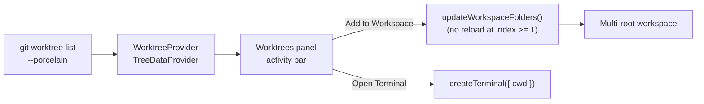

# Worktree View

A VS Code extension that lists the git worktrees of the current repository in a
dedicated activity-bar panel and lets you open each one **without reloading the
window**.

## Why

`Open Folder` / `vscode.openFolder` swaps the single window root and triggers a
full window + extension-host reload. That makes it painful to hop between the
worktrees where you have agents running.

This extension uses **multi-root workspaces** instead: each worktree is added as
an extra workspace folder via `workspace.updateWorkspaceFolders`. As long as the
first folder (index 0) is left untouched, VS Code does **not** reload the window,
so switching is instant.

## Features

- **Worktrees panel** in the activity bar listing every worktree (primary +
  linked), with branch name, and badges for `primary` / `detached` / `locked` /
  `open`.
- **Add Worktree to Workspace** — mounts the worktree as an extra root, no reload.
- **Remove Worktree from Workspace** — unmounts it (the primary root is protected).
- **Open Terminal Here** — a terminal rooted at the worktree (one per worktree),
  handy for running agents.
- **Reveal in Explorer View**.

## Develop

```bash
npm install
npm run compile     # or: npm run watch
```

Press `F5` (Run Extension) to launch an Extension Development Host. Open a folder
that is a git repository (with worktrees) to populate the panel.

## Architecture



## Caveats

- Adding/removing **folder index 0** restarts the extension host; this extension
  only ever appends/removes at index >= 1 to avoid that.
- The repository is located from the first workspace folder.
