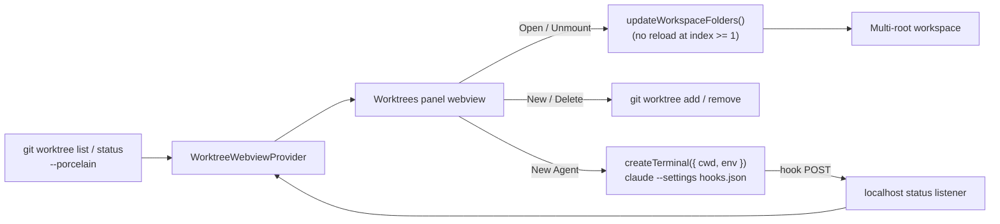

# Worktree View

A VS Code extension for working across the git worktrees of a repository — mount
them **without reloading the window**, and run and monitor multiple Claude agent
sessions per worktree from a single panel.

## Why

`Open Folder` / `vscode.openFolder` swaps the single window root and triggers a
full window + extension-host reload. That makes it painful to hop between the
worktrees where you have agents running.

This extension uses **multi-root workspaces** instead: each worktree is added as
an extra workspace folder via `workspace.updateWorkspaceFolders`. As long as the
first folder (index 0) is left untouched, VS Code does **not** reload the window,
so switching is instant.

## Features

- **Worktrees panel** (webview) listing every worktree (primary + linked), with
  branch name and badges for `primary` / `detached` / `locked`. Worktrees with a
  waiting or active agent float to the top so attention is routed automatically.
- **Per-worktree git status** — a clean/changed count plus ahead/behind distance
  from the upstream branch.
- **New Worktree** — `git worktree add` for a new branch, mounted on creation.
- **Delete Worktree** — `git worktree remove` (offers `--force` when dirty).
- **Open / Unmount** — add or remove a worktree as a workspace root, no reload
  (the primary root is protected).
- **Agents** — start one or more Claude CLI sessions per worktree, each in its
  own terminal. Sessions can be revealed (focus) or stopped from the panel, and
  closing a terminal removes its row.

## Agent status from hooks

Each agent is launched with a generated settings file
(`claude --settings …`) whose [hooks](https://docs.claude.com/en/docs/claude-code/hooks)
report lifecycle events back to the extension over a loopback HTTP listener. The
events map to a status shown in the panel:

| Hook                                       | Status    |
| ------------------------------------------ | --------- |
| `SessionStart`, `Stop`                     | idle      |
| `UserPromptSubmit`, `PreToolUse`, `PostToolUse` | active |
| `Notification` (permission / question)     | waiting   |

The extension passes each agent its identity and the listener's port/token via
the terminal environment (`WT_AGENT_*`); the bundled `media/agent-hook.js`
reporter reads these and POSTs the status. The listener binds to `127.0.0.1`
only and rejects reports without the per-session token. Status reporting needs
`node` on `PATH` and an unsandboxed network loopback.

## Develop

```bash
npm install
npm run compile     # or: npm run watch
```

Press `F5` (Run Extension) to launch an Extension Development Host. Open a folder
that is a git repository (with worktrees) to populate the panel.

## Architecture



## Caveats

- Adding/removing **folder index 0** restarts the extension host; this extension
  only ever appends/removes at index >= 1 to avoid that.
- The repository is located from the first workspace folder.
- Agent sessions are tracked in memory and are not restored across a reload.
