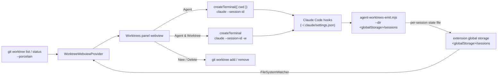
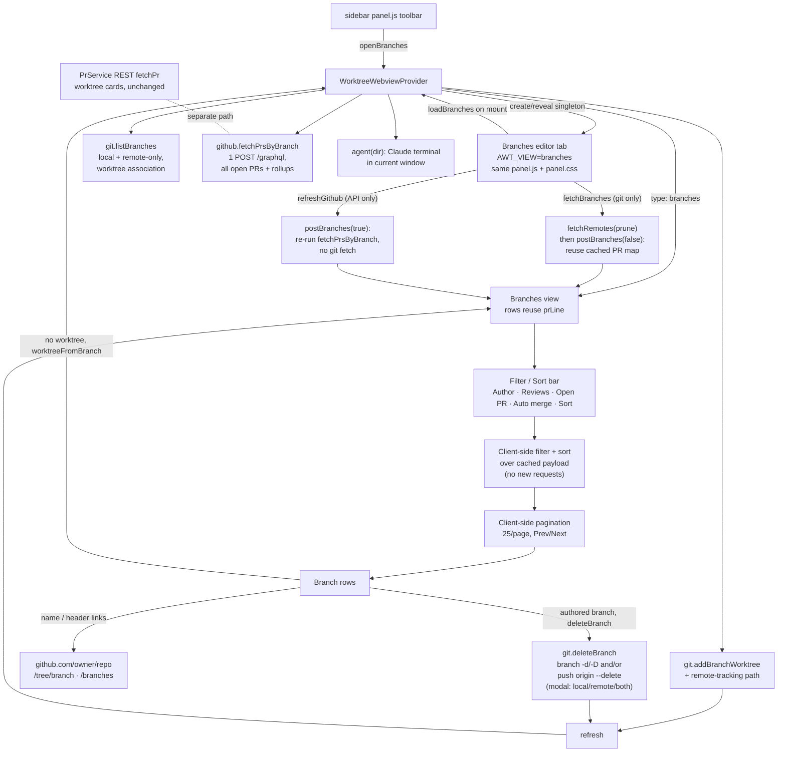

# Agent Worktrees

A VS Code side panel for running and monitoring multiple Claude Code agents
across the git worktrees of a repository. Spin up a Claude session in any
worktree, watch each one go **active**, **waiting**, or **idle** at a glance, and
manage the worktrees themselves without leaving the panel.

## Why

Worktrees are the natural unit for running several agents in parallel: each gets
an isolated checkout, so they never step on each other's files. But coordinating
them means juggling terminals and `git worktree` commands by hand, with no single
place to see which agent needs you. This panel puts every worktree, its git
state, and its running agents in one view.

## Screenshots

<sub>Click any thumbnail to view it full size.</sub>

| Worktrees, git status & agents | PR checks, review & comments | Settings & integrations | Skills used per agent |
| :---: | :---: | :---: | :---: |
| [](https://raw.githubusercontent.com/BradenTerry/agent-worktrees/main/images/overview.png) | [](https://raw.githubusercontent.com/BradenTerry/agent-worktrees/main/images/pr-status.png) | [](https://raw.githubusercontent.com/BradenTerry/agent-worktrees/main/images/settings.png) | [](https://raw.githubusercontent.com/BradenTerry/agent-worktrees/main/images/skills.png) |

## Features

- **Worktrees panel** (webview) listing every worktree (primary + linked), with
  branch name and badges for `Primary` / `detached` / `locked`.
- **Per-worktree git status** — a clean/changed count, `+`/`−` line totals, and
  the ahead/behind distance from the upstream branch, refreshed as files change.
- **GitHub PR status** — when a stored token resolves a PR for the branch, the
  card shows the PR title (wrapping when long), then its lifecycle state, CI
  check rollup, review decision and comment counts (polled from the REST API in
  `src/github.ts` / `src/prs.ts`). Two
  merge-readiness pills sit beside the state badge: `Out of date` when GitHub's
  `mergeable_state` is `behind` ("This branch is out-of-date with the base
  branch"), and `Auto-merge` when auto-merge is enabled on the PR.
- **Agent** — start one or more Claude CLI sessions in a worktree, each in its
  own terminal. Sessions can be revealed (focus) or stopped from the panel, and
  closing a terminal removes its row.
- **Agent & Worktree** — create a new worktree with Claude (`claude -w`) and
  start an agent in it in a single step.
- **Open in new window** — open any worktree in its own VS Code window from the
  card header. If a window for that worktree is already open, VS Code focuses it
  instead of duplicating (the focus behavior uses the `code` CLI when it is on
  `PATH`; otherwise a fresh window is always opened).
- **Delete Worktree** — `git worktree remove` (offers `--force` when dirty, and
  stops any agents running in the worktree first). Removing a worktree leaves its
  branch behind, so it then offers to delete that branch too (never the default
  branch); when the branch has commits not pushed to its upstream or the worktree
  had uncommitted changes, it confirms a second time before the force delete.
- **Skills used** — each agent row shows a chip with the count of Claude skills
  it has invoked; click it for the full list.
- **Subagents used** — a robot glyph with a count tracks how many subagents each
  agent has spawned (every `Task` tool call is one subagent). The Agents bar sums
  it across the worktree; each agent row shows its own.
- **Collapsible agent lists** with per-status counts, so a card reads at a glance
  and expands to the individual sessions on demand.
- **Branches view** — a toolbar button opens a dedicated editor tab listing every
  branch (local plus remote-only `origin/*`). Each row shows whether a worktree
  already exists, ahead/behind and the +/- line diff vs the branch's base, a
  **Delete Local** action (any local branch; it removes the local ref only and
  never touches the remote), and — for branches without a worktree — a **Create
  worktree & start
  agent** action that creates the worktree in the current window and launches a
  Claude agent. A header **Fetch** button with a **Prune** toggle pulls from the
  remote to refresh local branch state (git only), and a **Delete gone** button
  bulk-deletes every local branch whose upstream is gone (merged or deleted on
  the remote). When a GitHub token is stored, PR/CI status is refreshed
  automatically when the tab opens (the **Refresh GitHub** button spins until it
  lands) and can be re-polled on demand from that button, decoupled from the
  git fetch, which stays manual. When the PR integration is connected, rows carry
  their open PR's rollup and the view offers client-side filters with no default selection — an
  **Author** select populated from the fetched PRs and a single-select **Reviews**
  select (the GitHub review statuses) — plus sorting and **Open PR** / **Auto
  merge** toggle chips.

## Agent status from hooks

The panel cannot tell on its own whether a Claude session is working, waiting on
you, or idle. Claude Code's [hooks](https://docs.claude.com/en/docs/claude-code/hooks)
fire exactly on those transitions, so the extension installs one small emitter
script wired to a handful of events. The events map to a status shown in the
panel:

| Hook                                              | Status            |
| ------------------------------------------------- | ----------------- |
| `SessionStart`, `Stop`                            | idle              |
| `UserPromptSubmit`, `PreToolUse`, `PostToolUse`   | active            |
| `Notification` (permission / question)            | waiting           |
| `SessionEnd`                                       | removed from panel |

Installing the hooks edits your global `~/.claude/settings.json`, so it is always
gated behind **explicit consent** in the panel — nothing is written until you
accept. On accept, the bundled `hooks/agent-worktrees-emit.mjs` is copied into
the extension's global storage and wired into settings (the command passes the
state directory to the emitter via `--dir`, since that separate process can't
read the extension's context).

Each hook event runs the emitter, which derives the session's worktree from git
and writes one small state file per session into the extension's **global
storage**. When the extension launched the agent it passes `claude
--session-id <uuid>` and stamps that same uuid into the terminal env as
`AGENT_WORKTREES_SID`; the emitter (a child of the Claude process) inherits it
and keys the state file by it rather than by Claude's live `session_id`. That id
is stable across `/resume` (Claude's own `session_id` changes, but the launch id
in the terminal env and the process argv does not), so the panel row, its
terminal handle, and `pkill -f <id>` stay linked after a resume instead of
orphaning the row. Sessions not launched by the extension fall back to the live
`session_id`. The files land in `<globalStorage>/sessions/` (e.g.
`~/Library/Application Support/Code/User/globalStorage/bradenterry.agent-worktrees/`
on macOS). The extension watches that directory and groups the sessions by
worktree. **Nothing is sent over the network** — status flows entirely through
local files, and nothing of the extension's lives in your `~/.claude` tree apart
from the hook entries in `settings.json`. Status reporting needs `node` on
`PATH`.

## Requirements

- The [Claude Code CLI](https://docs.claude.com/en/docs/claude-code) (`claude`)
  on your `PATH`.
- `git` and `node` on your `PATH`.
- A workspace whose first folder is inside a git repository.

## Develop

```bash
npm install
npm run compile     # or: npm run watch
```

Press `F5` (Run Extension) to launch an Extension Development Host. Open a folder
that is a git repository (with worktrees) to populate the panel.

## Architecture



### Branches view

The **Branches** toolbar button posts an `openBranches` message to the webview
provider, which opens (or reveals, if already open) a dedicated webview as an
editor tab in the active column, filling the editor area. It is a singleton: a
second click reveals the existing tab rather than duplicating it. The tab loads
the same `media/panel.js` + `media/panel.css` as the sidebar, switched into
branches mode by a `window.AWT_VIEW = "branches"` flag set in its HTML. On mount
the tab requests data with a `loadBranches` message.

On `loadBranches` the provider builds the branch data and posts it back to that
panel as a `{ type: "branches" }` payload:

- `git.listBranches` enumerates every local branch plus every remote-only
  `origin/*` branch (each shown once by short name) and annotates whether a
  worktree already holds it and whether a matching `origin/<name>` exists (so the
  row can tag itself "local only" / "local + remote" / "remote only"). It then
  enriches each branch with ahead/behind and a +/- line diff against its compare
  base — its upstream when configured, otherwise the repo's default branch
  (`origin/HEAD`). Ahead/behind comes from `%(upstream:track)` when there is an
  upstream and from `git rev-list --left-right --count base...tip` otherwise; the
  diff from `git diff --numstat base...tip`. The per-branch git calls run with
  bounded concurrency so a many-branch repo doesn't spawn a process per branch at
  once, and any per-branch failure leaves that branch's counts at zero. Every git
  call goes through `execFile` (argument arrays, no shell), so there is no
  per-call `cmd.exe`/`sh` wrapper — on Windows that roughly halves the process
  count for a branch listing and avoids shell-specific `--format` quoting.
- The git-only branch list paints first, so the tab is responsive immediately,
  then PR data is fetched in the background: when the PR integration is enabled
  with a token connected, opening the tab kicks off a GitHub refresh on load (the
  **Refresh GitHub** button spins until it lands) and that button re-polls on
  demand afterwards. The git fetch is **not** run on open — it stays the manual
  **Fetch** button. With no token the view stays git-only and never calls the API.
- When that fetch runs (on open or on demand) and the PR integration is enabled
  with a token connected, `github.fetchPrsByBranch` issues a batched `POST /graphql` request
  (paged from most-recently-updated, so one call for small repos and a bounded
  few for large ones) that returns the repo's PRs (open, merged and closed) with
  their rollups (state, check rollup, comment count) and the fields the filters
  need — author, created/updated timestamps, assignee logins, review
  author/state, requested-reviewer logins, and `viewer.login`. The result is
  mapped to branches by head ref client-side, and the fetch time is surfaced as
  the header's **Last refreshed** label. A transport or GraphQL failure degrades
  the whole view to "no PR data"; rows still render.

This GraphQL path is used **only** by the branches view. The per-worktree PR
badges on the cards keep the existing per-branch REST `fetchPr` path unchanged,
so the two are separate code paths.

Filtering and sorting (author, reviews, sort, the Open PRs / Auto merge chips) run
entirely client-side over that single cached payload — changing a filter or sort
issues no new network requests. Nothing is selected by default: the view lists
every branch until you pick a filter. The **Author** select is a multi-select
populated from the fetched PRs' authors (`authorOptions`, with the viewer pinned
first); the **Reviews** select is single-select over the GitHub review statuses
(`No reviews`, `Review required`, `Approved`, `Changes requested`, `Reviewed by
you`, `Not reviewed by you`, `Awaiting review from you`) with an `Any` entry that
clears it. The **Open PR** chip keeps only branches whose PR is open or draft, and
**Auto merge** keeps only those whose PR has auto-merge enabled (`autoMergeRequest`
on the GraphQL node). While any PR filter or PR sort is active, branches with no
open PR are hidden. With
the integration off or no token connected, only the branch-name sort is offered and
the PR-based controls are hidden. The selected filters and sort persist across
reopens via the webview state.

A branch with no worktree shows a **Create worktree & start agent** action; one
that already has a worktree shows a **Worktree exists** marker plus a **Start
agent** action that posts an `agent` message to launch a Claude agent in that
existing worktree. Clicking create posts a `worktreeFromBranch` message; the
provider runs
`git.addBranchWorktree` (checking out an existing local branch, or creating a
local tracking branch for a remote-only branch), starts a Claude agent in it via
the existing `agent(dir)` flow in the current window, then refreshes the sidebar
and re-posts the branch data so the row flips to the marker.

**Deleting branches.** Delete is local-only: every branch with a local ref shows
a **Delete Local** action that removes the local branch and never touches the
remote. A remote-only branch has no local ref, so it shows no action. The repo's
default branch (origin/HEAD's short name, carried on each row as `isDefault`) is
never deletable: the row shows no Delete action and `deleteBranchAction` refuses
it server-side (via `defaultBranchName`) even if a crafted message asks. Clicking
it posts a `deleteBranch` message carrying the branch name and whether its PR is
`merged`.

Git refuses to delete a branch that is checked out in a worktree, so
`deleteBranchAction` inspects `listWorktrees` first. If the **primary** worktree
(this repo dir) is on the branch, the delete is blocked with a "switch away
first" message. If a **linked** worktree is on it, the delete is allowed but
guarded: a modal warns it will leave that worktree on a detached HEAD, and the
provider runs `detachWorktreeHead` (a `git checkout --detach` in that worktree)
to free the ref before deleting.

Before the delete it computes `unpushedCommitCount` — commits not on the branch's
upstream, or (with no upstream) not on the default branch — and, when non-zero
and the PR is not merged, surfaces the count in a confirm (a second modal in the
linked-worktree path) and force-deletes on consent. A merged PR also
force-deletes without the "not fully merged" prompt: a squash-merge leaves the
branch's commits unreachable from the base, so `git branch -d` would refuse even
though the work landed. `git.deleteBranch` runs `git branch -d`/`-D`; a residual
unmerged refusal still falls back to an explicit force prompt. Both views refresh
afterward so the row drops.

**Bulk "Delete gone".** The header **Delete gone** button posts `deleteGoneBranches`.
`git.goneBranches` reads `git for-each-ref ... %(upstream:track,nobracket)` and
returns the local branches whose track is `gone` (the upstream was deleted, what
`git branch -vv` shows as `[gone]`), so it reflects the last fetch; pair it with
**Prune** to register a just-deleted remote. `deleteGoneBranchesAction` drops the
default branch, skips any branch checked out in a worktree (it never bulk-detaches,
and reports the skipped count), lists the rest in one confirm, then deletes with
`-d`. Branches that refuse as "not fully merged" (squash-merges) are collected and
force-deleted only after a second, explicit confirm naming them.

**No delete flicker.** A delete triggers a refresh, but a routine refresh already
in flight may have started its `gatherBranches()` before the delete and resolve
*after* it, re-posting the deleted branch, which the next refresh then removes
again (the "branch flickers back, then gone" report). `postBranches` guards against
this with a monotonic `branchPostSeq`: each call claims the latest token before
awaiting git/GitHub and only posts if it is still the latest when it resolves, so a
stale gather can't clobber a newer render.

**GitHub links.** When `origin` is a github.com remote the provider attaches
`repoUrl` (`https://github.com/<owner>/<repo>`) to the payload. Each row links its
name to the branch tree (`/tree/<branch>`, each path segment encoded so slashes
survive), and the header carries a **Branches on GitHub** link to `/branches`.
These are plain `<a target="_blank">` anchors that VS Code opens externally — no
round-trip.

**Refresh and fetch.** `fetchRemotes(cwd, { prune })` runs `git fetch --all`
(with `--prune` unless disabled), so stale `refs/remotes/origin/*` (branches
deleted on the remote) are dropped and no longer surface as phantom "remote only"
/ "local + remote" rows. Opening the tab (`loadBranches`) posts the local list
immediately (flagged `githubRefreshing` when a token is connected, so the Refresh
GitHub button spins), then — when a token is connected — runs `postBranches(true)`
for PR/CI status, then a background `refresh(false)` for the sidebar. The posts
are awaited in sequence so the slow GitHub post isn't dropped by the
`branchPostSeq` staleness guard. No git fetch runs on open; that stays the manual
**Fetch** button, which posts `fetchBranches` with the
**Prune** checkbox state; the provider fetches with the chosen prune setting, then
re-reads both views (without a second fetch) and re-posts the branches reusing the
cached PR map (`postBranches(false)`) — so the git fetch never hits the GitHub
API. The Prune choice is persisted in the webview state.

**GitHub refresh (on open and on demand).** PR/CI status is fetched by
`postBranches(true)` — the only path that runs `fetchPrsByBranch` and stamps
`branchPrsAt` — shown next to a **Last refreshed** label (the fetch time, or
**Never** before the first refresh) when a token is stored (`github.hasToken`).
Two things call it: opening the tab (`loadBranches`, see above) and the **Refresh
GitHub** button (`refreshGithub`) on demand. Every other path (the git Fetch,
watcher-driven refreshes, worktree/branch mutations) calls `postBranches(false)`
and reuses the cached PR map, so they re-render rows without touching the GitHub
API. The GitHub refresh stays the API-only counterpart to the git-only Fetch;
the two are independent so refreshing PR state never triggers a git fetch and
vice versa.

**Performance.** The webview only rebuilds the DOM when the posted payload
actually changed (it compares a JSON signature, mirroring the settings view's
`ghSig` guard), so a routine poll no longer wipes the list or resets the user's
scroll position; renders that do happen restore the `.brows` scroll offset. The
filtered list is paginated client-side (25 per page) with a Prev/Next pager, and
the page resets to the first whenever a filter or sort changes.

**In-progress buttons.** Buttons that kick off real git/network/window work
(`agent`, `agentWorktree`, `openWindow`, `openBranches`, `worktreeFromBranch`,
`fetchBranches`, `refreshGithub` — see `BUSY_ACTIONS` in `panel.js`) swap their
icon for a spinning ring and disable themselves on click (`markBusy`). The state
is transient DOM: the next `update`/`branches` payload re-renders the view with
the real icon restored, so it clears automatically when the work lands. A no-op
fetch that returns an unchanged payload re-renders only when a spinner is pending
(so background polls still skip the rebuild), and a 15s safety timeout restores
any button that never sees a re-render.



## Caveats

- The repository is located from the first workspace folder.
- Agent terminals are tracked in memory; after an extension-host reload the panel
  can still show and stop agents (by session id / working directory) but loses
  the terminal handle used to reveal them.
- The session list lives in global storage shared by every VS Code window, but
  terminal handles are per-window. So a window can show (and stop) an agent that
  another window launched, yet clicking it cannot reveal a terminal it does not
  own; the panel says so instead of silently doing nothing.
- A terminal closed without `/exit` never fires `SessionEnd`; its state file is
  pruned automatically once it is older than 24 hours.
</content>
