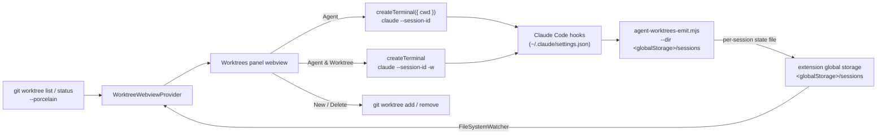

# Agent Worktrees

A VS Code side panel for running and monitoring multiple Claude Code agents
across the git worktrees of a repository. Spin up a Claude session in any
worktree, watch each one go **active**, **waiting**, or **idle** at a glance, and
manage the worktrees themselves without leaving the panel.

## Why

Worktrees are the natural unit for running several agents in parallel: each gets
an isolated checkout, so they never step on each other's files. But coordinating
them means juggling terminals and `git worktree` commands by hand, with no single
place to see which agent needs you. This panel puts every worktree, its git
state, and its running agents in one view.

## Screenshots

<sub>Click any thumbnail to view it full size.</sub>

| Worktrees, git status & agents | PR checks, review & comments | Settings & integrations |
| :---: | :---: | :---: |
| [](https://raw.githubusercontent.com/BradenTerry/agent-worktrees/main/images/overview.png) | [](https://raw.githubusercontent.com/BradenTerry/agent-worktrees/main/images/pr-status.png) | [](https://raw.githubusercontent.com/BradenTerry/agent-worktrees/main/images/settings.png) |

## Features

- **Worktrees panel** (webview) listing every worktree (primary + linked), with
  branch name and badges for `Primary` / `detached` / `locked`.
- **Per-worktree git status** — a clean/changed count, `+`/`−` line totals, and
  the ahead/behind distance from the upstream branch, refreshed as files change.
- **Agent** — start one or more Claude CLI sessions in a worktree, each in its
  own terminal. Sessions can be revealed (focus) or stopped from the panel, and
  closing a terminal removes its row.
- **Agent & Worktree** — create a new worktree with Claude (`claude -w`) and
  start an agent in it in a single step.
- **Open in new window** — open any worktree in its own VS Code window from the
  card header. If a window for that worktree is already open, VS Code focuses it
  instead of duplicating (the focus behavior uses the `code` CLI when it is on
  `PATH`; otherwise a fresh window is always opened).
- **Delete Worktree** — `git worktree remove` (offers `--force` when dirty, and
  stops any agents running in the worktree first).
- **Skills used** — each agent row shows a chip with the count of Claude skills
  it has invoked; click it for the full list.
- **Collapsible agent lists** with per-status counts, so a card reads at a glance
  and expands to the individual sessions on demand.

## Agent status from hooks

The panel cannot tell on its own whether a Claude session is working, waiting on
you, or idle. Claude Code's [hooks](https://docs.claude.com/en/docs/claude-code/hooks)
fire exactly on those transitions, so the extension installs one small emitter
script wired to a handful of events. The events map to a status shown in the
panel:

| Hook                                              | Status            |
| ------------------------------------------------- | ----------------- |
| `SessionStart`, `Stop`                            | idle              |
| `UserPromptSubmit`, `PreToolUse`, `PostToolUse`   | active            |
| `Notification` (permission / question)            | waiting           |
| `SessionEnd`                                       | removed from panel |

Installing the hooks edits your global `~/.claude/settings.json`, so it is always
gated behind **explicit consent** in the panel — nothing is written until you
accept. On accept, the bundled `hooks/agent-worktrees-emit.mjs` is copied into
the extension's global storage and wired into settings (the command passes the
state directory to the emitter via `--dir`, since that separate process can't
read the extension's context).

Each hook event runs the emitter, which derives the session's worktree from git
and writes one small state file per session into the extension's **global
storage** (`<globalStorage>/sessions/`, e.g.
`~/Library/Application Support/Code/User/globalStorage/bradenterry.agent-worktrees/`
on macOS). The extension watches that directory and groups the sessions by
worktree. **Nothing is sent over the network** — status flows entirely through
local files, and nothing of the extension's lives in your `~/.claude` tree apart
from the hook entries in `settings.json`. Status reporting needs `node` on
`PATH`.

## Requirements

- The [Claude Code CLI](https://docs.claude.com/en/docs/claude-code) (`claude`)
  on your `PATH`.
- `git` and `node` on your `PATH`.
- A workspace whose first folder is inside a git repository.

## Develop

```bash
npm install
npm run compile     # or: npm run watch
```

Press `F5` (Run Extension) to launch an Extension Development Host. Open a folder
that is a git repository (with worktrees) to populate the panel.

## Architecture



## Caveats

- The repository is located from the first workspace folder.
- Agent terminals are tracked in memory; after an extension-host reload the panel
  can still show and stop agents (by session id / working directory) but loses
  the terminal handle used to reveal them.
- A terminal closed without `/exit` never fires `SessionEnd`; its state file is
  pruned automatically once it is older than 24 hours.
</content>
