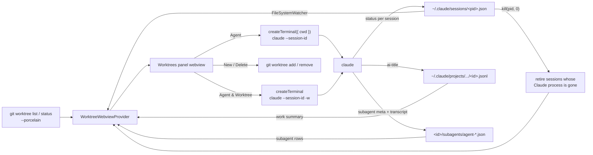

# Agent Worktrees

A VS Code side panel for running and monitoring multiple Claude Code agents
across the git worktrees of a repository. Spin up a Claude session in any
worktree, watch each one go **active**, **waiting**, or **idle** at a glance, and
manage the worktrees themselves without leaving the panel.

Worktrees are the natural unit for running several agents in parallel: each gets
an isolated checkout, so they never step on each other's files. Coordinating them
by hand means juggling terminals and `git worktree` commands with no single place
to see which agent needs you. This panel puts every worktree, its git state, and
its running agents in one view.

## Screenshots

<sub>Click any thumbnail to view it full size.</sub>

| Worktrees, git status & agents | PR checks, review & comments | Settings & integrations | Linked files | Skills used per agent |
| :---: | :---: | :---: | :---: | :---: |
| [](https://raw.githubusercontent.com/BradenTerry/agent-worktrees/main/images/overview.png) | [](https://raw.githubusercontent.com/BradenTerry/agent-worktrees/main/images/pr-status.png) | [](https://raw.githubusercontent.com/BradenTerry/agent-worktrees/main/images/settings.png) | [](https://raw.githubusercontent.com/BradenTerry/agent-worktrees/main/images/linked-files.png) | [](https://raw.githubusercontent.com/BradenTerry/agent-worktrees/main/images/skills.png) |

## Features

**Worktrees**

- Every worktree (primary + linked) as a card, with `Primary` / `detached` /
  `locked` badges and a per-card refresh that re-reads just that worktree.
- Git status per card: clean/changed count, `+`/`−` line totals, ahead/behind vs
  upstream. Recomputed on discrete signals (saves, the Git extension's repo state,
  a poll for the worktrees nothing else watches), never a workspace-wide file
  watcher, so a card does not disagree with the Source Control view: see
  [Refresh coalescing](docs/refresh-coalescing.md).
- **New Worktree**, **Open in new window** (focuses an existing window via the
  `code` CLI when it is on `PATH`), and **Change branch** via a quick pick of the
  branches free to check out, plus a create-new-branch entry. The switch runs
  `git switch` in that worktree only.
- **[Searching a worktree](docs/worktree-search.md)** from this window, since a
  worktree is not a workspace folder and so neither Find in Files nor `Ctrl/Cmd+P`
  reaches it. Two per-card actions scope those to the worktree instead: a search
  that pre-fills the search view's include path, and a file picker fed by
  `git ls-files`. Neither touches the workspace, so the agents stay in this window.
- **Delete Worktree** behind one modal that discloses everything upfront: agents
  to be stopped, uncommitted changes to be discarded, the branch left behind and
  its unpushed commits. Offers **Remove** or **Remove and Delete Branch**, then
  needs no follow-up prompts. When `git worktree remove` exits non-zero it has
  usually still unregistered the worktree (it does not roll back a partial
  removal), so the provider re-reads `git worktree list` before reporting: a
  worktree git dropped but whose files it could not delete is reported as exactly
  that, not as a failed removal the panel then contradicts by dropping the card.
- **[Run and Debug](docs/debug-sessions.md)** per worktree: a Debug button (only on
  cards whose worktree has launch configurations) picks one of its
  `.vscode/launch.json` targets, with or without the debugger, and rows underneath
  stop the sessions it started. The Run and Debug view itself cannot be retargeted
  by an extension, so the panel drives `debug.startDebugging` with the folder
  variables rewritten to the worktree and its `${input:...}` variables resolved
  from the worktree's own declarations.
- **Stale lock cleanup** for the locks `claude -w` leaves behind when a session
  crashes. Only locks naming a claude pid that is no longer running are cleared.
- **[Linked files](docs/linked-files.md)** symlinked into every worktree, the ones
  `claude -w` creates included, so gitignored local config (`.env`,
  `appsettings.*.json`, certs) is not missing from a fresh checkout. Windows falls
  back to junctions and hard links so it works unelevated.

**Agents**

- Start one or more Claude CLI sessions per worktree, each in its own terminal;
  reveal or stop them from the panel. The active terminal's agent is highlighted
  by a class toggle, with no re-render and no git spawns. Titles are left to
  Claude Code on purpose (see [Terminal tab titles](docs/terminal-titles.md)).
- A row finds its terminal by process ancestry, not by the launch id, since a
  session can register an id that is not in its own argv (see
  [Agent status](docs/agent-status.md)).
- **Agent & Worktree** creates a worktree with `claude -w` and starts an agent in
  it in one step. The new worktree gets its card without a manual refresh: a
  session whose cwd is not itself a card is the cue to re-list worktrees (see
  [Refresh coalescing](docs/refresh-coalescing.md)).
- Status per agent, read from Claude Code's own session registry (see
  [Agent status](docs/agent-status.md)). Collapsible lists with per-status counts,
  and a number badge on the Activity Bar icon counting **waiting** agents, so a
  blocked agent surfaces while the panel is hidden.
- **[Subagents](docs/subagents.md)** in flight appear as indented rows with their
  type, description and elapsed time, read from the files Claude writes for them,
  and land on the card for the worktree they were actually given.
- A chip per agent counting the Claude skills it has invoked; click for the list.
  Read from the session's transcript, scanned once and topped up from its tail.

**GitHub and branches**

- **A branch on GitHub from its card**: a GitHub mark beside the worktree name
  links to `<origin>/tree/<branch>`. Origin is resolved once per window at the
  repo root (every worktree of a repo shares it) and needs no token, so the link
  is there whether or not the PR integration is on. Absent for a non-GitHub
  origin and for a detached worktree, which has no branch page.
- **PR status** on a card when a stored token resolves a PR for the branch: title,
  lifecycle state, CI rollup, review decision, comment counts, plus `Out of date`
  and `Auto-merge` pills (`src/github.ts`, `src/prs.ts`).
- **[Branches view](docs/branches-view.md)** in a dedicated editor tab: every local
  and remote-only branch with worktree association, ahead/behind, last-updated,
  git-based filters and sort, optional PR status, **Create worktree & start
  agent**, **Delete Local**, **Fetch** with **Prune**, and bulk **Delete gone**.

## Agent status

Claude Code keeps a registry of its live sessions at
`~/.claude/sessions/<pid>.json` and records what each one is doing in a `status`
field it rewrites on every transition. The panel reads that: `busy` and `shell`
show as active, `waiting` as waiting, `idle` as idle, and a status it does not
recognize leaves the row reading idle rather than guessing.

Nothing is installed and nothing is asked for. Earlier versions wired an emitter
script onto ten Claude Code hooks to infer the same thing from events, which
meant editing your global `settings.json` (hence a consent page), a process
spawned per event on the tool-call hot path, and an interpreter to run it with.
Activation now removes all of that, leaving any hooks you added yourself alone.

The registry directory is also the refresh signal - a file appearing, changing or
vanishing is a session starting, transitioning or ending - and the pid it records
is what retires a row whose terminal was closed without `/exit`. Each row's label
is Claude's own work summary, read from the tail of that session's transcript.
**Nothing is sent over the network**, and nothing of the extension's lives in
your `~/.claude` tree.

Details, including the status mapping, which card a session lands on, what the
registry cannot answer (a resumed session's terminal), and what removal
takes out: [docs/agent-status.md](docs/agent-status.md). Subagent rows come from
Claude's per-subagent files: [docs/subagents.md](docs/subagents.md).

## Architecture


```mermaid
flowchart LR
    G["git worktree list / status<br/>--porcelain"] --> P[WorktreeWebviewProvider]
    P --> V[Worktrees panel webview]
    V -->|Agent| T["createTerminal({ cwd })<br/>claude --session-id"]
    V -->|Agent & Worktree| TW["createTerminal<br/>claude --session-id -w"]
    V -->|New / Delete| WT["git worktree add / remove"]
    T --> C
    TW --> C
    C["claude"] -->|"status per session"| S["~/.claude/sessions/&lt;pid&gt;.json"]
    C -->|"ai-title"| J["~/.claude/projects/.../&lt;id&gt;.jsonl"]
    C -->|"subagent meta + transcript"| SA["&lt;id&gt;/subagents/agent-*.json"]
    SA -->|subagent rows| P
    S -->|FileSystemWatcher| P
    S -->|"kill(pid, 0)"| L["retire sessions whose<br/>Claude process is gone"]
    L --> P
    J -->|work summary| P
```

The panel UI is a webview with no framework: `media/panel.js` renders all markup,
`media/panel.css` styles it from `--vscode-*` theme tokens. `src/` is the
extension host: git (`git.ts`), GitHub polling (`github.ts`, `prs.ts`), the
webview provider (`worktreeWebview.ts`), coalescing (`scheduler.ts`), symlinks
(`links.ts`), agent status (`sessionRegistry.ts`, `transcript.ts`,
`liveness.ts`).

## Design notes

The rationale behind the parts that are easy to get wrong twice:

| Doc | Covers |
| --- | --- |
| [Agent status](docs/agent-status.md) | The session registry, work summaries, retiring dead sessions, removing the old hooks |
| [Subagents](docs/subagents.md) | The per-subagent files, which card a row lands on, and what retires it |
| [Refresh coalescing](docs/refresh-coalescing.md) | Which signals refresh, the two status tiers, the agent-only path, why there is no `**/*` watcher, and the Performance tab |
| [Branches view](docs/branches-view.md) | Branch listing, the bulk PR fetch, filters, deletes, flicker guards |
| [Run and Debug in a worktree](docs/debug-sessions.md) | Why the debug view can't be retargeted, launch.json parsing, session tracking |
| [Terminal tab titles](docs/terminal-titles.md) | Why the extension does not pass `name` to `createTerminal` |
| [Linked files](docs/linked-files.md) | The symlink list and the Windows junction/hard-link fallbacks |
| [Searching a worktree](docs/worktree-search.md) | Scoping Find in Files to a worktree, the `git ls-files` picker, and why neither mounts a workspace folder |

## Requirements

- The [Claude Code CLI](https://docs.claude.com/en/docs/claude-code) (`claude`)
  on your `PATH`.
- `git` on your `PATH`.
- A workspace whose first folder is inside a git repository.

## Develop

```bash
npm install
npm run compile     # or: npm run watch
```

Press `F5` (Run Extension) to launch an Extension Development Host. Open a folder
that is a git repository (with worktrees) to populate the panel.

### Tests

Two layers, both run on the `ubuntu`/`macos`/`windows` CI matrix
(`.github/workflows/ci.yml`, which is `pull_request`-only, so land every change
through a PR):

```bash
npm test                   # fast: node --test over test/**/*.test.js (pure git/util logic)
npm run test:integration   # real VS Code extension host (@vscode/test-electron)
```

`npm test` exercises the pure logic against the real `git` CLI and never needs
VS Code. `npm run test:integration` downloads a real VS Code, launches the
extension host, and runs `src/test/integration/**` (compiled to `out/test/`) with
the `vscode` API available. That is what gives **real Windows coverage** of the
parts the unit suite can't reach (activation, commands, the built-in Git
extension API), which is where the Windows-only panel failures lived. On a
headless Linux box it needs a display (`xvfb-run -a npm run test:integration`).

`npm run screenshots` regenerates `images/*.png` for the marketplace listing by
rendering the real `panel.js` / `panel.css` in a browser with fake data. Re-run it
after a UI change.

## Caveats

- The repository is located from the first workspace folder.
- Webview views resolve lazily, so the waiting-agent badge on the Activity Bar
  icon only appears once the panel has been opened in that window.
- Agent terminals are tracked in memory; after an extension-host reload the panel
  can still show and stop agents (by session id / working directory) but loses
  the terminal handle used to reveal them.
- Claude's session registry is shared by every VS Code window, but terminal
  handles are per-window. A window can show and stop an agent that another window
  launched, yet clicking it cannot reveal a terminal it does not own; the panel
  says so instead of silently doing nothing.
- A session killed with its terminal never gets to remove its own registry file,
  so every session is confirmed against the pid it recorded for itself. That
  answers "is this process alive", not "can this window reach it", so an agent
  running in another window (or in a terminal outside VS Code) stays listed as it
  should.
