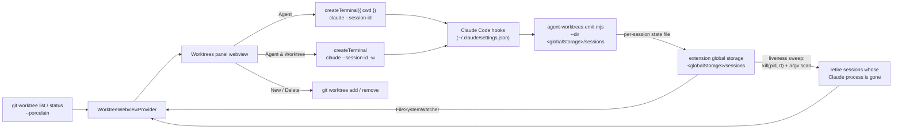

# Agent Worktrees

A VS Code side panel for running and monitoring multiple Claude Code agents
across the git worktrees of a repository. Spin up a Claude session in any
worktree, watch each one go **active**, **waiting**, or **idle** at a glance, and
manage the worktrees themselves without leaving the panel.

Worktrees are the natural unit for running several agents in parallel: each gets
an isolated checkout, so they never step on each other's files. Coordinating them
by hand means juggling terminals and `git worktree` commands with no single place
to see which agent needs you. This panel puts every worktree, its git state, and
its running agents in one view.

## Screenshots

<sub>Click any thumbnail to view it full size.</sub>

| Worktrees, git status & agents | PR checks, review & comments | Settings & integrations | Linked files | Skills used per agent |
| :---: | :---: | :---: | :---: | :---: |
| [](https://raw.githubusercontent.com/BradenTerry/agent-worktrees/main/images/overview.png) | [](https://raw.githubusercontent.com/BradenTerry/agent-worktrees/main/images/pr-status.png) | [](https://raw.githubusercontent.com/BradenTerry/agent-worktrees/main/images/settings.png) | [](https://raw.githubusercontent.com/BradenTerry/agent-worktrees/main/images/linked-files.png) | [](https://raw.githubusercontent.com/BradenTerry/agent-worktrees/main/images/skills.png) |

## Features

**Worktrees**

- Every worktree (primary + linked) as a card, with `Primary` / `detached` /
  `locked` badges and a per-card refresh that re-reads just that worktree.
- Git status per card: clean/changed count, `+`/`−` line totals, ahead/behind vs
  upstream. Recomputed on discrete signals, never a workspace-wide file watcher
  (see [Refresh coalescing](docs/refresh-coalescing.md)).
- **New Worktree**, **Open in new window** (focuses an existing window via the
  `code` CLI when it is on `PATH`), and **Change branch** via a quick pick of the
  branches free to check out, plus a create-new-branch entry. The switch runs
  `git switch` in that worktree only.
- **Delete Worktree** behind one modal that discloses everything upfront: agents
  to be stopped, uncommitted changes to be discarded, the branch left behind and
  its unpushed commits. Offers **Remove** or **Remove and Delete Branch**, then
  needs no follow-up prompts.
- **[Run and Debug](docs/debug-sessions.md)** per worktree: a Debug button (only on
  cards whose worktree has launch configurations) picks one of its
  `.vscode/launch.json` targets, with or without the debugger, and rows underneath
  stop the sessions it started. The Run and Debug view itself cannot be retargeted
  by an extension, so the panel drives `debug.startDebugging` with the folder
  variables rewritten to the worktree.
- **Stale lock cleanup** for the locks `claude -w` leaves behind when a session
  crashes. Only locks naming a claude pid that is no longer running are cleared.
- **[Linked files](docs/linked-files.md)** symlinked into every worktree the panel
  creates, so gitignored local config (`.env`, `appsettings.*.json`, certs) is not
  missing from a fresh checkout. Windows falls back to junctions and hard links so
  it works unelevated.

**Agents**

- Start one or more Claude CLI sessions per worktree, each in its own terminal;
  reveal or stop them from the panel. The active terminal's agent is highlighted
  by a class toggle, with no re-render and no git spawns. Titles are left to
  Claude Code on purpose (see [Terminal tab titles](docs/terminal-titles.md)).
- **Agent & Worktree** creates a worktree with `claude -w` and starts an agent in
  it in one step.
- Status per agent, derived from Claude Code hooks (see
  [Agent status](docs/agent-status.md)). Collapsible lists with per-status counts,
  and a number badge on the Activity Bar icon counting **waiting** agents, so a
  blocked agent surfaces while the panel is hidden.
- **[Subagents](docs/subagents.md)** in flight appear as indented rows with their
  type, description and elapsed time, land on the card for the worktree they were
  actually given, and mark which one is waiting on you.
- A chip per agent counting the Claude skills it has invoked; click for the list.

**GitHub and branches**

- **PR status** on a card when a stored token resolves a PR for the branch: title,
  lifecycle state, CI rollup, review decision, comment counts, plus `Out of date`
  and `Auto-merge` pills (`src/github.ts`, `src/prs.ts`).
- **[Branches view](docs/branches-view.md)** in a dedicated editor tab: every local
  and remote-only branch with worktree association, ahead/behind, last-updated,
  git-based filters and sort, optional PR status, **Create worktree & start
  agent**, **Delete Local**, **Fetch** with **Prune**, and bulk **Delete gone**.

## Agent status

The panel cannot tell on its own whether a session is working, waiting on you, or
idle, so the extension installs one small emitter script
(`hooks/agent-worktrees-emit.mjs`) on Claude Code's
[hooks](https://docs.claude.com/en/docs/claude-code/hooks):

| Hook                                                                              | Status             |
| --------------------------------------------------------------------------------- | ------------------ |
| `SessionStart`, `Stop`                                                            | idle               |
| `UserPromptSubmit`, `PostToolUse`, `SubagentStart`, `SubagentStop`                | active             |
| `PreToolUse` (Agent/Task/Skill only: records skills + subagent tasks)             | active             |
| `Notification` (permission / question)                                            | waiting            |
| `PermissionRequest`                                                               | unchanged          |
| `SessionEnd`                                                                      | removed from panel |

Each event writes one small state file per session into the extension's global
storage, atomically, which a `FileSystemWatcher` picks up. **Nothing is sent over
the network**, and nothing of the extension's lives in your `~/.claude` tree apart
from the hook entries in `settings.json`. Installing the hooks edits your global
`~/.claude/settings.json`, so it is always gated behind explicit consent in the
panel. Sessions whose Claude process is gone are retired by a liveness sweep that
requires positive evidence of death, never merely the absence of evidence of life.

Details, including the `Notification` type handling, the caching and hook
matchers that keep the per-tool-call cost to one hook process, and the sweep's
decision tree:
[docs/agent-status.md](docs/agent-status.md).

## Architecture


```mermaid
flowchart LR
    G["git worktree list / status<br/>--porcelain"] --> P[WorktreeWebviewProvider]
    P --> V[Worktrees panel webview]
    V -->|Agent| T["createTerminal({ cwd })<br/>claude --session-id"]
    V -->|Agent & Worktree| TW["createTerminal<br/>claude --session-id -w"]
    V -->|New / Delete| WT["git worktree add / remove"]
    H["Claude Code hooks<br/>(~/.claude/settings.json)"] --> E["agent-worktrees-emit.mjs<br/>--dir &lt;globalStorage&gt;/sessions"]
    E -->|per-session state file| S["extension global storage<br/>&lt;globalStorage&gt;/sessions"]
    S -->|FileSystemWatcher| P
    S -->|"liveness sweep:<br/>kill(pid, 0) + argv scan"| L["retire sessions whose<br/>Claude process is gone"]
    L --> P
    T --> H
    TW --> H
```

The panel UI is a webview with no framework: `media/panel.js` renders all markup,
`media/panel.css` styles it from `--vscode-*` theme tokens. `src/` is the
extension host: git (`git.ts`), GitHub polling (`github.ts`, `prs.ts`), the
webview provider (`worktreeWebview.ts`), coalescing (`scheduler.ts`), symlinks
(`links.ts`), liveness (`liveness.ts`).

## Design notes

The rationale behind the parts that are easy to get wrong twice:

| Doc | Covers |
| --- | --- |
| [Agent status from hooks](docs/agent-status.md) | The hook wiring, the emitter, and retiring dead sessions |
| [Subagents](docs/subagents.md) | What registers and retires a subagent row, and which card it lands on |
| [Refresh coalescing](docs/refresh-coalescing.md) | Which signals refresh, the agent-only path, why there is no `**/*` watcher |
| [Branches view](docs/branches-view.md) | Branch listing, the bulk PR fetch, filters, deletes, flicker guards |
| [Run and Debug in a worktree](docs/debug-sessions.md) | Why the debug view can't be retargeted, launch.json parsing, session tracking |
| [Terminal tab titles](docs/terminal-titles.md) | Why the extension does not pass `name` to `createTerminal` |
| [Linked files](docs/linked-files.md) | The symlink list and the Windows junction/hard-link fallbacks |

## Requirements

- The [Claude Code CLI](https://docs.claude.com/en/docs/claude-code) (`claude`)
  on your `PATH`.
- `git` and `node` on your `PATH`.
- A workspace whose first folder is inside a git repository.

## Develop

```bash
npm install
npm run compile     # or: npm run watch
```

Press `F5` (Run Extension) to launch an Extension Development Host. Open a folder
that is a git repository (with worktrees) to populate the panel.

### Tests

Two layers, both run on the `ubuntu`/`macos`/`windows` CI matrix
(`.github/workflows/ci.yml`, which is `pull_request`-only, so land every change
through a PR):

```bash
npm test                   # fast: node --test over test/**/*.test.js (pure git/util logic)
npm run test:integration   # real VS Code extension host (@vscode/test-electron)
```

`npm test` exercises the pure logic against the real `git` CLI and never needs
VS Code. `npm run test:integration` downloads a real VS Code, launches the
extension host, and runs `src/test/integration/**` (compiled to `out/test/`) with
the `vscode` API available. That is what gives **real Windows coverage** of the
parts the unit suite can't reach (activation, commands, the built-in Git
extension API), which is where the Windows-only panel failures lived. On a
headless Linux box it needs a display (`xvfb-run -a npm run test:integration`).

`npm run screenshots` regenerates `images/*.png` for the marketplace listing by
rendering the real `panel.js` / `panel.css` in a browser with fake data. Re-run it
after a UI change.

## Caveats

- The repository is located from the first workspace folder.
- Webview views resolve lazily, so the waiting-agent badge on the Activity Bar
  icon only appears once the panel has been opened in that window.
- Agent terminals are tracked in memory; after an extension-host reload the panel
  can still show and stop agents (by session id / working directory) but loses
  the terminal handle used to reveal them.
- The session list lives in global storage shared by every VS Code window, but
  terminal handles are per-window. A window can show and stop an agent that
  another window launched, yet clicking it cannot reveal a terminal it does not
  own; the panel says so instead of silently doing nothing.
- A terminal closed without `/exit` never fires `SessionEnd`; the liveness sweep
  retires that session once its process is gone, and a file the sweep cannot
  judge is pruned once it is older than 24 hours.
- The sweep answers "is this process alive", not "can this window reach it". An
  agent running in another window, or in a terminal outside VS Code, stays listed
  as it should.
