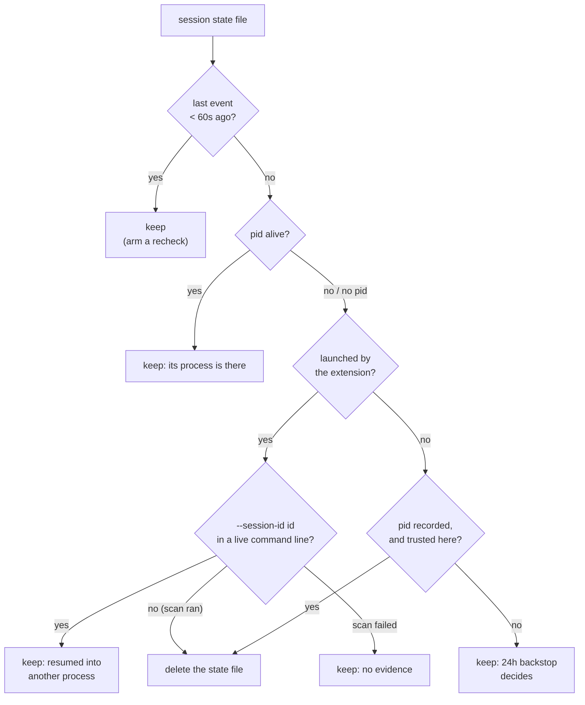

# Agent status from hooks

How the panel learns what each Claude session is doing, and how it retires
sessions whose process is gone.

The panel cannot tell on its own whether a Claude session is working, waiting on
you, or idle. Claude Code's
[hooks](https://docs.claude.com/en/docs/claude-code/hooks) fire exactly on those
transitions, so the extension installs one small emitter script wired to a handful
of events.

| Hook                                                                              | Status             |
| --------------------------------------------------------------------------------- | ------------------ |
| `SessionStart`, `Stop`                                                            | idle               |
| `UserPromptSubmit`, `PreToolUse`, `PostToolUse`, `SubagentStart`, `SubagentStop`  | active             |
| `Notification` (permission / question)                                            | waiting            |
| `PermissionRequest`                                                               | unchanged          |
| `SessionEnd`                                                                      | removed from panel |

Two of those do more than set a status:

- `SubagentStart` / `SubagentStop` also open and pause the subagent rows under the
  agent, which the `background_tasks` registry then reconciles (see
  [Subagents](subagents.md)).
- `PermissionRequest` is installed purely to name the subagent behind a prompt,
  and deliberately leaves the status alone. It runs in the permission decision
  path, ahead of any prompt, and fires for calls an allowlist or auto mode settles
  silently, so reporting a status from it would clear a genuine waiting state (and
  the Activity Bar badge) while the user was still answering.

## `Notification` is not always "waiting"

The emitter reads the payload's `notification_type`:

- **`agent_completed`** keeps the agent **active**. A background subagent
  finished; the parent is about to pick the result up.
- **`idle_prompt`** is not a "needs you" signal at all. It fires ~60s after any
  turn ends with no user input, including when a session simply finished and is
  sitting idle, which used to flag every done agent as waiting and pin a permanent
  count on the Activity Bar badge. It now keeps the agent **active** while
  background subagents are still running, and otherwise preserves the prior state
  (an unanswered permission prompt stays waiting, a finished turn stays idle).
- **Everything else** marks **waiting** as before: permission prompts, a subagent
  needing input, or an older Claude Code that sends no type.

The pending count comes from the transcript's latest `turn_duration` record
(`pendingBackgroundAgentCount`), which Claude Code appends at every turn end,
*after* the `Stop` hook has already run. Only `Notification`, which fires much
later, trusts it.

## Installing the hooks

- Installing edits your global `~/.claude/settings.json`, so it is always gated
  behind **explicit consent** in the panel. Nothing is written until you accept.
- On accept, the bundled `hooks/agent-worktrees-emit.mjs` is copied into the
  extension's global storage and wired into settings.
- The command passes the state directory to the emitter via `--dir`, since that
  separate process cannot read the extension's context.

### Which Node runs the emitter

The emitter is a Node script Claude Code spawns through your shell, so the
command has to name an interpreter (`src/nodeRuntime.ts`). It used to name a
bare `node`, which made a Node install a hard requirement: Claude Code ships as
a native binary, so `claude` on your `PATH` does not imply `node` on it, and a
missing one surfaced as a hook error per event instead of degrading quietly.

- **A `node` on `PATH`** is still preferred, and is recorded by **absolute
  path** - the hook runs in Claude Code's shell, whose `PATH` is not necessarily
  the extension host's. A Node older than 18 is treated as absent.
- **Otherwise VS Code's own Node**, which is always there. On a remote or server
  host `process.execPath` is already a plain Node and is invoked directly; on the
  desktop it is Electron, which behaves as Node only with
  `ELECTRON_RUN_AS_NODE=1`.
- Microsoft's builds ship Electron with the `runAsNode` fuse disabled, so the
  env var alone is ignored there and `--ms-enable-electron-run-as-node` has to
  go with it. Only their builds know that flag (`process.versions`
  `microsoft-build` gates it), and it is passed **after** the emitter path, as
  VS Code does in its own askpass spawn: before it, a build that does not know
  it dies on an unknown option; after it, it is just an argument the emitter
  ignores.
- That env var is why there is a **launcher** (`agent-worktrees-emit.sh`, or
  `.cmd` on Windows) beside the emitter: a hook command is one string handed to
  whichever shell the user has, and an env-var prefix cannot be written once for
  both cmd.exe and `sh`. It is generated next to the emitter on every start, and
  rewritten only when its body changes, so a VS Code update that moves the
  executable is picked up without touching a launcher some hook may be running.
- Both shapes are recognized as ours by the shared `agent-worktrees-emit` stem,
  so switching between them repairs the existing hook entries rather than
  duplicating them.

## What the emitter writes

- One small state file per session, into the extension's **global storage**,
  written atomically via tmp + rename so the watcher never reads a half-written
  file.
- Files land in `<globalStorage>/sessions/`, e.g.
  `~/Library/Application Support/Code/User/globalStorage/bradenterry.agent-worktrees/`
  on macOS. The extension watches that directory and groups the sessions by
  worktree.
- **Nothing is sent over the network.** Status flows entirely through local files,
  and nothing of the extension's lives in your `~/.claude` tree apart from the hook
  entries in `settings.json`.

## Keeping the hot path cheap

`PreToolUse` fires on every tool call and Claude Code blocks the tool until the
hook exits, so the emitter caches aggressively. On Windows, where process spawns
are expensive, that cache is the difference between hooks being free and every
tool call paying a visible startup tax.

- The session's worktree/branch resolution is cached in the state file, keyed by
  the session's `cwd`, so follow-up events reuse it instead of spawning
  `git rev-parse` twice per event. `SessionStart` re-resolves from git.
- Events fired *by* a subagent carry its `agent_id`, and when it runs in an
  isolated worktree its own `cwd`. They always reuse the parent's cached worktree
  for the *session*; re-resolving would move the parent's row onto the subagent's
  card. That cwd is resolved separately, cached against itself, and recorded on the
  subagent instead (see
  [Subagents follow the worktree they were given](subagents.md#subagents-follow-the-worktree-they-were-given)),
  so a subagent costs one `git` spawn rather than one per tool call.
- The transcript tail read that picks up Claude's generated session title runs on
  the turn-boundary events (`UserPromptSubmit`, `Stop`, `Notification`,
  `SubagentStop`, `SessionStart`) and is kept off `PreToolUse`/`PostToolUse` once a
  title is known (the prior title is carried forward). While the session has no
  title yet, and the first lands mid-turn a few seconds after the first prompt,
  tool events do read the tail, throttled to once per 5 seconds.

## Session ids survive `/resume`

- When the extension launched the agent it passes `claude --session-id <uuid>` and
  stamps that same uuid into the terminal env as `AGENT_WORKTREES_SID`.
- The emitter, a child of the Claude process, inherits it and keys the state file
  by it rather than by Claude's live `session_id`.
- That id is stable across `/resume` (Claude's own `session_id` changes, but the
  launch id in the terminal env and the process argv does not), so the panel row,
  its terminal handle, and `pkill -f <id>` stay linked after a resume instead of
  orphaning the row.
- Sessions not launched by the extension fall back to the live `session_id`.

## Retiring agents that are no longer running

- `SessionEnd` deletes a session's state file, so a session that exits cleanly takes
  its row with it.
- Nothing fires when a session dies *with* its terminal: the window was closed, the
  terminal killed, the machine restarted. The file survives in the shared state dir
  with whatever status it last had.
- The dir is global, so the next window to open renders those sessions as live
  agents with no process and no terminal behind them, often mid-work, with a spinner
  and an Activity Bar badge.

The emitter therefore stamps two liveness markers into every state file, and the
panel sweeps the dir with them before each refresh:

- **`pid`**: Claude Code runs a hook command as a **direct child** of the session
  process, so the emitter's parent *is* the agent. Checked with `kill(pid, 0)`: no
  spawn, and exact modulo pid reuse. Re-stamped on every event, so a session
  resumed into another process records the pid actually running it; never from a
  subagent-fired event, whose parent may be shorter-lived than the session.
- **`launched`**: set when the id came from `AGENT_WORKTREES_SID`, i.e. the
  extension started this agent and passed the id on Claude's own argv. Such a
  session can be found by scanning running processes' command lines for
  `--session-id <id>` (`ps -Ao args=`, or PowerShell's CIM query on Windows, the
  same mechanism the Windows stop path uses).

The sweep is throttled to once every 30s, and re-arms on a self-armed timer when a
file is younger than the grace period, so a window reopened seconds after the
previous one closed still clears.

### Positive evidence of death, never absence of evidence of life

A wrong prune hides a live agent, so the sweep only ever acts on proof. Three
consequences:

- A file written by an emitter too old to record either marker is left to the 24h
  backstop.
- **A dead pid is not proof on Windows**, where a hook run through a short-lived
  shell wrapper would make the recorded parent exit immediately and look exactly
  like a dead agent. (A *live* pid is trusted everywhere: it can only make the
  sweep more conservative.) Windows keeps the argv check, which covers every
  session the extension launched.
- A wrong prune self-heals anyway: the state file is rewritten by the session's
  very next hook event, so a live agent that was pruned reappears the moment it
  does anything.

## Failures stay silent by design

Claude Code surfaces any nonzero hook exit, or any stderr output at all, as a
`hook error ... failed with non-blocking status code` warning in the session. Wired
to `PreToolUse` that would mean a warning per tool call.

- The emitter swallows every failure and always exits 0 silently. A state write
  that cannot land (deleted global storage, a synced `settings.json` whose `--dir`
  path does not exist on this machine, a read-only disk) degrades to a missed
  status update, never a visible error.
- The hook command runs the interpreter with `--no-warnings` (in the launcher
  too), so Node's own startup warnings (deprecation/experimental, varying by
  version) cannot hit stderr before the emitter gets control.
