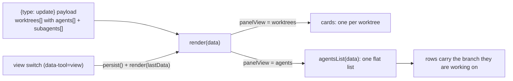
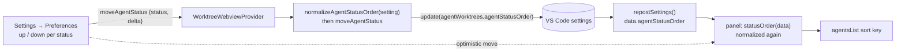

# Agents view

A second view of the sidebar panel: every agent in the repository as one flat
list, instead of one card per worktree with its agents inside it.

The cards answer *what is this worktree doing*. The agents view answers *what is
running, and what does it need from me* - the question you have when the repo
summary says four agents and two subagents, and finding the one that is waiting
means opening four cards.

## Switching

- A segmented pair of buttons: the stacked-cards glyph for the worktrees view,
  the agent mark for this one. Two buttons rather than one that swaps, because
  which view you are in is a state worth showing and a single toggle can only
  show the one you are not in.
- It sits at the right end of the repo-wide agent summary line, not in the row of
  tools beside the repository name. What it picks is how those agents are listed,
  so it belongs with the count of them; the name's row is the actions that create
  and open things. **Expand/collapse all** is grouped with it, immediately to its
  left, for the same reason. The auto margin holding the pair right applies per
  flex line, so on a panel too narrow for both it wraps to its own row and stays
  right-aligned.
- The choice is persisted in the webview state (`panelView`), so reopening the
  panel returns to the view you were last in.
- **Expand/collapse all** is disabled in this view - its rows are the leaves, so
  there is nothing to fold - but it stays in place rather than disappearing, so
  the switch beside it does not move between the two views. Its tooltip says so
  ("Disabled in the agents view: nothing to fold"), which is why it is dimmed by
  a class rather than by the `disabled` attribute: a truly disabled button
  dispatches no mouse events and could not be hovered to read it.

Switching is webview-local. Both views render from the same `{type:"update"}`
payload the extension already posts, so the switch is a re-render with **no round
trip to the extension** and no git or GitHub work of any kind.

## What a row shows

The rows are the card's own `.agent-row` and `.subagent-row`, so an agent reads
the same in either view: status dot, the work summary, the terminal chip when it
owns the open terminal, a stop button, and the subagent/skill chips. Clicking a
row reveals its terminal; a subagent row reveals its parent's.

What the flat list has to add is **where the work is landing**, which a card gave
for free by being the thing the row sat inside:

- Each agent row carries a branch chip (`.agent-where`): the worktree's branch,
  its path in the tooltip, a house glyph when it is the primary worktree, and the
  detached glyph in the warning colour when the worktree is on no branch. Without
  it two rows reading "Fix the flaky test" are indistinguishable.
- The branch and the counters share the row's second line, so the summary keeps
  the full width and still wraps rather than clipping.

## Subagents

On a card, a subagent given a worktree of its own is a row on **that** worktree's
card - the card for the code it is touching - and its parent carries only a count.
Here there are no cards, so the tree is the honest one: every subagent is a row
under the agent that spawned it, and one working in a worktree of its own says so
with a branch chip of its own (`.subagent-where`).

A subagent whose parent session is not itself in the list - its agent is running
somewhere the panel is not showing - still gets a row, at the end, naming the
agent that sent it. Otherwise it would simply vanish when the view is switched.

## Order

Rows are grouped by status, waiting first out of the box: that order is what the
view is for, since the agent that needs you is then at the top whatever worktree
it is in.

The sort is stable, so within a status the rows keep the order the cards are in,
and a row moves only when its status actually changes.

### It is a preference

Which status leads is a matter of taste - someone watching a fan-out cares about
**active**, someone triaging cares about **waiting** - so the order is the user's,
set in **Settings → Preferences** with an up/down control per status.

- Stored in `agentWorktrees.agentStatusOrder` (a real VS Code setting, so it
  syncs and can be edited in `settings.json` like any other), applying to every
  repository. The worktree cards are unaffected: there each agent is already on
  the card for the code it is working on.
- The setting is hand-editable, so it is **normalized rather than validated** on
  every read (`src/agentOrder.ts`, unit-tested): known statuses in the order
  given, first occurrence only, then any status the value left out appended in
  the default order. A list naming two of the three would otherwise decide the
  third's agents are not drawn at all. The webview repeats the same
  normalization, so it never depends on a well-formed payload to draw every row.
- A move is computed **from the stored setting, in the extension**, not from an
  order the webview posts, so two fast clicks or a stale payload can only reorder
  the list the user actually has. The webview still moves the row optimistically
  on click and lets the extension's push confirm it, the same trick the Source
  Control scope pill uses.
- `ghSig` (what decides whether an open settings page re-renders) includes the
  order, or the confirming push would be dropped as unchanged and a failed write
  would leave the optimistic order on screen with nothing to correct it.

## What it does not have

Everything about the worktree itself stays on the cards: git totals, the PR
rollup, debug sessions, the per-worktree actions menu, Source Control scoping.
This view is deliberately only the agents; the switch is one click away when the
question is about a worktree instead.
