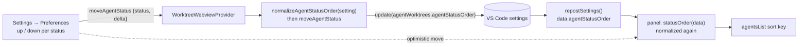

# Agents view

A second view of the sidebar panel: every agent in the repository as one flat
list, instead of one card per worktree with its agents inside it.

The cards answer *what is this worktree doing*. The agents view answers *what is
running, and what does it need from me* - the question you have when the repo
summary says four agents and two subagents, and finding the one that is waiting
means opening four cards.

## Switching

- A **tab strip** across the foot of the panel header, labelled **Worktrees** and
  **Agents**. Two tabs rather than one button that swaps, because which view you
  are in is a state worth showing and a single toggle can only show the one you
  are not in.
- Tabs, not two toolbar buttons. The list below is the tab's contents and
  pressing one changes the whole panel; as a pair of small controls parked at the
  end of the agent-summary line they read as two more buttons among the counters,
  and the panel had no at-a-glance answer to "which view is this".
- Drawn as folder tabs: outlined on three sides, top corners rounded, open at the
  bottom. The strip carries the rule that divides the header from the list, and
  the selected tab paints its own bottom edge in the page colour over that rule,
  cutting it - so the tab and the list read as one surface and the unselected one
  reads as sitting behind it. Every tab carries the full border, transparent when
  unselected, so nothing changes size when the selection moves. The accent
  (`panelTitle-activeBorder`) caps the selected tab's top edge, because at a
  glance colour is what finds it - a neutral outline alone is too quiet in a
  light theme. Uppercase 11px keeps VS Code's panel-title voice, so the strip
  reads as chrome around the list rather than as panel content.
- Words rather than glyphs. The pair used a stacked-cards mark and the agent
  mark, but the agent mark is the panel's most repeated glyph - it heads the
  repo agent count, every card's agent count and every agent row - so a fourth
  use of it read as another counter rather than as a control.
- The strip is the last row of `.repo-bar`, under the repository name and the
  repo-wide agent summary: the header names the repository and counts what is in
  it, then hands down to the tabs the choice of how that is listed.
- The choice is persisted in the webview state (`panelView`), so reopening the
  panel returns to the view you were last in.
- **Expand/collapse all** rides at the right end of the strip, borderless, where
  a panel keeps its title actions - what it folds is the tab's contents. It is
  disabled in this view (its rows are the leaves, so there is nothing to fold)
  but stays in place rather than disappearing, so the strip does not change shape
  between the two views. Its tooltip says so ("Disabled in the agents view:
  nothing to fold"), which is why it is dimmed by a class rather than by the
  `disabled` attribute: a truly disabled button dispatches no mouse events and
  could not be hovered to read it.

Switching is webview-local. Both views render from the same `{type:"update"}`
payload the extension already posts, so the switch is a re-render with **no round
trip to the extension** and no git or GitHub work of any kind.

## What a row shows

The rows are the card's own `.agent-row` and `.subagent-row`, so an agent reads
the same in either view: status dot, the work summary, the terminal chip when it
owns the open terminal, a stop button, and the subagent/skill chips. Clicking a
row reveals its terminal; a subagent row reveals its parent's.

What the flat list has to add is **where the work is landing**, which a card gave
for free by being the thing the row sat inside:

- Each agent row carries a branch chip (`.agent-where`): the worktree's branch,
  its path in the tooltip, a house glyph when it is the primary worktree, and the
  detached glyph in the warning colour when the worktree is on no branch. Without
  it two rows reading "Fix the flaky test" are indistinguishable.
- The branch and the counters share the row's second line, so the summary keeps
  the full width and still wraps rather than clipping.

## Subagents

On a card, a subagent given a worktree of its own is a row on **that** worktree's
card - the card for the code it is touching - and its parent carries only a count.
Here there are no cards, so the tree is the honest one: every subagent is a row
under the agent that spawned it, and one working in a worktree of its own says so
with a branch chip of its own (`.subagent-where`).

A subagent whose parent session is not itself in the list - its agent is running
somewhere the panel is not showing - still gets a row, at the end, naming the
agent that sent it. Otherwise it would simply vanish when the view is switched.

## Order

Rows are grouped by status, waiting first out of the box: that order is what the
view is for, since the agent that needs you is then at the top whatever worktree
it is in.

The sort is stable, so within a status the rows keep the order the cards are in,
and a row moves only when its status actually changes.

### Pinned agents

A pin on each row lifts that agent above the grouping entirely: pinned rows sort
first, whatever their status, so the one session you are actually shepherding
stays at the top while the rest of the list churns around it. The grouping is
not discarded, only outranked - it still orders the pinned rows among themselves
and everything below them.

The pin ranks above the status because it is the narrower statement. The status
order is a standing preference about how the whole list reads; a pin is the user
naming **one** agent, right now, and an override that its own group order could
push back down would not be an override.

- The control is a thumbtack at the right of the row, outlined where a pin could
  go and filled where one is. Deliberately **outside** `.row-actions` (the group
  holding the stop button), which is transparent until the row is hovered: a
  pinned row has to say why it is at the top when nothing is pointing at it, and
  an opacity on the group cannot be undone by a child.
- **Agents-view rows only.** On a card the row's place is already decided by the
  worktree it belongs to, so a pin there would be an offer with no effect.
- A rule with a break in it marks where the pinned run ends. The hairline above
  every agent already says "next agent", so a slightly darker one in the same
  place would say nothing; the gap is what separates the groups.
- Pinning scrolls the list back to the top, unpinning does not. Pinning is a
  request to keep that row in sight and it has just moved somewhere the user may
  not be looking; unpinning is done while looking straight at the row, and
  jumping would only lose their place.

### Where the pins live

In the **webview's own state** (`pinnedAgents`), beside `expanded` and the
current tab - not in a VS Code setting like the status order. The two look
similar and are not: the status order is a standing preference about how the
list reads, while a pin names one live session, by an id that means nothing in
another window and nothing at all once that session ends.

Which is also why the list has to be swept. Session ids are not reused, so
without one the stored list would grow for as long as the panel's state
survives. Every payload drops the pins whose session it no longer lists - but
only on the **second** payload in a row that misses one. A session's registry
file is rewritten in place on every status transition, so a single gather can
miss a session that is still very much running, and one unlucky read must not
quietly unpin it. The absence count is in memory only: a reload starts it again,
which at worst delays a dead pin's cleanup by one payload.

Pinning is webview-local like the tab switch itself - it decides how the payload
the panel already has is ordered, so there is no round trip and no git or GitHub
work behind it.

### It is a preference

Which status leads is a matter of taste - someone watching a fan-out cares about
**active**, someone triaging cares about **waiting** - so the order is the user's,
set in **Settings → Preferences** with an up/down control per status.

- Stored in `agentWorktrees.agentStatusOrder` (a real VS Code setting, so it
  syncs and can be edited in `settings.json` like any other), applying to every
  repository. The worktree cards are unaffected: there each agent is already on
  the card for the code it is working on.
- The setting is hand-editable, so it is **normalized rather than validated** on
  every read (`src/agentOrder.ts`, unit-tested): known statuses in the order
  given, first occurrence only, then any status the value left out appended in
  the default order. A list naming two of the three would otherwise decide the
  third's agents are not drawn at all. The webview repeats the same
  normalization, so it never depends on a well-formed payload to draw every row.
- A move is computed **from the stored setting, in the extension**, not from an
  order the webview posts, so two fast clicks or a stale payload can only reorder
  the list the user actually has. The webview still moves the row optimistically
  on click and lets the extension's push confirm it, the same trick the Source
  Control scope pill uses.
- `ghSig` (what decides whether an open settings page re-renders) includes the
  order, or the confirming push would be dropped as unchanged and a failed write
  would leave the optimistic order on screen with nothing to correct it.

## What it does not have

Everything about the worktree itself stays on the cards: git totals, the PR
rollup, debug sessions, the per-worktree actions menu, Source Control scoping.
This view is deliberately only the agents; the other tab is one click away when the
question is about a worktree instead.
