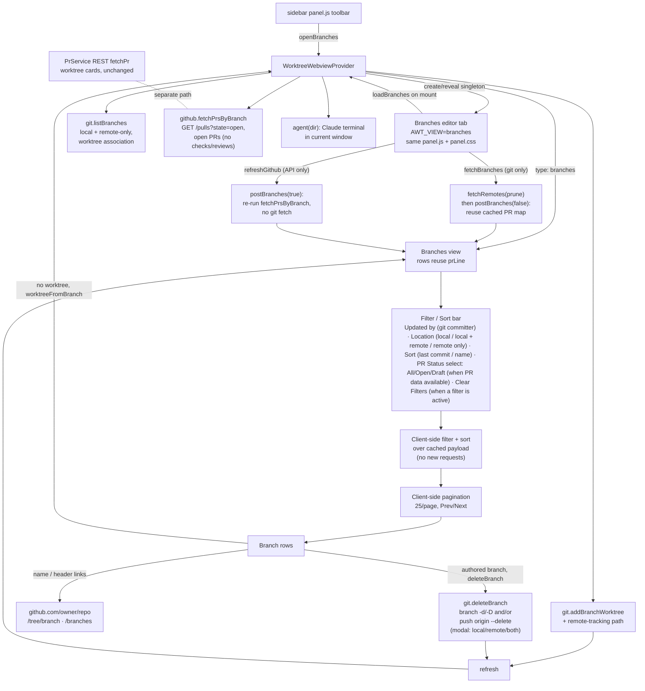

# Branches view

A dedicated editor tab listing every branch, with worktree association, git
metadata and optional PR status. The view is **git-first**: everything it sorts
and filters on comes from git, so it works with no GitHub token at all.

## Opening the tab

- The **Branches** toolbar button posts an `openBranches` message to the webview
  provider, which opens (or reveals) a webview as an editor tab in the active
  column, filling the editor area.
- It is a singleton: a second click reveals the existing tab rather than
  duplicating it.
- The tab loads the same `media/panel.js` + `media/panel.css` as the sidebar,
  switched into branches mode by a `window.AWT_VIEW = "branches"` flag in its HTML.
- On mount it requests data with a `loadBranches` message, which the provider
  answers with a `{ type: "branches" }` payload.

## Branch listing (`git.listBranches`)

- Enumerates every local branch plus every remote-only `origin/*` branch, each
  shown once by short name.
- Annotates whether a worktree already holds it, and whether a matching
  `origin/<name>` exists, so the row can tag itself "local only" / "local + remote"
  / "remote only".
- Enriches each branch with ahead/behind against its compare base: its upstream
  when configured, otherwise the repo's default branch (`origin/HEAD`).

Ahead/behind is gathered as cheaply as git allows:

- from `%(upstream:track)` when there is an upstream;
- otherwise from a single batched
  `git for-each-ref --format=%(ahead-behind:<default>)` call (git 2.41+) over all
  refs at once;
- falling back to a per-branch `git rev-list --left-right --count base...tip` only
  on older git, or when a branch compares to its own `origin/<name>` (a per-branch
  base that cannot be expressed against a single committish).

Those per-branch calls run with bounded concurrency so a many-branch repo does not
spawn a process per branch at once, and any per-branch failure leaves that branch's
counts at zero.

**No `+`/`−` line diff, deliberately.** That needed one `git diff` process per
branch (git has no batch form), which was the main cost on large repos, and the
commit ahead/behind is the more useful signal.

The same `for-each-ref` calls also read each branch's tip-commit `committerdate`,
`committername` and `committeremail`: one extra field per record, no extra git
process. Those give the row its "last updated" line and the **Updated by** filter.

Implementation notes:

- Every git call goes through `execFile` (argument arrays, no shell), so there is
  no per-call `cmd.exe`/`sh` wrapper. On Windows that roughly halves the process
  count for a branch listing and avoids shell-specific `--format` quoting.
- Each call has a timeout, so a wedged invocation cannot hang the view.
- Git activity plus a per-load timing summary (branch count, ahead/behind call
  counts) is logged to the "Agent Worktrees" output channel, wired via
  `setGitLogger` so `git.ts` keeps no dependency on the vscode API.
- The `for-each-ref` parsing is split into pure `parseLocalBranchRefs` /
  `parseRemoteBranchRefs` helpers, unit-tested and CRLF-safe.
- If listing fails the error is surfaced in the view, not swallowed into an empty
  list.

### Tracing

The optional `Agent Worktrees: Trace` setting turns on verbose tracing of every
external call.

- Surfaced under **Settings → Debug** (a toggle plus **Open log**), and also
  flipped by the "Toggle Debug Tracing" command. Both write the same
  `agentWorktrees.trace` config, re-applied by the host's
  `onDidChangeConfiguration` handler.
- `git.ts` and `github.ts` each take an injected tracer (`setGitTracer` /
  `setGithubTracer`) wired by the extension host to the diagnostics channel, so
  both stay free of a *runtime* vscode dependency. Their `vscode` imports are
  type-only and elided, which is what lets the unit tests load them without a
  vscode stub.
- Each git invocation and each GitHub `fetch` is logged with its command/URL,
  duration and result. Request headers, which carry the token, are never logged.
- Off by default, with zero overhead when off: the tracer is null, so no trace
  strings are built.

## PR data for the list

The git-only branch list paints first, so the tab is responsive immediately, then
PR data is fetched in the background.

- With the PR integration enabled and a token connected, opening the tab kicks off
  a GitHub refresh (the **Fetch Open PRs** button spins until it lands), and that
  button re-polls on demand afterwards.
- The git fetch is **not** run on open. It stays the manual **Fetch** button.
- With no token the view stays git-only and never calls the API.

`github.fetchPrsByBranch` does the work:

- One REST `GET /repos/{owner}/{repo}/pulls?state=open`, paged from
  most-recently-updated, so one call in the common case and no per-PR follow-ups.
- **Open-only on purpose.** The view only renders open/draft PRs, and a repo carries
  far more closed/merged PRs than live branches, so `state=all` used to page through
  up to ~1000 historical PRs to surface a handful of open ones.
- Returns the fields the list endpoint carries: state, author, assignees, requested
  reviewers, auto-merge. It has **no** CI-check, review-decision or comment data, so
  those badges stay empty in the branches view; pulling them would need a per-PR
  follow-up the bulk path deliberately skips.
- The result is mapped to branches by head ref client-side, and the fetch time
  becomes the header's **Last refreshed** label.
- A failure degrades the whole view to "no PR data". Rows still render, and the
  reason (`fetchPrsByBranch` returns an `error`) plus a "fetched N PRs, matched M
  branches" tally are logged to the output channel.
- Because it is a plain `GET /pulls`, a fine-grained PAT only needs **Pull
  requests: Read**. The previous GraphQL path failed with "Resource not accessible
  by personal access token" on tokens denied GraphQL.

### The worktree-card poll is a separate path

`PrService` shares the bulk-list technique but stays separate, because the cards do
show checks and reviews.

- Each poll starts with one bulk `GET /pulls?state=open` per repo, shared by that
  repo's worktrees and mapped by head ref, instead of one `?head=` call per
  worktree.
- Follow-ups are fetched only where something can have changed. A PR whose
  `updated_at` and head SHA match the cache is reused outright, at zero requests.
- Two blind spots `updated_at` cannot see are covered separately: checks are
  refetched while the cached rollup is pending (check completion does not bump
  `updated_at`), and an aux refresh of detail + checks runs at most every five
  minutes to catch base-branch movement (the "Out of date" pill) and re-runs of
  completed checks.
- Reviews and comments refetch only on an `updated_at` change.
- For a branch with no open PR in the bulk list: a cached merged/closed PR is
  terminal and never refetched (anything new would be an open PR and appear in the
  bulk list), and such PRs no longer count toward the fast poll cadence. An
  uncached branch, or one whose PR just left the open list, pays one `state=all`
  lookup to learn its state.

### Cache entries are tagged with their branch

The panel reads the cache back by (worktree, branch), so a worktree that changed
branch reads as "not known yet" rather than showing the branch it left.

- The case that matters is a merged PR: the terminal-state rule above means a stale
  one would otherwise sit on the card forever, never re-checked.
- The tag also guards the write side. A poll that started before the switch does not
  store its result against the new branch, and does not reuse the old branch's value
  as its `prior`.
- A refresh requested while one is already in flight is queued rather than dropped,
  so the new branch is fetched as soon as the running poll finishes instead of at
  the next timer tick.
- Every request stays ETag-conditional, so 304 replies do not count against the rate
  limit, and the token is memoized instead of re-read from SecretStorage on every
  call (invalidated via `secrets.onDidChange`, so a token change in another window
  is picked up).

## Filters, sort and pagination

All of it runs client-side over the cached payload, so changing anything issues no
network request.

Git-based, always available:

- **Updated by**: multi-select of the branches' tip-commit committers
  (`userOptions`), viewer pinned first when a committer name matches the GitHub
  login.
- **Location**: multi-select over `Local only` / `Local + remote` / `Remote only`,
  matching the tag each row displays (`branchKind`). An empty selection means no
  filter.
- **Sort**: single-select over `Recently updated` / `Least recently updated`
  (tip-commit `committerdate`) and `Name (A–Z)`.

PR-aware, shown **only** when GitHub PR data is available (and ignored if their
persisted state is stale while the integration is off, so neither can blank the
list):

- **PR Status**: `All`, `Open` or `Draft`. The fetch is open-only, so those are the
  only states it can match.
- **Reviewer**: `All`, or `Review requested`, which narrows to branches whose PR has
  a review requested from the signed-in user (`reviewRequestedFromViewer`), i.e. the
  PRs they still have to review.

**Clear Filters** (right-aligned, `data-action="clearFilters"`) resets Updated by,
Location, PR Status and Reviewer in one click. Sort is an ordering, not a filter, so
it is left alone. The button is `disabled` unless a filter is actually narrowing the
list, on the same predicate `visibleBranches` filters on:

```
users.length > 0 || locations.length > 0 ||
(prStatus !== "all" && prAvailable) || (reviewer !== "all" && prAvailable)
```

Selected filters and sort persist across reopens via the webview state. The
filtered list is paginated client-side, 25 per page with a Prev/Next pager, and the
page resets to the first whenever a filter or sort changes.

A branch's open (or draft) PR rollup is rendered as a hint on its row when one
exists. Merged/closed PRs are not loaded, which is why deleting a squash-merged
branch falls back to git's "not fully merged" prompt (one extra confirmation).

## Creating a worktree from a branch

- A branch with no worktree shows **Create worktree & start agent**; one that
  already has a worktree shows a **Worktree exists** marker plus **Start agent**,
  which posts an `agent` message to launch a Claude agent in that existing worktree.
- Clicking create posts `worktreeFromBranch`. The provider runs
  `git.addBranchWorktree` (checking out an existing local branch, or creating a
  local tracking branch for a remote-only branch), starts a Claude agent in it via
  the existing `agent(dir)` flow in the current window, then refreshes the sidebar
  and re-posts the branch data so the row flips to the marker.
- Worktrees the extension creates (this action and the New Worktree command) go
  inside the primary worktree at `.claude/worktrees/<branch>`, the same location
  `claude -w` uses, rather than the repo's parent directory
  (`worktreeUtils.worktreeDirFor`).
- The extension never edits the repo's ignore rules. Exactly as with `claude -w`,
  the nested directory shows as an untracked entry in `git status` unless the user
  excludes it themselves (one `/.claude/worktrees/` line in `.git/info/exclude` or
  `.gitignore`).

## Deleting branches

Delete is **local-only**:

- Every branch with a local ref shows **Delete Local**, which removes the local
  branch and never touches the remote. A remote-only branch has no local ref, so it
  shows no action.
- The repo's default branch (origin/HEAD's short name, carried on each row as
  `isDefault`) is never deletable: the row shows no Delete action, and
  `deleteBranchAction` refuses it server-side via `defaultBranchName` even if a
  crafted message asks.
- Clicking posts a `deleteBranch` message carrying the branch name and whether its
  PR is `merged`.

Git refuses to delete a branch checked out in a worktree, so `deleteBranchAction`
inspects `listWorktrees` first:

- **Primary worktree on the branch**: blocked, with a "switch away first" message.
- **Linked worktree on it**: allowed but guarded. A modal warns it will leave that
  worktree on a detached HEAD, and the provider runs `detachWorktreeHead` (a
  `git checkout --detach` in that worktree) to free the ref before deleting.

Then the unpushed-commit path:

- `unpushedCommitCount` counts commits not on the branch's upstream, or with no
  upstream, not on the default branch.
- When non-zero and the PR is not flagged merged, the count is surfaced in a confirm
  (a second modal in the linked-worktree path) and the delete is forced on consent.
- A branch carrying a known-merged PR passes a `merged` flag to skip the "not fully
  merged" prompt. Since the branches view fetches open PRs only, a squash-merged
  branch usually arrives without that flag and hits the fallback instead.
- `git.deleteBranch` runs `git branch -d`/`-D`; an unmerged refusal falls back to an
  explicit force prompt. Both views refresh afterward so the row drops.

### Bulk "Delete gone"

- The header **Delete gone** button posts `deleteGoneBranches`.
- `git.goneBranches` reads `git for-each-ref ... %(upstream:track,nobracket)` and
  returns the local branches whose track is `gone`, what `git branch -vv` shows as
  `[gone]`. It reflects the last fetch, so pair it with **Prune** to register a
  just-deleted remote.
- `deleteGoneBranchesAction` drops the default branch, skips any branch checked out
  in a worktree (it never bulk-detaches, and reports the skipped count), lists the
  rest in one confirm, then deletes with `-d`.
- Branches that refuse as "not fully merged" (squash-merges) are collected and
  force-deleted only after a second, explicit confirm naming them.

### No delete flicker

- A delete triggers a refresh, but a routine refresh already in flight may have
  started its `gatherBranches()` before the delete and resolve *after* it,
  re-posting the deleted branch, which the next refresh then removes again. That
  was the "branch flickers back, then gone" report.
- `postBranches` guards against it with a monotonic `branchPostSeq`: each call
  claims the latest token before awaiting git/GitHub, and only posts if it is still
  the latest when it resolves, so a stale gather cannot clobber a newer render.

## Fetch vs GitHub refresh

The two are independent, so refreshing PR state never triggers a git fetch and vice
versa.

**Git only (`fetchBranches`).**

- `fetchRemotes(cwd, { prune })` runs `git fetch --all`, with `--prune` unless
  disabled, so stale `refs/remotes/origin/*` (branches deleted on the remote) are
  dropped and no longer surface as phantom "remote only" / "local + remote" rows.
- The **Fetch** button posts the **Prune** checkbox state; the provider fetches with
  that setting, then re-reads both views without a second fetch and re-posts the
  branches reusing the cached PR map (`postBranches(false)`), so the git fetch never
  hits the GitHub API.
- The Prune choice is persisted in the webview state.

**API only (`postBranches(true)`).**

- The only path that runs `fetchPrsByBranch` and stamps `branchPrsAt`, shown next to
  a **Last refreshed** label (the fetch time, or **Never** before the first refresh)
  when a token is stored (`github.hasToken`).
- Two things call it: opening the tab, and the **Refresh GitHub** button
  (`refreshGithub`) on demand.
- Every other path (the git Fetch, watcher-driven refreshes, worktree/branch
  mutations) calls `postBranches(false)` and reuses the cached PR map, so they
  re-render rows without touching the GitHub API.

**On open (`loadBranches`)** the local list is posted immediately, **without**
awaiting the GitHub token probe (`connection()`, a network round trip that used to
gate the first paint):

- it synthesizes a `hasToken` connection from the local `getToken()` so the Fetch
  Open PRs button still shows, flagged `githubRefreshing` when a token is present so
  it spins;
- then does the rest in the background: the real `connection()` probe, then, with a
  token connected, `postBranches(true)` for PR/CI status, then a background
  `refresh(false)` for the sidebar;
- the background posts are awaited in sequence, so the slow GitHub post is not
  dropped by the `branchPostSeq` staleness guard.

## GitHub links

When `origin` is a github.com remote the provider attaches `repoUrl`
(`https://github.com/<owner>/<repo>`) to the payload.

- Each row links its name to the branch tree (`/tree/<branch>`, each path segment
  encoded so slashes survive).
- The header carries a **Branches on GitHub** link to `/branches`.
- Both are plain `<a target="_blank">` anchors that VS Code opens externally, with
  no round-trip.

## Rendering performance

- The webview rebuilds the DOM only when the posted payload actually changed (it
  compares a JSON signature, mirroring the settings view's `ghSig` guard), so a
  routine poll no longer wipes the list or resets the user's scroll position.
  Renders that do happen restore the `.brows` scroll offset.
- Buttons that kick off real git/network/window work (`agent`, `agentWorktree`,
  `openWindow`, `openBranches`, `worktreeFromBranch`, `fetchBranches`,
  `refreshGithub`, see `BUSY_ACTIONS` in `panel.js`) swap their icon for a spinning
  ring and disable themselves on click (`markBusy`).
- That busy state is transient DOM: the next `update`/`branches` payload re-renders
  with the real icon restored, so it clears automatically when the work lands. A
  no-op fetch returning an unchanged payload re-renders only when a spinner is
  pending, so background polls still skip the rebuild, and a 15s safety timeout
  restores any button that never sees a re-render.


