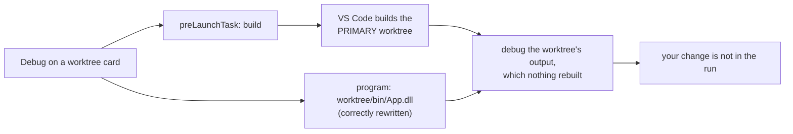

# Run and Debug in a worktree

The **Debug** button on a card runs one of that worktree's launch configurations,
with or without the debugger, and the rows underneath it stop and restart what it
started.

## Why the panel has to own both ends

- The Run and Debug view cannot be retargeted by an extension. Its dropdown is
  built from the **workspace folders'** launch configs plus the workspace-level
  `launch` section, and the selection belongs to the user. There is no API to set
  an active launch folder.
- A worktree is not a workspace folder, so VS Code never surfaces its
  `.vscode/launch.json` at all, and cannot resolve `${workspaceFolder}` against
  it.
- `debug.startDebugging(folder, config)` is the one debug entry point that takes
  a target, so the panel reads the worktree's launch.json itself and passes a
  configuration object.
- Two alternatives were rejected. Adding the worktree via
  `updateWorkspaceFolders` does put its configs in the dropdown, but going from a
  single-folder to a multi-folder workspace **restarts the extension host**,
  which loses every agent terminal handle the panel tracks. Rewriting paths in a
  `resolveDebugConfiguration` hook for `*` would make the existing F5 honor the
  worktree, but it changes what F5 does invisibly and has to guess which fields of
  every debug type carry paths.

Because the sessions start outside the debug view, the card is also the only place
they can be named per worktree and acted on, which is what the session rows are
for.

## Parsing launch.json

`src/debugTargets.ts` is VS Code-free and unit-tested (`test/debugTargets.test.js`).

- launch.json is JSONC, which `JSON.parse` rejects, so comments and trailing
  commas are stripped by a scanner rather than a regex: a `"https://..."` value
  keeps its tail, and a `,}` inside a string is not treated as a trailing comma.
- A malformed file yields **no targets**, which renders as no Debug button. There
  is nothing the user could do with a parse error surfaced on a card.
- Configurations missing `name`, `type` or `request` are dropped. VS Code's own
  schema requires all three, so an entry without them could not start anyway.
- `compounds` are offered too, and start their members in order. Members are
  counted and filtered against the configurations that exist, so a compound
  naming a deleted config still works and one naming only deleted configs is not
  offered. The multi-root `{folder, name}` member form is ignored, since it points
  outside this worktree.

## Rewriting a configuration for the worktree

`prepareConfig` returns a copy, never mutating what was parsed:

- `${workspaceFolder}`, `${workspaceRoot}` and `${workspaceFolderBasename}` are
  replaced with the worktree, walking nested objects and arrays (an `args` entry
  or an `env` value carries paths as often as `program` does). `${input:...}` is
  resolved by the panel too, for the reasons below. **Every other `${...}`
  variable is left for VS Code**, so `${config:...}` and `${env:...}` still
  resolve, against the primary folder.
- `cwd` defaults to the worktree. Without it an adapter whose cwd defaults to the
  workspace folder would run the worktree's program from the primary checkout. A
  config that sets `cwd` itself is left alone.
- The session is renamed `<config> (<worktree>)`, so VS Code's CALL STACK says
  which worktree a session belongs to when several are running. Those views are
  worktree-agnostic; the card row is not, so it drops the suffix and shows the
  configuration name alone - inside a card, `(<worktree>)` only repeats the
  branch name in the header above it. The unsuffixed name is carried on the
  configuration as `agentWorktreesBaseName` rather than parsed back off the end
  of the session name, which would go wrong for a config whose own name ends in
  parentheses. A session started before the key existed falls back to its full
  name. The **log** keeps the suffixed name: it spans every worktree.
- The worktree path is recorded on the configuration itself
  (`agentWorktreesPath`), plus `agentWorktreesNoDebug` for a run started without
  debugging and `agentWorktreesFromInput` for one filled in from a prompt, which
  is how stopping it stays out of the log too. `DebugSession.configuration` keeps
  unknown properties verbatim, which is how a running session is mapped back to
  its card.

The `folder` argument passed to `startDebugging` is the workspace folder that *is*
the worktree when there is one, else the first folder. Since the folder variables
are already substituted, it only decides where the remaining variables resolve.

## Input variables

A configuration can be parameterized with `${input:<id>}`, declared in a
top-level `inputs` array of **the same file**. VS Code resolves those against the
workspace folder's launch.json, which for a worktree means one of two wrong
answers:

- an id the primary checkout does not declare fails the launch outright, even
  though the worktree that owns the configuration declares it;
- an id it happens to declare is prompted with the *primary* file's definition,
  which can be a different question with different options.

So `src/debugInputs.ts` (VS Code-free, unit-tested in `test/debugInputs.test.js`)
resolves them from the worktree's own file, and `startDebugging` is handed a
configuration with no `${input:...}` left in it.

- All three types work. `promptString` is an input box (`password` honored),
  `pickString` a quick pick where the declared `default` comes up selected
  without reordering the author's options, and `command` runs a VS Code command
  and takes its result as the value.
- A `command` input's `args` are the inputs to that command, and they get the
  same folder rewriting as the configuration - so a command that lists candidates
  lists the **worktree's**. A `default` or `description` is rewritten the same way.
- References are collected deep and in order (`program`, `args`, `env`, nested
  objects), so the prompts follow the configuration as written and each id is
  asked once.
- Input values are substituted **before** the folder variables, so an answer
  containing `${workspaceFolder}` still points at the worktree.
- A **compound** resolves every member's inputs up front, before the first
  pre-launch task runs. An id two members share is asked once, where VS Code asks
  per member, and dismissing a prompt has cost nothing yet.
- An **undeclared** id refuses the launch, with a warning naming the id.
  Substituting nothing would start a program with a hole in its arguments. A
  dismissed prompt abandons the launch silently, as VS Code does.
- A `command` input whose command throws warns and abandons the launch; one that
  returns no string is treated as dismissed, since that is how a command's own
  picker reports a cancel.
- `${input:...}` in the **pre-launch task** resolves too, from the worktree's
  tasks.json `inputs` - a separate namespace from launch.json's, as in VS Code.
  The panel runs that task itself, so an unsubstituted reference would otherwise
  reach a shell verbatim.
- **Nothing an input was answered with reaches the diagnostics log.** What the
  user typed ends up in the configuration's name, program and arguments, and that
  log is the thing that gets pasted into bug reports - a `password` input exists
  precisely because its value should not be lying around. So a configuration that
  referenced an input is not traced when it starts or when it is stopped, and
  neither is a pre-launch task an input fed. The prompts themselves log nothing
  either. What still gets logged carries only launch.json and tasks.json content:
  the id that was not declared, a task label, a command name. A launch that
  **fails** is still marked, by a line naming neither the configuration nor the
  adapter's message (which can quote the arguments the answer went into), so
  "nothing happened" is never silent in the log.

## preLaunchTask, or: the reason this is not one API call

A `preLaunchTask` is a **label**. VS Code resolves it against the workspace
folder's tasks.json and runs it with that folder as cwd, and there is no argument
for "run this task somewhere else".

Passing the label through is therefore a silent wrong-result bug, and it is the
one this feature shipped with first:

So `prepareConfig` **strips** `preLaunchTask` and `postDebugTask` from what is
handed to VS Code, and the panel resolves and runs the pre-launch task itself
against the worktree (`src/debugTasks.ts`, unit-tested in
`test/debugTasks.test.js`):

- The label is looked up in the **worktree's** tasks.json, by explicit `label` or
  by the `npm: <script>` form an npm task takes without one.
- `type: "npm"` becomes `npm run <script>`, honoring the task's `path` subfolder.
  `type: "shell"` / `"process"` keep their command and args, with the folder
  variables substituted and a relative `options.cwd` resolved under the worktree.
  Platform blocks (`windows` / `linux` / `osx`) are merged over the base first.
- With no tasks.json entry, an `npm: <script>` label falls back to the worktree's
  package.json, since VS Code auto-detects those tasks and a launch.json can name
  one that tasks.json never defines.
- The task runs as a `ShellExecution` with cwd set to the worktree, behind a
  cancellable notification, and the launch waits for `onDidEndTaskProcess`. A
  **non-zero exit aborts the launch**: debugging output a failed build did not
  produce is exactly the confusion this path exists to prevent.

Three cases it cannot handle, each of which warns rather than pretending:

- **A provider task** (`type: "typescript"`, `"gulp"`, `"dotnet"`, or anything a
  extension contributes) cannot be reproduced from its definition. The launch
  continues with a warning that the task was skipped, because refusing outright
  would make the button useless for those projects and the user may well have
  built the worktree already.
- **A background task** (`isBackground: true`, a watch) is started but not waited
  on. VS Code waits for the problem matcher's begin/end pattern, which an
  extension cannot observe.
- **`postDebugTask`** is skipped with a warning. Running it means holding the
  label until the session ends and resolving it the same way, which is not worth
  it until someone needs it.

## Picking a target

One quick pick, not two steps:

- Accepting an item starts it **with** debugging.
- Each row carries a play button ("Start without debugging") which starts it with
  `noDebug: true`. The tooltip is what makes the alternative discoverable, and it
  costs no extra keystroke for the common case.
- A compound is described as `compound · N configurations`, so it does not read
  like a single launch.

If the first member of a compound fails to start, the rest are skipped: starting
them against a half-built setup is worse than stopping with one warning.
`startDebugging` resolving `false` means the adapter refused (a missing program,
an uninstalled debug extension) and VS Code has already shown its own error, so
the panel only names the configuration.

## Stopping and restarting

`DebugSessionTracker` follows `onDidStartDebugSession` / `onDidTerminateDebugSession`
and claims a session only when it carries the worktree tag.

- A session started from the Run and Debug view, or by another extension, is never
  listed. The panel offers to stop and restart only what it started.
- Both buttons on a row are **always visible**, unlike an agent row's
  hover-revealed actions: these sessions were started from the card, so the card
  has to carry the obvious way out. VS Code's debug toolbar also works, but it acts
  on the session it considers active, which is the wrong one as soon as two
  worktrees are running something - and that is exactly why restart cannot be
  `workbench.action.debug.restart` either.
- Stopping removes the row via the terminate event, not optimistically. A session
  that refuses to die keeps its row and its buttons.
- Disposing the tracker (extension-host shutdown) stops tracking, not the
  sessions. They keep running exactly as if they had been started from the debug
  view.

### What a restart actually does

A relaunch, not an adapter restart: stop the session, wait for it to terminate,
run the pre-launch task in the worktree again, start the same configuration.
Rebuilding is the point - the reason to restart is the change you just made in
that worktree, and an adapter-level restart would run the old output.

- Each launch is kept as a **recipe** (the prepared configuration, the resolved
  pre-launch task, `noDebug`, the worktree), so a restart re-reads nothing. It
  does not re-parse launch.json, which may have been edited since, and it does not
  re-ask the `${input:...}` questions: the session comes back as the session that
  was running, with the answers it was running with. A launch.json change is
  picked up by the Debug button, which is where a *different* launch belongs.
- The recipe is paired with its session by the worktree and configuration-name
  tags the configuration already carries, since `startDebugging` does not hand
  back the session it started. Two cards can be launching at once, so the pending
  launches are a list, matched, rather than one slot.
- The row **stays on the card while the restart runs**, marked "restarting" with
  both buttons disabled and the green run glyph dropped, because the session is
  genuinely not running. With a build in the gap the card would otherwise sit
  empty for several seconds and read as "the click killed it".
- A session that does not terminate within ten seconds is **not** restarted, with
  a warning naming it. Starting a second copy against whatever the first still
  holds open (a port, a lock file) is worse than not restarting.
- A restart whose build fails, or whose launch the adapter refuses, drops the row:
  the old session is gone and nothing replaced it. The warnings are the same ones
  the Debug button shows, and a session configured from an `${input:...}` answer
  stays out of the log here too.
- A session the tracker somehow has no recipe for still restarts, from the
  configuration VS Code is running. Only its pre-launch task is lost - the label
  was stripped before VS Code ever saw it.

`test/debugRestart.test.js` drives the whole round trip against a stubbed
extension host: it asserts that the relaunch is byte-for-byte the configuration
that was running, that the build ran again and the prompts did not, and that the
row behaves at each step (held while the restart runs, dropped when the relaunch
is refused, un-marked when the session will not stop).

## Refresh cost

- `canDebug` is one `readFile` per worktree per **full** refresh, which is
  nothing next to the git spawns already in that path. Adding a launch.json shows
  up on the next full refresh, or immediately via the card's own refresh button.
- A session starting or ending patches the cached payload and re-posts, rather
  than re-running the git gather. This is the same trick the agent-only refresh
  uses for hook events (see [Refresh coalescing](refresh-coalescing.md)).
