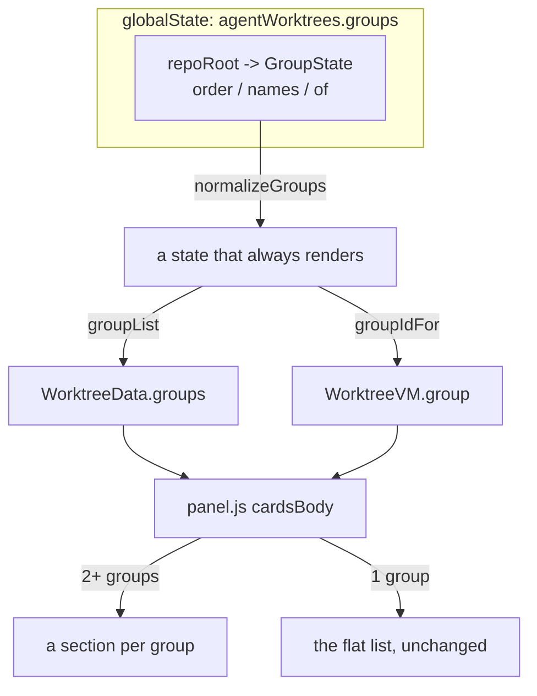

# Worktree groups

User-named sections over the cards list, so a worktree kept open until its PR
merges stops competing for attention with the one being typed into.

The panel's cards are ordered by `git worktree list` and nothing else, which is
fine at three worktrees and not at ten. The ones you are done with are the ones
that accumulate: a branch pushed and waiting on review has to stay checked out,
but there is nothing left to read on its card. Groups are where those go.

Membership is **manual** in this phase. Rules that file a worktree automatically
are the next one, and this layer is what they will assign into.

## The three invariants

**The primary worktree is not in a group.** It is the checkout the repository
itself lives in and every other worktree hangs off, so it is not one of the
things you file - it is what they are filed under. It leads the list, above every
section, with a labelled rule between it and them; the panel offers it no group
to move to, and `assignGroupAction` refuses it if asked anyway. A membership
stored for it before that was the rule is cleaned up on the next gather, by being
left out of the filable set `pruneGroups` is given.

**General always exists, and is called General.** It is where an unassigned
worktree lives, where a deleted group's members fall to, and what an unrecognized
group id resolves to. Every path through `groups.ts` preserves it, which is what
makes the one failure a grouping feature must not have - a card filed somewhere
that is not drawn - unreachable.

It cannot be renamed or deleted. It is not a group the user made: it is the
bucket everything else falls into, and both this document and the panel's own
copy name it in prose ("moves to General", "Empty. Move a worktree here"). A
renamed one makes those sentences lie and leaves no stable word for where an
unfiled worktree lives, so `normalizeGroups` overwrites whatever name a blob
carries for it, `renameGroup` no-ops on it, and its header menu offers neither
entry. It can still be moved: where the default sits in the order is a real
preference, and rule precedence will be read off that order.

**A new worktree is in General**, by construction rather than by a rule that has
to run: membership is the presence of an entry in `of`, and a path nobody has
filed has none, so `groupIdFor` answers General for it. Nothing has to notice
that a worktree was created, and there is no window in which a fresh card is
unplaced.

**Membership is keyed by worktree path, not by branch.** `switchWorktreeBranch`
means a worktree can change branch under you, and filing one is a statement about
the working copy you parked, not about what happens to be checked out in it.
Paths are canonicalized (`normalizePath`) before they are stored, so the same
worktree compares equal on Windows too.

## Where the state lives

`globalState`, under `agentWorktrees.groups`, as a map of repo root to
`GroupState` - the same shape and for the same reasons as the linked-paths map
beside it:

- It is per-repo, and keyed by absolute paths that mean nothing on another
  machine, so it is not a setting and does not belong in `settings.json`.
- It is structure the user built rather than a preference, so it is not webview
  state either: `expanded` and `pinnedAgents` describe how the panel is being
  looked at right now, and are lost with the webview by design. A group you made
  and filed four worktrees into is not.
- `globalState` rather than `workspaceState` so a second window opened on the
  same repo shows the same sections.

Keyed by the **primary worktree** (`repoSettingsKey`), not by `data.repoRoot`: in
a window opened on a linked worktree the repo root *is* that worktree, so reading
by it would miss everything stored under the primary's path.

The entry is deleted outright when a repo is back to General with nothing filed,
so the map does not accumulate blanks for repos that were grouped once.

## Normalizing, not validating

`normalizeGroups` is the only way the stored blob is read. It is a JSON value
that survives version changes and can be hand-edited, so it normalizes the way
`agentOrder.ts` does: whatever goes in, what comes out renders.

- Ids are kept in the order given, first occurrence only.
- A group with no usable name is dropped. Its members lose their `of` entry and
  fall to General rather than disappearing with it.
- A membership pointing at a group that did not survive is dropped, same effect.
- General is inserted if missing, at the front, since a state that never stored
  it has no preference to honour.
- `MAX_GROUPS` (24) caps the list. Not a UX limit anyone should reach; it is
  there so a corrupt blob cannot render thousands of headers.

Names are trimmed, single-spaced and capped at 40 characters, and a new or
renamed group is suffixed (`In review 2`) when another already answers to that
name case-insensitively. Two headers a glance cannot tell apart would make the
move-to menu a coin flip, and the ids that distinguish them are not on screen.

## Pruning

Memberships for worktrees that are gone are dropped on every full gather, in
`attachGroups`. That is the moment the live set is known, and `pruneGroups`
reports whether anything actually went so the common refresh writes nothing.

The groups themselves are never pruned. An empty group is a place the user made
to put things in, not litter, and one that vanished when its last card left would
look like the panel had deleted it. Empty sections keep their header and say so.

## What the panel draws

`cardsBody` in `media/panel.js` partitions the cards by `wt.group`.

**General is always drawn**, even in a repo where nobody has made a group. It is
where a new worktree lands, so it is the thing you drag out of and the header you
reach New group on. The panel spent a version only growing sections once you
already had two groups, which made the first one hard to find and then moved
every card on screen the moment you made it.

**The primary worktree leads, under a labelled rule.** `cardsBody` lifts it out
before partitioning and renders it first, then a `Worktrees` divider, then the
sections. The divider is labelled rather than a bare hairline: a line on its own
says "these are apart" without saying why, and what is below it is every other
worktree in the repository, however the user has since divided them up.

A section header is deliberately quieter than a card: a fold, a name, a count and
a caret, with no border, no fill and no card gutter. It labels the list rather
than being an item in it, and giving it a card's treatment would make every group
read as a card containing cards - one nesting level more than a sidebar carries.

## Showing that the cards are inside it

A header above a run of full-width cards is a header *next to* cards, not a
header *over* them: nothing draws the containment, and by the fourth card the
header has scrolled away anyway. Two things fix that, and both were needed.

**A rail, and 12px of indent.** The group's cards are held to the right of a 1px
rail that hangs off the header. It sits on the chevron's centre line, so what it
descends from is the control that folds them, and it stops at the last card's
bottom edge rather than in the gutter below it, so where it ends is where the
group ends.

It took over from the rail a card's own expanded body used to draw
(`.card-body::before`), which was removed with it: the two ran a few pixels apart
down the same stretch of card, and beside the Agents heading they read as a
gutter rather than as anything about either the card or the group. One rail, at
the level that now needs one. A card's fold is still marked by the horizontal
rule its body opens on.

12px is the entire budget, and it is measured rather than chosen: at 14 the
longest branch name in the fixtures stops fitting on one line at 260px, and the
card layout spends its width on exactly that. The section header is flush left to
buy the chevron's centre line back down to 6px. None of it is paid by a panel
with no groups, which draws no sections at all.

**Sticky section headers.** Which group you are looking at is precisely what
scrolling destroys. The header pins at `top: 0` and the card headers - already
sticky in this scroll region - pin *under* it, so scrolling a long group leaves
the branch name pinned beneath its section name, two levels deep, until the next
group pushes both off.

That needs the card headers offset by the section header's height, which
`syncGroupHeadHeight` measures after each render into `--group-head-h` rather
than writing down. The header is one line of fixed-size text beside an icon
button, so it is stable, but stable is not known, and a theme that changed it
would leave a hairline gap nothing in the source explains. The CSS carries the
first-paint value as a fallback.

Two details that bite: the offset rule is `.group .card .card-head`, three
classes deep, because `.card .card-head { top: 0 }` sits later in the stylesheet
and would win at equal specificity; and the section header needs an opaque
background (the sidebar's, since it sits on the panel rather than on a card)
because cards pass underneath it.

### Folding, and what folding must not hide

Collapse state is webview state (`collapsedGroups`), persisted alongside
`expanded`: which sections are open is how the panel is being looked at, and
collapsed is the point of the feature, so it survives a reload.

A collapsed header carries **the number of agents waiting on you inside it**.
That is what stops a group becoming somewhere work rots: you stop reading a
section on purpose, so folding one must not be able to swallow an agent that
needs you. It reads the same status the Activity Bar badge counts.

The badge is rendered whenever there is one to report and hidden by CSS while the
group is open, which keeps folding a class flip on DOM that is already there. A
badge that only existed in the collapsed markup would need a re-render to appear,
and a re-render costs the list its scroll position.

Folds for groups that no longer exist are dropped on render, so an id reused
later cannot arrive already collapsed.

## Moving a worktree

The move-to list leads the card's caret menu. Filing a worktree is the one action
in that menu you may do to the same card repeatedly - everything below it you do
to a worktree about once in its life - so it takes the cheapest target.

It is inline rather than behind a submenu or a quick pick: with a handful of
groups that is one click instead of three, and the menu already caps its own
height and scrolls when there are more than fit. The current group is a
`menuitemradio` with a check, and with no group but General the whole section
collapses to the entry that makes the first one.

Section headers carry their own caret: rename, move up, move down, new group, and
delete. General gets only the middle two and New group, since its name and its
existence are both fixed; the missing entries are absent rather than disabled -
there is nothing to explain, and two live entries read better than four with two
dead. Move up and down are present even on the first and
last group, where the host no-ops them: a menu whose entries change position
depending on which group you opened it on is worse than one with a dead entry.

The menu keeps Move up and Move down after drag reordering landed: menu-based
reordering is keyboard accessible for free, which dragging is not.

**Right-clicking a card, or a section header, opens the same menu its caret does**,
anchored at the pointer instead of under the button. The caret stays: this is the
shortcut for people who reach for it, not a replacement for a visible control. A
right-click inside the rename field is left alone, since the native menu there is
cut, copy and paste, which is the useful one.

## Naming a group in its header

Renaming happens in the header itself. A `showInputBox` throws focus to the top
of the window to edit one word on a thing you are already looking at, and it
cannot show you the name in the place the name lives.

The name becomes an `<input>` in place - same size, same weight, so the header
does not jump - with the current name selected, so typing replaces it and
clicking puts the caret where you clicked. **Enter** keeps it, **Escape** drops
it, and clicking away keeps it: the field holds a name that already exists, so
leaving is not a reason to throw the edit away. **F2** on a focused header opens
it, which is what renames things everywhere else in the editor.

Creating follows the same path. `createGroup` takes no prompt at all: the host
makes the group with the placeholder name `New group` and flags it on exactly one
payload (`WorktreeData.editGroup`), which the panel answers by opening that
header's field. Created and named are one gesture. A real placeholder name rather
than placeholder text in the field, so a rename walked away from still leaves a
group you can find and rename later.

Three things this costs, each with a guard:

- **A routine payload must not wipe a name being typed.** `render` keeps the data
  and skips the paint while a field is open, the same shape as the settings
  view's guard for the token field, and `endGroupRename` paints as soon as the
  field closes. It distinguishes a push from the internal re-render that opens
  and closes the field by identity (`data !== lastData`), since that one must
  still paint.
- **Space and Enter belong to the field, not to the fold under it.** The header's
  Enter/Space handler already excluded buttons and links; it excludes inputs too,
  or a space would fold the section and never reach the name.
- **The flag must fire once.** The host clears it after the post it rides on, and
  the panel also remembers the last id it acted on, because the cached payload
  passes through several posters (`postPrState`, `postDebugState`).

Validation stays in `groups.ts`: the panel sends what was typed and the next
payload says what it became. An empty field is a cancel.

## Dragging a section

Press a section header and move, and the header can be dropped anywhere in the
order.

**Pointer events, not HTML5 drag and drop.** This needs a drop indicator,
autoscroll at the edges of a short sidebar, and a cancel key; the native API
provides none of them while taking over the cursor and the drag image.

**The dragged group stays where it is and dims, and a line shows where it would
land.** A group can be several screens tall with its cards open, so carrying the
block under the pointer, or swapping neighbours as their midpoints pass, would
both be motion sickness. The line is the whole answer: where it lands is the only
thing the drop decides. Drawn faintly rather than hidden when the drop would be a
no-op, since "back where it started" is a legal place to let go, not a refusal.

**A press is not yet a drag.** Nothing starts until the pointer has moved 4px, so
clicking a header still folds it. When a drag does happen it sets a flag that
swallows the click the pointer release fires, or dropping a section would fold
the one you just moved.

Three things the implementation has to get out of the way:

- **Sticky headers are off for the duration** (`.cards.dragging .group-head`). A
  pinned header sits at the top of the list while its group is somewhere else,
  which makes both the measuring and the picture wrong. Drop positions are
  measured off the `.group` elements for the same reason.
- **The drop line is positioned in content coordinates.** An absolutely
  positioned child of a scroll container scrolls with the content, so the line is
  placed against `scrollTop` rather than against the viewport.
- **Autoscroll runs on a rAF loop, not on pointermove.** A pointer held still at
  the edge of the list is the case that needs it most, and that fires no move
  events at all. Each scroll step re-runs the drop calculation, since the list
  moved under a pointer that did not.

A refresh landing mid-drag is **held, not painted**, by the same guard the rename
field uses - agents push payloads constantly, and having the list rebuilt under a
drag would lose it. `endDrag` paints whatever arrived, which is also what repaints
after a cancel.

**A drop sends the same `moveGroup` delta the menu does**, computed as target
minus current. `moveGroup` splices, so an arbitrary distance works in one call.
That matters more than it looks: the order is what rule precedence will be built
on, and two ways to write it would be two things to keep in step.

## One body-mounted menu

Card menus and group menus are the same element with the same owner. Both are
mounted on `document.body`, because `.cards` is a scroll region and the card
header is sticky, so a menu inside one is clipped by the first and stacked under
the second.

Two separate menus would have meant two of everything that shuts one - the
outside click, the scroll, the resize, Escape, a re-render - and the only thing
that actually differs between them is which items they hold. The owner is a key
(`card:<path>` / `group:<id>`) matching a `data-menu-key` on the button, which is
also what the document-level outside-click listener exempts. That listener runs
after the panel's own, so a caret it did not know about would have its menu
opened and then shut again by the same click.

## Host actions

All five funnel through `editGroups`, so none of them can forget to persist or to
repaint. It patches the cached payload rather than re-gathering: nothing about
git or the agents changed, only which section each card is in - the same trick
`postDebugState` uses.

| Action | Prompt | Notes |
| --- | --- | --- |
| `createGroup` | None | Placeholder name, then flagged for the header field. Optionally files the card it was created from |
| `renameGroup` | None | The name comes from the header field. Refused for General |
| `deleteGroup` | Modal | Says how many worktrees move to General |
| `moveGroup` | None | Any distance, from the menu (one place) or a drop; out of range is a no-op |
| `assignGroup` | None | General clears the membership rather than storing one. Refused for the primary worktree |

Delete is the only one that prompts at all, and it is modal. Members moving to General is the part that
is not obvious from the click, and it is the only group action that discards
something the user made.

## Not in this phase

- **Rules.** Filtering worktrees into a group automatically (open PR, no agent,
  clean tree, upstream gone). When they land, group order becomes rule
  precedence - first match wins, top to bottom - so the reordering built here is
  the precedence UI, and a manual assignment has to outrank every rule.
- **Dragging worktrees between groups.** Sections reorder by drag; cards still
  move through the menu. The card is a much bigger drop target problem: the drop
  zones are the groups themselves, including collapsed and empty ones.
- **Groups in the agents view.** That view already groups by `agentStatusOrder`,
  and a second grouping model for the same rows would have to lose to it.
