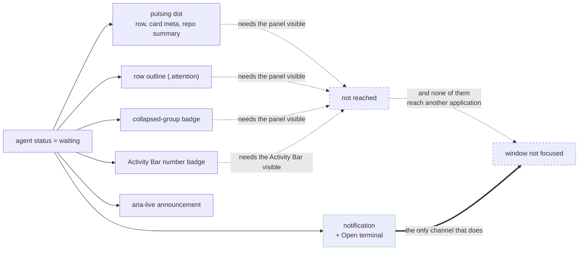
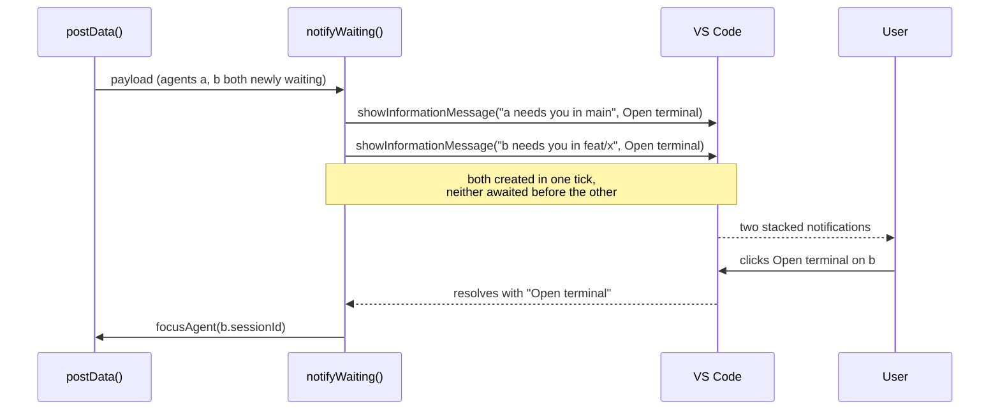
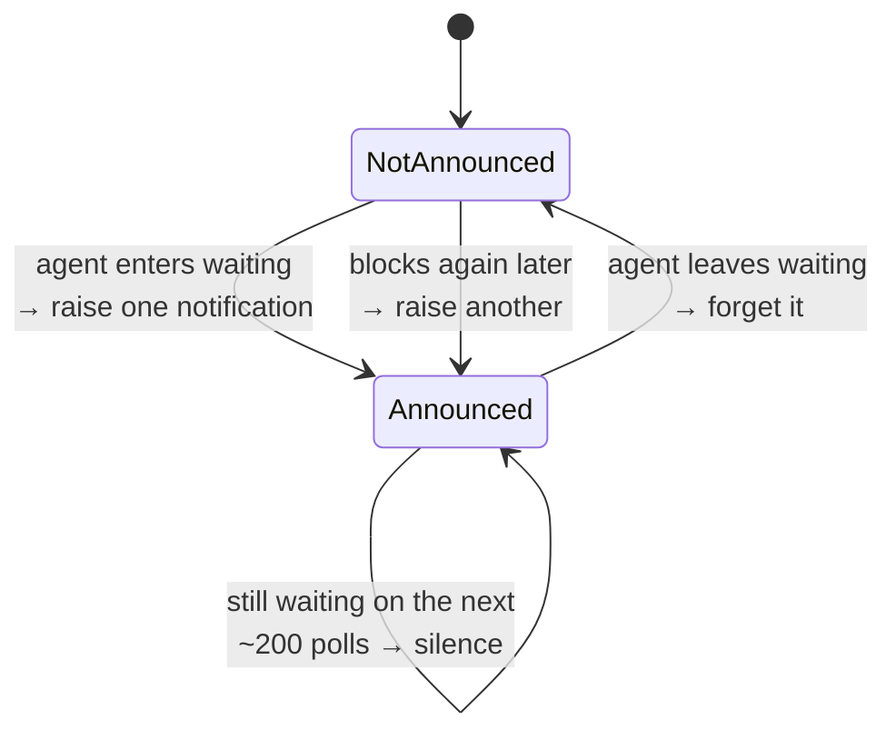
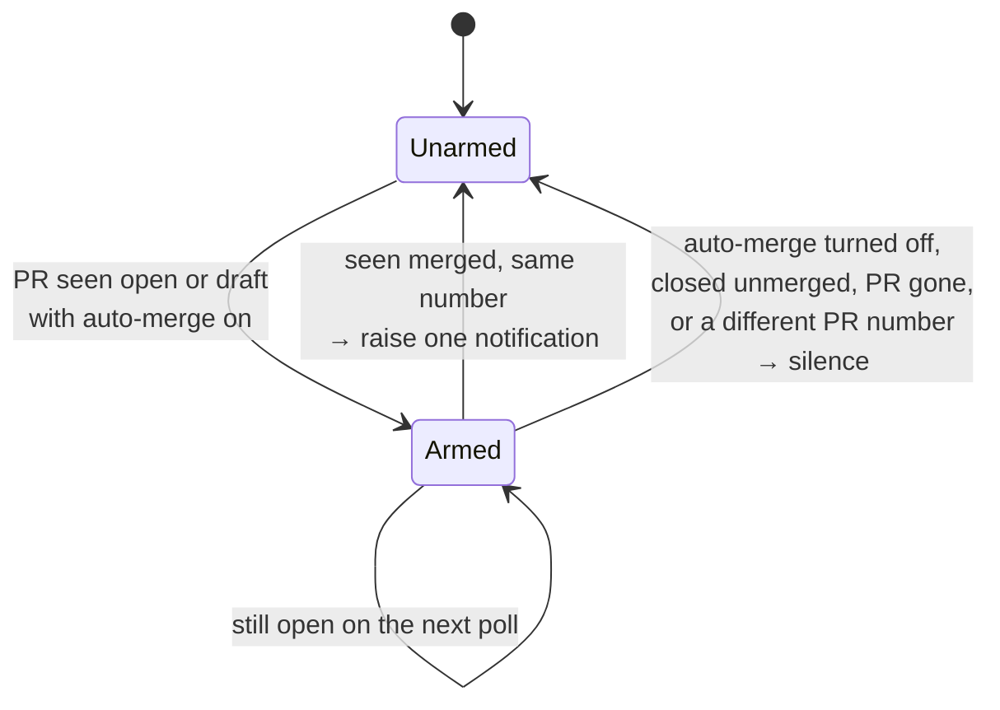

# Notifications

Two VS Code notifications, each under its own switch in **Settings →
Notifications**:

- a blocked agent: raised when an agent starts **waiting**, with a button that
  reveals its terminal;
- an auto-merged PR: raised when GitHub merges a PR the panel saw open with
  auto-merge on, with a button that opens it.

Most of this document is about the first, which set the rules the second
follows; the PR one is described at the end.

## Why the existing signals were not enough

Everything the panel said about a blocked agent terminated inside the panel or
the Activity Bar:

The Activity Bar badge is the strongest of the old signals and it is still a bare
integer that disappears with the Activity Bar. Once VS Code is behind a browser
or a terminal, nothing at all reaches the user, which is exactly the situation
where an agent parked on a permission prompt costs the most: the whole point of
running several is that they work while you are doing something else.

## One notification per agent

Two agents can hit a permission prompt in the same second, and they are two
different pieces of work in two different worktrees. They get **two
notifications**, each naming its own agent and each with its own button.

The implementation detail that makes that true: `showInformationMessage` resolves
when its notification is *dismissed*. Awaiting one before raising the next would
have shown two simultaneously blocked agents one at a time, the second appearing
only once the first had been answered - precisely backwards for the case the
feature exists to serve. So every notification for a batch is created in the same
tick and each promise is handled on its own.

Each closure captures the session id of the agent it is about, so the buttons
cannot be crossed however they are answered, in whatever order, or not at all.

## The button

**Open terminal** runs the same `focusAgent(sessionId)` the panel's own rows do,
so it inherits that path's behaviour whole - including its answer for a session
whose terminal belongs to another VS Code window, which it reports rather than
silently doing nothing.

## When it fires

Config: `agentWorktrees.notifyWaiting`.

| Value       | Behaviour                                                      |
| ----------- | -------------------------------------------------------------- |
| `off`       | Never. The dot, the group badge and the Activity Bar count only. |
| `unfocused` | **Default.** Only while the VS Code window is not focused.       |
| `focused`   | Only while the VS Code window is focused.                        |
| `always`    | Every time an agent starts waiting, focused or not.              |

`unfocused` is the default because it is the case nothing else covers. With the
window focused the user is already in VS Code and the pulse, the badge and the
repo-wide summary are all doing their job; interrupting them there is a second
copy of news they can already see. With it unfocused, none of those exist.

`focused` is the inverse, for two cases the default misses: the panel is not
on screen while the user is in VS Code (another sidebar view is active, or the
sidebar is closed), so nothing signals them until they open it; and a user who
wants in-editor alerts but not a stack of notifications waiting when they come
back from a browser. VS Code notifications are in-window, so anything raised
while unfocused is only seen on return anyway.

The setting is hand-editable like any other, so it is **normalized rather than
validated** on every read (`notifyMode`), and an unrecognized value falls back to
the default rather than to `always`: a typo in `settings.json` must not resolve
in the direction of interrupting the user more often than they asked for.

Focus is read **once per batch** (`vscode.window.state.focused`), not once per
notification. They are all being raised in response to a single refresh, so they
should agree about whether anyone was looking at the window when it landed.

## What stops it becoming noise

The panel polls once a second and `postData` runs on every refresh, so "there is
a waiting agent" is true hundreds of times for one prompt. The rule is one
notification per **entry** into the waiting status, held in
`announcedWaiting`, a set of session ids.

Dropping the id when the agent *stops* waiting, rather than when its session
ends, is what makes the second permission prompt of a long session reach you.
Keying it by session id rather than counting is what stops the first one
announcing on every poll.

### Seeding

The first payload after a window opens, or after an extension-host reload, would
otherwise look like every currently-blocked agent had just blocked, and fire a
burst of notifications about nothing that changed. That payload therefore
**seeds** the set without notifying (`newlyWaiting(..., seed = true)`).

Reconciliation runs before the mode is read, so the seeding and the bookkeeping
happen even while notifications are `off`. Turning the setting on mid-session
then announces the *next* agent to block, rather than everything already sitting
there.

## Where it hangs

Off `postData`, next to the Activity Bar badge, and before the
unchanged-payload early return for the same reason the badge is: both are
statements about the current state rather than about the DOM, and both must be
right on a refresh that re-posts nothing.

Consequence, shared with the badge: nothing fires until the panel's view has been
resolved at least once, because that is the extension's only refresh path.

## Auto-merged pull requests

A PR with auto-merge enabled lands without the user doing anything, which is the
one merge they were not watching for: they turned auto-merge on so they could go
and do something else. The card's PR pill flips to **merged** when the poll
notices, but the pill terminates inside the panel like every other signal there.

Config: `agentWorktrees.notifyPrMerged`, the same four values with the same
default and the same normalizer. The button is **Open PR** (`env.openExternal` on
the PR's URL).

The rule is a **transition this extension watched happen**, held in
`armedMerges`, a map of worktree path to PR number:

Arming requires *open with auto-merge on*, so a PR the user merges by hand,
one that was already merged when the window opened, and one a worktree
switched onto after the fact all stay silent without needing a seeding step:
nothing can fire on the first payload because nothing was armed before it.
Keying the arm by PR number as well as worktree is what keeps a card that
changes branches onto a merged PR from announcing a merge nobody was waiting on.

PR data reaches `postData` two ways, the gather (`attachPrStatus`) and the poll
(`postPrState`), and the check hangs off `postData` next to the waiting-agent
one, so the merge is seen whichever path noticed it first. Like that one, the
map is reconciled before the mode is read, so arming happens while the setting
is `off` and turning it on announces the next merge rather than nothing.

## The settings tab

**Settings → Notifications** renders the two as rows, each a switch with a
dropdown for *when* under it. The switch writes `off` or `unfocused`; the
dropdown moves between `unfocused`, `focused` and `always`. With the switch off
the dropdown stays in place, disabled, so the row keeps its height and flipping
the switch does not shift what is under it. What the four values mean is said once,
in a list above the rows, rather than repeated under each. They are separate settings because they
are separate interruptions: someone who wants to hear about a blocked agent may
still not want a toast for every PR that lands. The webview sends `setNotify`
with the kind and mode; the host normalizes the mode before writing it, so a
malformed message cannot put an unrecognized string into `settings.json`, and
reposts the cached payload rather than refreshing, since nothing about the
worktrees moved. The PR row says so when PR status is off under GitHub, since
the switch does nothing without it.

## Testing

The decisions are all in `src/waitingNotices.ts` and `src/mergeNotices.ts`,
which import no `vscode` API and hold no state of their own - the set and the
map are passed in. `test/waitingNotices.test.js` covers the poll not repeating,
two agents batching together, re-announcing after an agent unblocks, seeding
staying silent, the mode normalizer, the focus gate, and the notification text.
`test/mergeNotices.test.js` covers arming and firing once, the already-merged
and hand-merged cases staying silent, auto-merge being turned off, closing
unmerged, a branch switch onto another PR, two PRs landing on one poll, and the
text.
