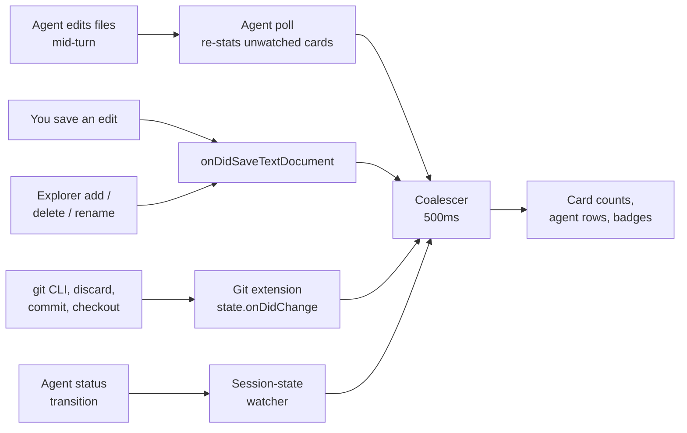

# Refresh coalescing

A full refresh spawns `git status` for every worktree, so reacting to every raw
event would peg the CPU, and much worse on Windows where a process spawn is far
more expensive than on macOS.

## What triggers a refresh

- Extension load.
- The manual Refresh button.
- The session-state `FileSystemWatcher`, one event per status transition Claude
  records (which also surfaces an agent creating a new worktree).
- The agent poll (`AGENT_POLL_MS`, 1s), while the view is visible, the **window
  is focused**, and at least one agent is on a card. Subagents are not in the
  session registry and come and go entirely inside one `busy` status, so the
  watcher never fires for them; see [subagents](subagents.md). It also carries the
  change counts for cards with a working agent, since a turn that long produces no
  watcher event either (see the agent-only path below) — but only for the cards
  no other signal covers; see [Two tiers](#two-tiers-what-the-poll-is-actually-for).
  What it does *not* do is anything a background window owes the user: the
  Activity Bar waiting badge is watcher-driven, so several open windows no longer
  each tick once a second.
- Window focus.
- **Document and file events** (`onDidSaveTextDocument`, plus create / delete /
  rename), filtered to `file`-scheme paths that are inside one of the cards. This
  is the hand-edit signal: nothing else sees a file the user edited in a worktree,
  since the agent poll only re-stats cards with a working agent and the Git
  extension only reports repositories it has open. A save, not a keystroke, so it
  is naturally sparse; the scope filter is what keeps a scratch file in an
  unrelated folder from paying for a gather.
- **`Repository.state.onDidChange` from the built-in Git extension**, one
  subscription per repository it has open. This is the working-tree signal, and
  the panel gets it without watching anything: the Git extension is already
  watching those repositories and already debounces its own status runs. Without
  it, a panel with **no agent on any card had no trigger at all** (the poll is
  off, the session watcher is silent), so a change the user made, staged or
  discarded in the Source Control view directly above kept its old count on the
  card until they clicked Refresh. It fires for exactly the repositories that view
  shows counts for, which is the set the disagreement is visible in. It re-stats
  **only the worktree the event names** (`onRepoStateChange`), not every card:
  routing it through the full gather meant one repository moving spawned git for
  every worktree on the panel, on the signal that fires most often. A root that
  matches no card still falls back to a gather, since "a repository we do not
  show" and "a card that has not been listed yet" are indistinguishable from
  there.

Two signals are deliberately **not** full-refresh triggers, because neither says
anything about a working tree. Both patch the cached payload and repost, with no
git spawns:

- **Source-control repo open/close**, which can only move the scope pill, so it
  patches `scmActive`. That patch path is also what confirms the webview's
  optimistic pill after a scope click: the Git extension regularly registers the
  swapped repo seconds later on Windows with many worktrees, and routing that
  through the debounced full gather left the pill trailing the Source Control
  view by the length of a full refresh.
- **Fresh PR status from the poller**, which patches `pr` (`postPrState`). A PR
  with checks still running polls every 15s, and 7s in the window after a push,
  so driving a full gather off it re-spawned git for every worktree several times
  a minute to learn nothing about any of them. A worktree with no cached value
  for the branch it currently has checked out loses its badge rather than keeping
  a stale one, which is what both a cleared token and a branch switch look like
  from here.

Each signal exists because something else cannot see that kind of change. The
change counts on a card are the part users compare against the Source Control
view, so it is worth being explicit about which signal covers what:

The gaps that map closes, each of which was a bug report: an agent editing for a
whole turn fires **no** watcher event (one turn is one status), a hand edit to a
worktree file fires no Git-extension event (that worktree is usually not a
repository it has open), and with no agent anywhere the poll is off entirely, so
before the Git-extension signal existed a discarded change had nothing at all to
report it.

Deliberately **not** a workspace-wide `**/*` watcher. Note what the objection is
and is not: the panel *does* now refresh on a saved file (see the trigger list), so
"a save is too much" was never the real argument. These two are:

- Our own `git status` opportunistically rewrites `.git/index`, so watching the
  tree fed git's writes straight back into another refresh: a perpetual loop that
  respawned git for every worktree several times a second even while idle.
  Read-only git runs with `GIT_OPTIONAL_LOCKS=0` so it never churns the user's
  index, which is what closes that loop.
- **Volume.** A watcher fires per filesystem write - a build, an `npm install`, a
  formatter, git's own metadata - while `onDidSaveTextDocument` fires once per
  deliberate save. Same information about the working tree, orders of magnitude
  fewer events, and no chance of hearing our own reads back.

The same reasoning is what makes the Git extension's repo-state event safe to
take: read-only runs do not write the index, so a refresh cannot be what the
extension reports next. It is the information a `**/*` watcher would have given,
already debounced, from a watcher that exists either way.

## Two tiers: what the poll is actually for

A worktree's counts can move without any deliberate user action, and the panel
has exactly two ways to find out. They cost very different amounts, so cards are
split by which one they have (`src/statusPoll.ts`):

| | Change signal | `git status` cadence |
| --- | --- | --- |
| Repository open in the Git extension | `state.onDidChange` for that repository | on the event, plus `WATCHED_STATUS_TTL_MS` (30s) as a backstop |
| No open repository | none | `agentWorktrees.statusPollSeconds` (default 10s), and only while an agent is working there |

The first tier is free: something else is already running that watcher, and it
tells us when to look. The second has no signal at all — nothing sees a file an
agent writes into a linked worktree — so a timer is the only option.

The old rule was a flat 2s for every card with a working agent, which paid the
polling price on precisely the cards that least needed it. Two seconds was set
against "the panel must not contradict the Source Control view", and that
standard only ever applied to tier one: a card the Source Control view is not
showing cannot contradict it. So tier two can afford to be slow, and tier one
does not need a timer at all.

The tier is read off the live subscription map rather than recorded separately,
which is what makes the **Source Control scope button** work without knowing any
of this. Scoping closes every other repository (see `applyScopeScm`), those
entries come out via `onDidCloseRepository`, and their cards fall back onto the
poll on the next tick — the scoped worktree becomes the one event-driven card,
and the rest go quiet.

The 30s backstop on tier one is not redundant. "The Git extension will tell us"
is an assumption the user can switch off underneath the panel (`git.autorefresh`),
and a card that silently freezes forever is a worse failure than one that costs a
status every half minute.

The rate is a setting because the right answer is per-machine: on Windows every
process spawn is far more expensive than on macOS, and a large repository without
git's own accelerators can take seconds per status. `pollIntervalMs` clamps
whatever is in `settings.json` to 2–60s rather than trusting it, since
`package.json` bounds only what the settings UI offers, and a `0` there would
mean a git spawn per tick.

## Cost control in a full refresh

- `git diff --numstat HEAD` runs only for worktrees with tracked changes. A clean
  worktree skips it, halving its per-worktree spawns.
- Per-worktree statuses run at most 4 at a time (`mapLimit`), so a many-worktree
  repo never fires an unbounded spawn burst.
- A hidden sidebar still runs the git gather (the Activity Bar badge needs it) but
  skips the PR/token/remote work until re-shown.
- The Branches tab is only re-read while that tab is visible. Hidden behind
  another editor it skips the git-heavy branch listing and catches up when
  revealed.
- `hasDebugTargets` (the Debug button's condition) reads each worktree's
  `.vscode/launch.json` at most once per edit, keyed by mtime. A missing file —
  the common case — costs one failed `stat`. Only the answer is cached, never the
  parsed configs, so starting a session always re-reads the file and can't launch
  a stale copy.

## Settings → Performance: git's own accelerators

Everything above is this extension spending less. The largest remaining cost is
inside `git status` itself, and it is git's to fix: `status` has to report
untracked files, so it walks every directory in the working tree.

- `core.untrackedCache` keeps each directory's result in `.git/index` with its
  stat data, so a directory whose mtime has not moved is not re-read.
- `core.fsmonitor` runs a per-repo daemon on the OS's change notifications
  (FSEvents, `ReadDirectoryChangesW`) and asks it what changed. Built into git
  since **2.37**; before that the key meant "run this hook", so writing `true` to
  an older git would configure a hook path that does not exist.

Both live in the user's repository config, so the tab reports the state and gives
each one a switch. The switch is the consent (it is labelled with what it writes,
under a paragraph naming both keys, and it goes both ways), which is why there is
no modal in front of it.

The tab carries one control that is *not* git's: the recheck interval, which
writes this extension's own `agentWorktrees.statusPollSeconds` and applies to
every repository. It sits here because it answers the same question the switches
do — "the panel is spending too much time in git" — and a fixed list of rates is
offered rather than a free number, so the control cannot ask for a value the
extension will clamp back underneath the user.

**Turning off is not symmetric with turning on**, because git's defaults are not:

| Key | On | Off |
| --- | --- | --- |
| `core.untrackedCache` | `true` | `false` — unset means **keep**, which leaves an existing cache in the index and in use. Only `false` removes it. |
| `core.fsmonitor` | `true` | unset, then `false` if the effective value is still on (an inherited `--global true`). Off has to mean off. |

What the tab will not do:

- write `core.untrackedCache` when `git update-index --test-untracked-cache`
  fails, i.e. when the filesystem does not report directory mtimes reliably;
- write `core.fsmonitor` on a git older than 2.37, **or on a platform git has no
  backend for** — it shipped for macOS and Windows, and where it is missing,
  enabling it makes `git status` fail rather than speed up. That is asked of git
  (`fsmonitor--daemon status`, whose "not supported" is told apart from the
  ordinary "not running" by `saysUnsupported`) rather than mapped from
  `process.platform`, since the supported set is git's and grows between releases;
- overwrite a `core.fsmonitor` that names the user's own program (Watchman, say).
  `parsePerfConfig` distinguishes `true` (git's daemon) from a path (`hook`) for
  exactly this reason, and `keep` on the untracked cache counts as off, since it
  is not the state being offered.

The extension-host side re-checks all of that before writing: a payload the view
was rendered from can be stale, and a stale payload must not be able to talk the
provider into enabling something on an unsupported platform.

The filesystem test runs at the repo root, and the config is written there too,
which is the only coherent single answer: linked worktrees share that config. A
worktree living on a different (and unsuitable) filesystem is not something one
setting can express.

The state is read **on demand**, when the tab is opened (`loadGitPerf`), not on
the refresh path: it is three git calls, one of which walks the working tree. It
is requested from `renderSettings`, not from the tab click, because the selected
tab outlives closing Settings — reopening straight onto Performance has to ask
too. The
result is cached on the provider and rides along on later payloads, so the section
re-renders from data like every other tab. `getStatus` also reports the first
status slower than `SLOW_STATUS_MS` to the provider
(`setSlowStatusHandler`), which is what turns the tab's lead line from a
description into "this repo measured slow, here is the fix".

## The agent-only path

The session-state watcher is by far the most frequent trigger while an agent
works, and it does **not** run the full gather. An event means agent state
changed and files may have changed in *that* agent's worktree, not the others, so
`refreshAgents`:

- re-reads the session files and swaps the agent VMs — and the subagent rows the
  cards own, which a fan-out puts on a card with no agent of its own — into the
  last gathered payload;
- re-runs `git status` only for the worktrees that have a reason to have changed:
  one whose session just fired (the watcher records each changed file's session
  id), or one hosting an **active** agent (or a running subagent);
- and only if that worktree has not been stat'd within its tier's interval (see
  [Two tiers](#two-tiers-what-the-poll-is-actually-for)), so a card with a working
  agent costs one status every `agentWorktrees.statusPollSeconds` rather than one
  per poll tick — and none at all while its repository is open in the Git
  extension, which re-stats it on its own event instead.

The non-idle half of that is not optional, and getting it wrong was a bug. The
original rule was "only worktrees whose sessions fired", justified by *Claude
rewrites a session's registry file on every status transition, and a working agent
transitions several times a second*. It does not: Claude writes that file on
transitions, and **one long turn is one status**. Measured on a real session, the
file went **39 seconds** without a write while the agent edited four files. For
that whole turn the panel produced no re-stat and the card's change count sat
frozen while the Source Control view moved: the "panel says 3 changes, SCM says
4" report. Idle and *waiting* rows are still not a reason to re-stat:
neither is editing, and entering or leaving either state is a transition, so the
last write before a pause is caught by the fired-session half and the resumption
announces itself. Counting `waiting` as work would put a card parked on a
permission prompt on a two-second git treadmill for as long as the user takes to
read it. The exception is a waiting parent whose subagents are still running,
which does keep re-stat'ing.

It falls back to a full refresh in three cases:

- **A session appears in a worktree the cached payload does not know.**
- **A session's cwd is not itself one of the cards** (`unplaced`), which is the
  case that actually catches an agent creating its own worktree. A `claude -w`
  worktree is created *inside* the repo, so the session lands on the repo root's
  card, one the cache knows perfectly well, and the check above sees nothing
  wrong. Left to it, the new agent's row sat on the main worktree's card and the
  new worktree had no card at all until the user clicked Refresh. The same
  reporting covers a subagent given a worktree of its own; see
  [subagents](subagents.md). Once per path, since a cwd that no gather can turn
  into a card (a subdirectory of a worktree, an agent in an unrelated repo) must
  not re-gather on every poll.
- **One of those `git status` calls reports a different branch**, i.e. an agent ran
  `git checkout`, typically back to the default branch once its PR merged.
  - A branch change invalidates more than the patched fields: the card's branch
    name, and the PR the PR service targets. Only the full gather can re-derive
    those.
  - The branch comes free with the status call, since `git status
    --porcelain=v2 --branch` already prints a `# branch.head` header, so the check
    costs no extra process. A worktree throttled by its tier's interval is not
    stat'd, so a checkout can go unnoticed for that long — though on a card whose
    repository is open, the checkout is itself a repo-state event, so it is seen
    at once.

The posted-payload dedupe strips the `lastActivity` heartbeat (bumped by every
hook event, never rendered) from its signature, so an agent streaming tool calls
no longer re-posts, and full-DOM-rebuilds, a byte-identical panel.

## Ordering: only the newest post wins

- The full and agent-only refreshes run on separate coalescers, so they can
  overlap.
- A slow full refresh reads its session snapshot *before* the git work that delays
  it, so it could land after a faster agent-only update and overwrite newer agent
  state. This is what once left the Activity Bar badge showing a waiting agent
  that had already gone active.
- Every refresh therefore claims a monotonic token before reading session state,
  and only the newest claim may post. This is the sidebar counterpart of the
  branches view's `branchPostSeq` guard.
- A superseded **full gather does not drop its payload**, though: only its agent
  snapshot is stale, and dropping the post threw the fresh git work out with it.
  The agent poll claims a token every second, so any gather slower than that (a
  `git fetch`, a PR fetch, a status sweep over many worktrees) was routinely
  discarded. That is the other half of why a new worktree, or a card's change
  counts, could sit stale until a manual Refresh happened to win the race.
  `postGather` instead re-reads the sessions (an mtime-cached registry read plus
  cached titles), swaps the rows onto the freshly gathered payload, and posts
  under a new claim: newest git *and* newest agents. An agent-only refresh still
  in flight loses its post to that claim and catches up on the next tick.

## The Coalescer

All signals funnel through a `Coalescer` (`src/scheduler.ts`):

- a trailing debounce (`REFRESH_DEBOUNCE_MS`, 500ms) collapsing a burst into one
  refresh;
- a `maxDelay` cap so a *continuous* stream (a build writing files, an agent
  streaming tool events) still flushes at a bounded rate instead of starving;
- in-flight coalescing so an async refresh never overlaps itself: triggers
  arriving mid-refresh fold into a single follow-up.

The session-state watcher pokes a second `Coalescer` that nudges the
independently throttled PR poller, so an active agent's hook stream does not hit
the GitHub API per event. The clock is injectable, so the coalescing guarantees
are unit-tested with virtual time in `test/scheduler.test.js`.
