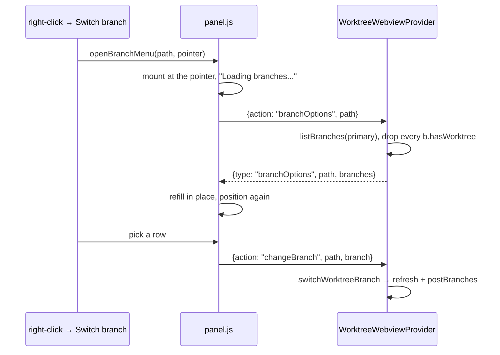

# Switching a worktree's branch

**Switch branch** in a card's menu opens the branch list *in that menu*, where
the pointer already is. It was a `showQuickPick`.

## Why it is not a quick pick

`showQuickPick` paints at the top centre of the **window**. The control that
opens it is a card in a sidebar, so you right-click at the bottom-left of the
screen and the list you have to read appears at the top-middle of it, with
nothing left on screen saying which worktree you are switching. Run and Debug
moved off the quick pick for exactly this reason (see
[Run and Debug](debug-sessions.md)); this was the last per-worktree action still
throwing the eye across the window.

It opens **over** the menu it came from, at the same anchor, like the debug
target list: a cascading submenu needs somewhere to cascade to, and a sidebar is
a narrow column with none on either side.

## Where the list comes from

The branches are **not** on the payload. Building the list is a pair of
`for-each-ref` passes plus the ahead/behind sweep (see
[Branch listing](branches-view.md#branch-listing-gitlistbranches)), and the
sidebar payload is re-posted about once a second while an agent works - carrying
a branch list on every one of those would cost the same git work again, for a
list a worktree needs perhaps once in its life.

So the menu asks for it when it opens:

- The menu opens on whatever it already has (nothing, the first time) and fills
  in when the answer lands, so it is never waiting on git to appear. Filling it
  changes its height, which is why placement is its own step
  (`positionMenu`) rather than something `mountMenu` does once.
- An answer is kept per worktree path, so re-opening paints from the last one
  immediately - and every open re-asks, so what is on screen is never stale for
  more than a round trip.
- Errors come back as a line drawn in place of the rows. A dialog would be the
  thing this menu exists to avoid, and the menu is already open waiting.
- `hasWorktree` does the filtering: it drops both the branch checked out here and
  any held by another worktree, since git allows a branch in one worktree at a
  time.
- Most recently updated first, the order the branches view sorts by. The menu is
  capped to the room it has, so what leads the list is what gets read before the
  filter is reached for, and "the branch I was on this morning" beats "the branch
  beginning with a".

## The field, and the two entries that are not branches

- **A filter field**, because a quick pick brought one. A repo with three
  branches does not need it; the one with three hundred is exactly where a menu
  without it would be worse than the picker it replaced. It is sticky with the
  heading, so it is still there after scrolling looking for a branch, and typing
  redraws only the rows - replacing the field would take the caret out of it
  mid-word.
- Down and Enter from the field go to the **rows**, not to the menu's first item:
  what you were typing was a branch name. Up goes to the last row.
- **Create new branch** sits above the list and outside the filter. It is what
  you reach for when none of the branches is the one you want, which is exactly
  when the filter has emptied the list. It is the one thing here that still opens
  a dialog - a name that does not exist yet has no list to put under the pointer.
- **200 rows at a time.** A monorepo's branch list runs to thousands and a menu
  is a few hundred pixels tall; past that the rows are DOM nobody scrolls to, and
  the field above is the way to reach them. The last line says how many of how
  many are drawn.
- The menu takes a **fixed width** rather than fitting its contents: it opens on
  a loading line and fills with rows a moment later, and a menu that resized
  between the two would shift out from under the pointer that opened it.
