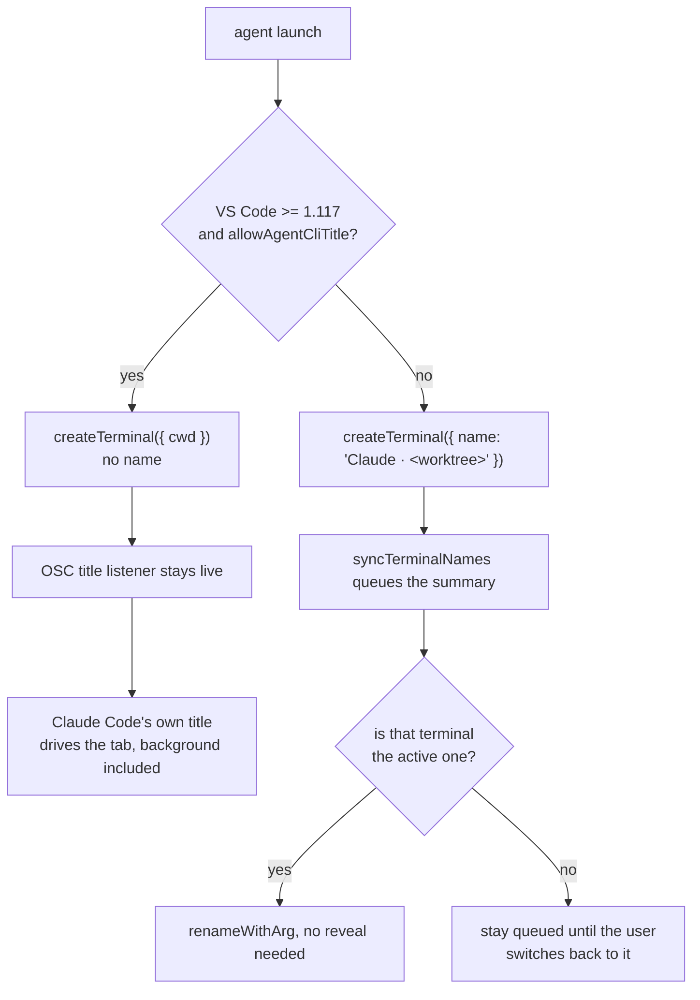

# Terminal tab titles

Agent terminals are titled by Claude Code, not by the extension. The way to
arrange that is to **not** pass `name` to `createTerminal`.

## Why passing a name breaks it

- VS Code treats an extension-supplied `name` as a static API title.
- The `TitleEventSource.Api` branch disposes the xterm listener that applies OSC
  title escape sequences, permanently: nothing re-registers it.
- Claude Code emits exactly such a sequence, continuously, carrying the same
  generated topic the panel row shows.
- Since VS Code 1.117 the label computer recognises an agent CLI from that
  sequence (`/claude\s*code/i`) and swaps the tab title template to `${sequence}`
  on its own, gated on `terminal.integrated.tabs.allowAgentCliTitle` (default
  `true`).

So naming the terminal is precisely what used to suppress the free,
always-current title.

## Why not rename it afterwards

No API renames a terminal in the background:

- `Terminal.name` is read-only.
- `workbench.action.terminal.renameWithArg` is registered as an active-instance
  action.
- `workbench.action.terminal.rename` opens a quick pick.

Renaming therefore meant revealing the terminal first, which is what made a
background agent steal the terminal tab you were reading whenever it produced a
new title. Leaving the title to Claude removes the reveal entirely, and works for
terminals that are not visible at all.

## The fallback path never reveals either

- A queued rename is applied only when its terminal is already
  `vscode.window.activeTerminal`, so the command needs no `show()` and cannot
  disturb the tab selection or pop open a hidden panel.
- A terminal the user never returns to keeps its launch name. Its panel row still
  shows the summary.
