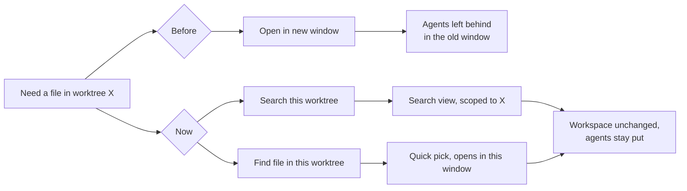

# Searching a worktree from the panel's window

Two per-card actions, in the row that carries **Debug** and **New agent**: a
magnifier that searches the worktree's contents, and a file-with-magnifier that
opens one of its files by name.

**Why:** a worktree is a sibling directory, not a workspace folder of the window
the panel is docked in. Neither of VS Code's file-finding affordances reaches it:

- **Find in Files** searches the window's workspace folders.
- **Quick Open** (`Ctrl/Cmd+P`) indexes those same folders.

So the only way to read a worktree's code was **Open in new window**, which is
the very thing that scatters your agents: terminal handles are per-window, so
the agents you started stay in the window you left (see the note on
`focusAgent` in [Agent status](agent-status.md)). These two actions close that
gap without moving anything: the workspace stays exactly as it is, and the
agents stay in the window you are already in.

## Search this worktree

`workbench.action.findInFiles` with the worktree's absolute path as
`filesToInclude`. VS Code's search honours an absolute include path even when it
lies outside the workspace, which is what makes a scoped search possible without
adding a workspace folder (and so without the extension-host reload that a
single-root to multi-root transition costs).

- The query is left empty and `triggerSearch` is false: the panel sets up the
  scope, the user types what they are looking for.
- `showIncludesExcludes` expands the files-to-include row, so the scope is
  visible in the search view rather than silently applied. Without it a scoped
  search looks identical to an unscoped one.

## Find file in this worktree

A quick pick over the worktree's files, opening the choice in the current window.

- The list is `git ls-files --cached --others --exclude-standard`, run in the
  worktree. That is the same set Quick Open would show (tracked plus untracked,
  minus gitignored), and asking git means `node_modules` and build output stay
  out with no exclusion list of our own to maintain.
- `-z`, so a filename with odd characters cannot break the parse. Paths are
  deduped: `--cached` lists an unmerged path once per stage, so a conflicted file
  would otherwise appear three times.
- Sorted case-insensitively with the exact path as tie-break. Deliberately **not**
  `localeCompare`, whose order depends on the runner's locale while CI spans three
  OSes.
- `label` is the file name and `description` its directory, with
  `matchOnDescription` on, so typing part of a path narrows the list the way it
  would in Quick Open.
- The item list is passed to `showQuickPick` as a promise, so the picker paints
  immediately with its own loading state instead of the sidebar button looking
  dead while git runs. For the same reason neither action is in the webview's
  `BUSY_ACTIONS`: nothing re-renders the sidebar afterwards, so a spinner there
  would hang until the safety timeout.
- Capped at `WORKTREE_FILE_CAP` (20,000) entries to keep the picker responsive. A
  hit cap is **stated**, never silent: a truncated list would make a missing file
  read as "not in this worktree". The warning fires as the listing resolves, not
  after a pick, so it arrives while the picker is still open.
- Files open through `vscode.open`, not `showTextDocument`, so picking an image or
  a PDF lands in the editor that can render it instead of failing.

`parseWorktreeFiles` holds the parsing, deduping, sorting and capping, and is
unit-tested without spawning git (`test/worktreeFiles.test.js`).

## What this is not

Neither action mounts the worktree into the workspace, so the Explorer tree and
the SCM view still show only the folder this window opened. The panel's own
[Source Control scope](../README.md#features) pill remains the way to point the
Git view at another worktree.
